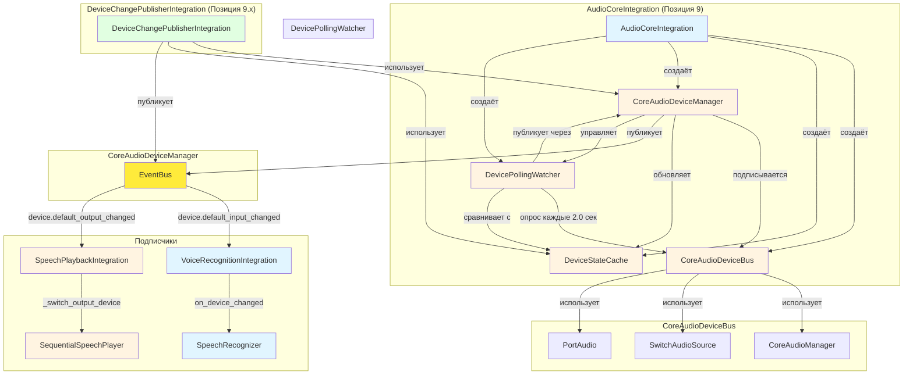

# Архитектура аудиосистемы Nexy

## Дата создания
2025-12-02

## Последнее обновление
2025-12-05 - **ЦЕНТРАЛИЗАЦИЯ УТИЛИТ**: Добавлен централизованный модуль `device_utils.py` для устранения дублирования логики работы с устройствами. Обновлены правила централизации и архитектурные принципы.
2025-12-04 - **ОБНОВЛЕНИЕ АРХИТЕКТУРЫ**: Обновлена схема архитектуры с актуальными компонентами (AudioCoreIntegration, CoreAudioDeviceManager, DeviceStateCache, DevicePollingWatcher). Исправлена публикация событий (async). Улучшено переключение устройств во время записи.

## Обзор

Аудиосистема Nexy состоит из двух независимых подсистем:
- **INPUT** - захват и распознавание речи с микрофона
- **OUTPUT** - воспроизведение аудио ответов через динамики/наушники

Обе подсистемы взаимодействуют через **EventBus** - событийную шину, которая обеспечивает слабую связанность компонентов.

---

## 1. Архитектурные принципы

### 1.1 Событийная архитектура (EventBus)

Все взаимодействие между компонентами происходит через **EventBus**:
- Компоненты **публикуют** события (`event_bus.publish()`)
- Компоненты **подписываются** на события (`event_bus.subscribe()`)
- События имеют **приоритеты** (CRITICAL, HIGH, MEDIUM, LOW)
- Обработка событий **асинхронная** (async/await)

### 1.2 Разделение ответственности

- **Модули** (`modules/`) - низкоуровневая логика (работа с PortAudio, Core Audio)
- **Интеграции** (`integration/integrations/`) - адаптеры между модулями и EventBus
- **Workflows** (`integration/workflows/`) - координаторы сложных цепочек действий
- **Core** (`integration/core/`) - инфраструктура (EventBus, StateManager, ErrorHandler)

### 1.3 Единый источник истины

- **ApplicationStateManager** - единый источник истины для состояния приложения
- **DeviceStateCache** - единый источник истины для состояний устройств (INPUT/OUTPUT)
- **session_id** - всегда берется из `state_manager.get_current_session_id()`
- **AppMode** - управляется через `state_manager.set_mode()`

---

## 2. Архитектура мониторинга устройств (2025-12-04)

### 2.1 Компоненты системы мониторинга

#### 2.1.1 AudioCoreIntegration
**Файл:** `integration/integrations/audio_core_integration.py`

**Ответственность:**
- Инициализация и запуск мониторинга устройств
- Создание и управление компонентами аудиосистемы:
  - `CoreAudioDeviceBus` - шина устройств CoreAudio
  - `DeviceStateCache` - кэш состояний устройств
  - `CoreAudioDeviceManager` - менеджер устройств
  - `DevicePollingWatcher` - polling fallback
- Предоставление `InputStreamManager` и `OutputStreamManager` для использования другими интеграциями
- Предоставление `DeviceStateCache` для передачи в `SpeechPlaybackIntegration` и `VoiceRecognitionIntegration`

**Инициализация:**
- Создается в `SimpleModuleCoordinator` на позиции 9 (перед `device_change_publisher`)
- Инициализирует все компоненты аудиосистемы
- Запускает мониторинг устройств (INPUT и OUTPUT)
- Предоставляет доступ к компонентам через публичные методы

#### 2.1.2 CoreAudioDeviceBus
**Файл:** `modules/audio_core/core_audio_device_bus.py`

**Ответственность:**
- Обёртка над `CoreAudioManager` для работы с нотификациями и списком устройств
- Подписка на CoreAudio нотификации через `CoreAudioManager`
- Получение информации о текущих устройствах через `SwitchAudioSource` и PortAudio
- Список всех доступных устройств через `list_devices()`

**Особенности:**
- Использует `SwitchAudioSource` как основной источник имени устройства
- Использует PortAudio для получения `device_id` по имени
- Поддерживает INPUT и OUTPUT направления

#### 2.1.3 DeviceStateCache
**Файл:** `modules/audio_core/device_state_cache.py`

**Ответственность:**
- Thread-safe кэш состояний устройств (INPUT и OUTPUT)
- Хранение `DeviceDescriptor` для каждого направления
- API: `update_default_input()`, `update_default_output()`, `get_default_input()`, `get_default_output()`

**Особенности:**
- Защищён `threading.Lock` для thread-safe доступа
- Хранит `DeviceDescriptor` с полной информацией об устройстве (uid, name, device_id, is_bluetooth, sample_rate, latency, blocksize)
- Выбрасывает `RuntimeError` если устройство не инициализировано

#### 2.1.4 CoreAudioDeviceManager
**Файл:** `modules/audio_core/core_audio_device_manager.py`

**Ответственность:**
- Получение событий от `CoreAudioDeviceBus`
- Нормализация сырых данных в `DeviceDescriptor`
- Обновление `DeviceStateCache`
- Публикация событий `device.default_input_changed` / `device.default_output_changed` в EventBus

**Алгоритм:**
1. Подписывается на `bus.subscribe_raw_events(callback)` для INPUT и OUTPUT
2. При callback: преобразует raw → `DeviceDescriptor`, обновляет `DeviceStateCache`, публикует `DeviceChangeEvent`
3. Если нотификации не пришли 1.5 сек (проверка timer), запускает `DevicePollingWatcher`
4. После первого успешного notification отключает watcher (опционально)

**Публикация событий:**
- ✅ **ИСПРАВЛЕНИЕ (2025-12-04)**: `publish_device_change_event()` теперь правильно публикует async события через `asyncio.create_task()` или в отдельном потоке
- Формат события: `device.default_{direction}_changed` с payload:
  - `device_name`, `device_id`, `is_bluetooth`, `source`
  - `old_device_name`, `old_device_id`
  - Расширенные поля: `uid`, `sample_rate`, `latency`, `blocksize`

#### 2.1.5 DevicePollingWatcher
**Файл:** `modules/audio_core/device_polling_watcher.py`

**Ответственность:**
- Polling fallback для обнаружения изменений устройств
- Опрашивает `bus.list_devices()` каждые 2.0 сек (обновлено с 5.0 сек для быстрого обнаружения AirPods)
- Сравнивает default UID с кэшем и публикует события через `CoreAudioDeviceManager`

**Особенности:**
- Запускается всегда (даже если CoreAudio работает) для гарантированного обнаружения изменений
- Интервал polling: 2.0 сек (быстрое обнаружение подключения устройств)
- Публикует события через `CoreAudioDeviceManager.publish_device_change_event()`

#### 2.1.6 DeviceChangePublisherIntegration
**Файл:** `integration/integrations/device_change_publisher_integration.py`

**Ответственность:**
- Обёртка над `DeviceChangePublisher` для интеграции с EventBus
- Использует компоненты из `AudioCoreIntegration` (manager, cache)
- Публикует события `device.default_input_changed` / `device.default_output_changed`

**Особенности:**
- Инициализируется после `AudioCoreIntegration` (позиция 9.x)
- Использует `DeviceChangePublisher` для координации публикации событий
- Поддерживает debounce механизм (300ms) для rapid device switch

### 2.2 Поток мониторинга устройств

```
1. AudioCoreIntegration.initialize()
   └─ Создаёт компоненты:
      ├─ CoreAudioDeviceBus
      ├─ DeviceStateCache
      ├─ CoreAudioDeviceManager
      └─ DevicePollingWatcher (poll_interval=2.0 сек)

2. CoreAudioDeviceManager.start_monitoring()
   ├─ Подписывается на CoreAudio нотификации (INPUT и OUTPUT)
   ├─ Инициализирует начальное состояние устройств
   └─ Запускает DevicePollingWatcher (всегда, для гарантированного обнаружения)

3. При смене устройства (CoreAudio notification или polling):
   └─ CoreAudioDeviceManager._subscribe_direction() callback
      ├─ Нормализует устройство в DeviceDescriptor
      ├─ Обновляет DeviceStateCache
      └─ Публикует событие через publish_device_change_event()
         └─ ✅ ИСПРАВЛЕНИЕ (2025-12-04): async публикация через asyncio.create_task()

4. Подписчики получают событие:
   ├─ VoiceRecognitionIntegration._on_input_device_changed()
   │  └─ SpeechRecognizer.on_device_changed()
   │     └─ ✅ УЛУЧШЕНИЕ (2025-12-04): Переключает устройство даже во время записи
   │        ├─ Закрывает старый поток
   │        ├─ Создаёт новый поток на новом устройстве
   │        └─ Продолжает запись на новом устройстве (если была активна)
   │
   └─ SpeechPlaybackIntegration._on_output_device_changed()
      └─ SequentialSpeechPlayer._switch_output_device()
         └─ AudioStreamManager.switch_device()
```

### 2.3 Диаграмма архитектуры мониторинга



---

## 3. INPUT подсистема (Захват и распознавание речи)

### 3.1 Компоненты

#### 3.1.1 InputProcessingIntegration
**Файл:** `integration/integrations/input_processing_integration.py`

**Ответственность:**
- Обработка событий клавиатуры (PRESS, LONG_PRESS, RELEASE, SHORT_PRESS)
- Управление состоянием комбинации (InputState: IDLE, PENDING, LISTENING, PROCESSING)
- Публикация событий `voice.recording_start` и `voice.recording_stop`
- Координация перехода в режим LISTENING → PROCESSING

**События:**
- **Публикует:**
  - `keyboard.press` - нажатие клавиши
  - `keyboard.short_press_cancelled` - короткое нажатие отменено
  - `voice.recording_start{session_id}` - начало записи (при LONG_PRESS)
  - `voice.recording_stop{session_id}` - конец записи (при RELEASE)
  - `mode.request{target=LISTENING|PROCESSING}` - запрос смены режима

- **Подписывается:**
  - `keyboard.press/release/short_press/long_press` - события клавиатуры
  - `voice.recognition_completed/failed` - результаты распознавания
  - `playback.completed` - завершение воспроизведения
  - `grpc.request_completed` - завершение gRPC запроса

#### 3.1.2 VoiceRecognitionIntegration
**Файл:** `integration/integrations/voice_recognition_integration.py`

**Ответственность:**
- Координация распознавания речи
- Управление микрофоном через `MicrophoneStateManager`
- Публикация результатов распознавания
- Работа с `SpeechRecognizer` для низкоуровневой работы с микрофоном
- ✅ **Обработка смены INPUT устройств** через `device.default_input_changed`

**События:**
- **Публикует:**
  - `voice.recognition_started{session_id}` - начало распознавания
  - `voice.recognition_completed{session_id, text, confidence}` - успешное распознавание
  - `voice.recognition_failed{session_id, error}` - ошибка распознавания
  - `voice.mic_opened{session_id}` - микрофон открыт
  - `voice.mic_closed{session_id}` - микрофон закрыт

- **Подписывается:**
  - `voice.recording_start` - начало записи
  - `voice.recording_stop` - конец записи
  - `microphone.open_requested` - запрос открытия микрофона
  - `microphone.close_requested` - запрос закрытия микрофона
  - ✅ `device.default_input_changed` - смена INPUT устройства (от CoreAudioDeviceManager)

#### 3.1.3 SpeechRecognizer
**Файл:** `modules/voice_recognition/core/speech_recognizer.py`

**Ответственность:**
- Низкоуровневая работа с PortAudio для захвата аудио
- Создание и управление PortAudio стримами через `AudioStreamManager` (legacy) или `InputStreamManager` (новая архитектура)
- Обработка аудио чанков через `_audio_callback`
- VAD (Voice Activity Detection) и нормализация аудио
- ✅ **Переключение устройств во время записи** (2025-12-04)

**Особенности:**
- ✅ Использует `AudioStreamManager` (legacy) для управления потоками
- ✅ Подписан на `device.default_input_changed` от `CoreAudioDeviceManager` (событийная реакция)
- ✅ **УЛУЧШЕНИЕ (2025-12-04)**: `on_device_changed()` теперь переключает устройство даже во время записи:
  - Закрывает старый поток
  - Создаёт новый поток на новом устройстве
  - Продолжает запись на новом устройстве (если была активна)
- Использует **SwitchAudioSource** как helper для чтения системного default input устройства
- Специальная обработка BT устройств (увеличенные задержки, retry логика)
- ✅ Старый polling (`AudioDeviceMonitor`) удален - использует централизованный мониторинг

**Методы переключения устройств:**
- `on_device_changed(device_name, device_id, is_bluetooth)` - обработка смены устройства
  - ✅ **УЛУЧШЕНИЕ**: Переключает устройство даже во время записи
  - Закрывает старый поток через `AudioStreamManager.close_stream()`
  - Создаёт новый поток через `AudioStreamManager.create_stream()`
  - Продолжает запись на новом устройстве (если была активна)

#### 3.1.4 MicrophoneStateManager
**Файл:** `modules/microphone_state/core/microphone_state_manager.py`

**Ответственность:**
- Управление состоянием микрофона (IDLE, OPENING, OPEN, CLOSING)
- Координация открытия/закрытия микрофона
- Публикация событий `microphone.opened/closed/error`

**Состояния:**
- `IDLE` - микрофон закрыт
- `OPENING` - процесс открытия микрофона
- `OPEN` - микрофон открыт и готов к записи
- `CLOSING` - процесс закрытия микрофона

### 3.2 Поток INPUT (от нажатия клавиши до распознавания)

```
1. Пользователь нажимает Ctrl+N (PRESS)
   └─ InputProcessingIntegration._handle_press()
      ├─ Создает pending_session_id = timestamp
      ├─ Переход: IDLE → PENDING
      └─ Публикует: keyboard.press

2. Пользователь удерживает Ctrl+N > 0.6s (LONG_PRESS)
   └─ InputProcessingIntegration._handle_long_press()
      ├─ Проверки (5 защит)
      ├─ Ожидания (_ensure_playback_idle, _wait_for_mic_closed)
      ├─ Сброс состояния
      └─ Публикует: voice.recording_start{session_id}
         └─ Переход: PENDING → LISTENING

3. VoiceRecognitionIntegration получает voice.recording_start
   └─ VoiceRecognitionIntegration._on_recording_start()
      ├─ MicrophoneStateManager.request_open(session_id)
      │   ├─ Переход: IDLE → OPENING
      │   ├─ Публикует: microphone.open_requested
      │   └─ Ждет: microphone.opened (таймаут 5s)
      │
      └─ SpeechRecognizer.start_listening()
         ├─ Использует AudioStreamManager.create_stream()
         ├─ Устройство определяется через DeviceStateCache (из AudioCoreIntegration)
         ├─ Публикует: microphone.opened
         └─ Публикует: voice.mic_opened

4. SpeechRecognizer._audio_callback получает аудио чанки
   ├─ Получает аудио данные из PortAudio
   ├─ Обрабатывает (нормализация, VAD)
   └─ Сохраняет в буфер для распознавания

5. Пользователь отпускает Ctrl+N (RELEASE)
   └─ InputProcessingIntegration._handle_key_release()
      ├─ Публикует: voice.recording_stop{session_id}
      └─ _wait_for_mic_closed() (таймаут 1.0s)

6. VoiceRecognitionIntegration получает voice.recording_stop
   └─ VoiceRecognitionIntegration._on_recording_stop()
      ├─ SpeechRecognizer.stop_listening()
      │   ├─ Останавливает поток через AudioStreamManager
      │   └─ Публикует: microphone.closed
      │
      └─ Запускает распознавание (симуляция или реальное)
         └─ Публикует: voice.recognition_completed{session_id, text, confidence}
            └─ Переход: LISTENING → PROCESSING

7. ✅ УЛУЧШЕНИЕ (2025-12-04): Пользователь надевает AirPods во время записи
   └─ CoreAudioDeviceManager обнаруживает смену устройства
      ├─ Публикует: device.default_input_changed (async)
      └─ VoiceRecognitionIntegration._on_input_device_changed()
         └─ SpeechRecognizer.on_device_changed()
            ├─ Закрывает старый поток (MacBook Air Microphone)
            ├─ Создаёт новый поток (AirPods)
            └─ Продолжает запись на AirPods (если была активна)
```

### 3.3 ListeningWorkflow

**Файл:** `integration/workflows/listening_workflow.py`

**Ответственность:**
- Координация режима LISTENING
- Дебаунс защита от случайных нажатий
- Умные таймауты (адаптивные)
- Мониторинг качества записи

**События:**
- **Подписывается:**
  - `voice.recording_start` - начало записи
  - `voice.recording_stop` - конец записи
  - `keyboard.short_press` - прерывание
  - `interrupt.request` - запрос прерывания
  - `app.mode_changed` - смена режима

**Особенности:**
- Проверяет минимальную длительность записи (debounce_threshold = 0.3s)
- Отслеживает максимальную длительность (max_listening_duration = 30.0s)
- Координирует возврат в SLEEPING при прерывании

---

## 4. OUTPUT подсистема (Воспроизведение аудио)

### 4.1 Компоненты

#### 4.1.1 SpeechPlaybackIntegration
**Файл:** `integration/integrations/speech_playback_integration.py`

**Ответственность:**
- Координация воспроизведения аудио ответов
- Обработка аудио чанков от gRPC сервера
- Управление `SequentialSpeechPlayer`
- Финализация воспроизведения по тишине
- ✅ **Обработка смены OUTPUT устройств** через `device.default_output_changed`

**События:**
- **Публикует:**
  - `playback.started{session_id}` - начало воспроизведения
  - `playback.completed{session_id}` - завершение воспроизведения
  - `playback.failed{session_id, error}` - ошибка воспроизведения

- **Подписывается:**
  - `grpc.response.audio` - аудио чанки от сервера
  - `grpc.request_completed` - завершение gRPC запроса
  - `grpc.request_failed` - ошибка gRPC запроса
  - `playback.raw_audio` - сырые аудио данные
  - `playback.signal` - короткие сигналы (тоны)
  - `grpc.request_cancel` - отмена gRPC запроса
  - ✅ `device.default_output_changed` - смена OUTPUT устройства (от CoreAudioDeviceManager)

**Особенности:**
- ✅ Получает `DeviceStateCache` из `AudioCoreIntegration` и передаёт в `SequentialSpeechPlayer`
- ✅ При получении `device.default_output_changed`:
  - Проверяет флаги `_pending_descriptor` и `_output_ready` в player
  - Вызывает `_retry_start()` если player ожидал дескриптор

#### 4.1.2 SequentialSpeechPlayer
**Файл:** `modules/speech_playback/core/player.py`

**Ответственность:**
- Низкоуровневая работа с PortAudio для воспроизведения
- Создание и управление PortAudio стримами через `AudioStreamManager` (legacy) или `OutputStreamManager` (новая архитектура)
- Обработка аудио чанков через `_audio_callback`
- Управление буфером воспроизведения (`ChunkBuffer`)
- ✅ **Автоматическое переключение устройств** через `device.default_output_changed`

**Особенности:**
- ✅ Использует `AudioStreamManager` (legacy) для управления потоками
- ✅ Получает `DeviceStateCache` из `SpeechPlaybackIntegration` для доступа к устройствам
- ✅ **Приоритет DeviceStateCache**: Сначала пытается получить устройство из `DeviceStateCache` с retry логикой (до 5 попыток с задержкой 0.5 сек)
- ✅ **Fallback на системный дефолт**: Если cache пуст, использует системный дефолт (`device=None`) вместо ошибки
- ✅ **Поддержка BT без device_id**: Если BT устройство не имеет PortAudio ID, использует `device=None` (macOS управляет параметрами)
- ✅ **Реакция на события**: При получении `device.default_output_changed` устанавливает `_output_ready=True` и вызывает `_retry_start()`
- Использует **SwitchAudioSource** как helper для чтения системного default output устройства
- Специальная обработка BT устройств:
  - Использует `device=None` (macOS управляет параметрами)
  - Увеличенные задержки (2.5с для prestart и close_delay)
  - Не задает `blocksize` и `latency` (macOS выбирает сам)
- ✅ Гарантированное закрытие старого потока через `AudioStreamManager`:
  - Цикл ожидания `active=False` (таймаут 3с для BT, 1с для обычных)
  - Задержка после `close()` (2.5с для BT, 0.3с для обычных)
- ✅ Старый polling (`_output_monitor_loop`) удален - использует централизованный мониторинг

**Методы работы с устройствами:**
- `_get_output_descriptor_with_retry(max_retries=5, retry_delay=0.5)` - получение дескриптора из cache с retry
- `_start_audio_stream(sync_output=True, device_id=None)` - создание потока с приоритетом cache
- `_retry_start()` - повторная попытка запуска потока после получения дескриптора
- `_switch_output_device()` - переключение устройства через `AudioStreamManager.switch_device()`

#### 4.1.3 CoreAudioManager
**Файл:** `modules/speech_playback/macos/core_audio.py`

**Ответственность:**
- ✅ Подписка на Core Audio нотификации о смене default INPUT и OUTPUT устройств
- Мгновенная реакция на смену устройства (без polling)
- Используется через `CoreAudioDeviceBus` в новой архитектуре

**Особенности:**
- ✅ Поддержка INPUT нотификаций (`kAudioHardwarePropertyDefaultInputDevice`)
- ✅ Поддержка OUTPUT нотификаций (`kAudioHardwarePropertyDefaultOutputDevice`)
- ✅ Поддержка одновременных подписок на INPUT и OUTPUT
- ✅ Метод `start_device_notifications(callback, device_type="input"|"output")`
- ✅ Метод `stop_device_notifications(device_type=None)` - от всех или конкретный тип

**Использование:**
- ✅ `CoreAudioDeviceBus` использует `CoreAudioManager` для подписки на нотификации
- ✅ При успешной подписке используется мгновенная реакция
- ✅ При ошибке подписки автоматически используется polling fallback

### 4.2 Поток OUTPUT (от gRPC ответа до воспроизведения)

```
1. GrpcClientIntegration получает аудио чанк от сервера
   └─ GrpcClientIntegration._on_audio_chunk()
      └─ Публикует: grpc.response.audio{session_id, audio_data, dtype, sample_rate, channels}

2. SpeechPlaybackIntegration получает grpc.response.audio
   └─ SpeechPlaybackIntegration._on_audio_chunk()
      ├─ Декодирует audio_data из bytes
      ├─ Проверяет/инициализирует плеер
      ├─ ✅ Смена устройства обрабатывается через device.default_output_changed (от CoreAudioDeviceManager)
      │   └─ SpeechPlaybackIntegration._on_output_device_changed()
      │      ├─ Проверяет флаги _pending_descriptor и _output_ready
      │      └─ Вызывает _retry_start() если player ожидал дескриптор
      │
      ├─ start_playback()  # Если не играет
      │   └─ _ensure_stream_started()
      │      ├─ ✅ Использует AudioStreamManager.create_stream()
      │      ├─ ✅ Приоритет DeviceStateCache: пытается получить устройство из cache с retry
      │      ├─ ✅ Fallback на системный дефолт: если cache пуст, использует device=None
      │      ├─ Для BT устройств: device=None, channels=1, без blocksize/latency
      │      └─ Запускает поток
      │
      └─ add_audio_data(audio_data, metadata)
         ├─ Добавляет в ChunkBuffer
         └─ Поток воспроизводит через _audio_callback()

3. SequentialSpeechPlayer._audio_callback получает запрос на воспроизведение
   ├─ Получает данные из ChunkBuffer
   ├─ Конвертирует каналы (моно → стерео при необходимости)
   └─ Записывает в outdata (PortAudio воспроизводит)

4. GrpcClientIntegration получает end_message от сервера
   └─ GrpcClientIntegration._on_end_message()
      └─ Публикует: grpc.request_completed{session_id}

5. SpeechPlaybackIntegration получает grpc.request_completed
   └─ SpeechPlaybackIntegration._on_grpc_completed()
      ├─ Устанавливает флаг _grpc_done_sessions[session_id] = True
      └─ Запускает _finalize_on_silence(session_id, timeout=3.0s)
         └─ После тишины публикует: playback.completed{session_id}
```

### 4.3 ProcessingWorkflow

**Файл:** `integration/workflows/processing_workflow.py`

**Ответственность:**
- Координация режима PROCESSING
- Управление цепочкой: capture → gRPC → playback → SLEEPING
- Ожидание реальных событий вместо таймаутов

**Этапы обработки:**
1. **CAPTURING** - захват скриншота
2. **SENDING_GRPC** - отправка на сервер
3. **PLAYING_AUDIO** - воспроизведение ответа
4. **COMPLETING** - завершение и возврат в SLEEPING

**События:**
- **Подписывается:**
  - `app.mode_changed` - вход в PROCESSING
  - `screenshot.captured/error` - результат захвата
  - `grpc.request_started/completed/failed` - статус gRPC
  - `playback.started/completed/failed` - статус воспроизведения
  - `keyboard.short_press/interrupt.request` - прерывания

- **Публикует:**
  - `mode.request{target=SLEEPING}` - возврат в SLEEPING
  - `grpc.request_cancel` - отмена gRPC при прерывании
  - `playback.stop` - остановка воспроизведения при прерывании

**Особенности:**
- Ждет **РЕАЛЬНЫХ событий** вместо таймаутов:
  - `screenshot.captured` → переход к gRPC
  - `grpc.request_completed` → ожидание завершения воспроизведения
  - `playback.completed` → возврат в SLEEPING
- Координирует прерывания через `playback.cancelled`

---

## 5. Взаимодействие INPUT и OUTPUT

### 5.1 Независимость подсистем

INPUT и OUTPUT работают **независимо** друг от друга:
- INPUT использует PortAudio стримы через `AudioStreamManager` для захвата аудио
- OUTPUT использует PortAudio стримы через `AudioStreamManager` для воспроизведения аудио
- Оба используют **общий AudioStreamManager** для управления PortAudio-потоками
- Оба используют **разные устройства** (input vs output)
- Оба имеют **собственные потоки** и буферы
- Оба используют **DeviceStateCache** для доступа к устройствам

### 5.2 Координация через EventBus

Взаимодействие происходит через **EventBus события**:

```
INPUT → OUTPUT координация:
1. INPUT завершает распознавание
   └─ voice.recognition_completed → InputProcessingIntegration
      └─ mode.request(PROCESSING) → ModeManagementIntegration
         └─ app.mode_changed(PROCESSING) → ProcessingWorkflow
            └─ Запускает цепочку: capture → gRPC → playback

2. OUTPUT начинает воспроизведение
   └─ playback.started → ProcessingWorkflow
      └─ Отслеживает этап PLAYING_AUDIO

3. OUTPUT завершает воспроизведение
   └─ playback.completed → ProcessingWorkflow
      └─ mode.request(SLEEPING) → ModeManagementIntegration
         └─ app.mode_changed(SLEEPING) → Все подписчики
```

### 5.3 Защита от конфликтов

**INPUT защита:**
- Проверка `state_manager.is_microphone_active()` перед началом записи
- Ожидание `_wait_for_mic_closed()` перед началом новой записи
- Проверка `_recording_started` для предотвращения дублирования
- ✅ **УЛУЧШЕНИЕ (2025-12-04)**: Переключение устройства во время записи не останавливает запись

**OUTPUT защита:**
- Подписка на `device.default_output_changed` от CoreAudioDeviceManager
- Автоматическое переключение через `AudioStreamManager.switch_device()` при смене устройства
- Гарантированное закрытие старого потока перед созданием нового (через AudioStreamManager)
- Ожидание `active=False` перед пересозданием потока
- ✅ **Приоритет DeviceStateCache**: Сначала пытается получить устройство из cache с retry
- ✅ **Fallback на системный дефолт**: Если cache пуст, использует `device=None` вместо ошибки

### 5.4 Прерывания

**Единый канал прерывания:**
- `keyboard.short_press` / `interrupt.request` → `playback.cancelled`
- **`playback.cancelled`** - ЕДИНЫЙ канал прерывания аудио
- ProcessingWorkflow/ListeningWorkflow обрабатывают прерывания и координируют возврат в SLEEPING

---

## 6. Определение устройств (Device Detection)

### 6.1 Единый источник истины

**System Default (CoreAudio)** - источник истины для default устройств:
- `CoreAudioDeviceManager` отслеживает изменения default INPUT/OUTPUT устройств через системные нотификации
- `DevicePollingWatcher` используется как fallback (всегда запущен для гарантированного обнаружения)
- При недоступности CoreAudio используется только polling fallback

**DeviceStateCache** - единый источник истины для состояний устройств:
- Хранит `DeviceDescriptor` для INPUT и OUTPUT
- Thread-safe доступ через `threading.Lock`
- API: `update_default_input()`, `update_default_output()`, `get_default_input()`, `get_default_output()`

**SwitchAudioSource** - основной helper для чтения/смены системного default в слое Python:
- Используется для получения имени текущего default устройства
- Используется для поиска device_id по имени через PortAudio
- Если SwitchAudioSource не вернул устройство → используется `device=None` (системный дефолт)

### 6.2 CoreAudioDeviceManager - Единый менеджер устройств ✅ РЕАЛИЗОВАНО

**✅ РЕАЛИЗОВАНО (2025-12-04):** Внедрен и работает единый компонент для мониторинга устройств.

**Компонент:** `modules/audio_core/core_audio_device_manager.py`

**Ответственность:**
- ✅ Единый мониторинг INPUT и OUTPUT устройств
- ✅ Подписка на Core Audio нотификации (приоритет 1)
- ✅ Fallback на polling при недоступности Core Audio
- ✅ Публикация событий в EventBus: `device.default_input_changed` / `device.default_output_changed`
- ✅ ✅ **ИСПРАВЛЕНИЕ (2025-12-04)**: Публикация событий через async (`asyncio.create_task()` или в отдельном потоке)
- ✅ Логирование источника (CoreAudio vs polling)

**Интеграция:** `integration/integrations/audio_core_integration.py`
- ✅ Инициализируется в SimpleModuleCoordinator на позиции 9 (перед device_change_publisher)
- ✅ Запускается при старте приложения
- ✅ Предоставляет `DeviceStateCache` для передачи в другие интеграции
- ✅ `VoiceRecognitionIntegration` и `SpeechPlaybackIntegration` получают cache через конструктор

**События EventBus:**
- `device.default_input_changed{device_name, device_id, is_bluetooth, source, old_device_name, old_device_id, uid, sample_rate, latency, blocksize}`
- `device.default_output_changed{device_name, device_id, is_bluetooth, source, old_device_name, old_device_id, uid, sample_rate, latency, blocksize}`

**Источники событий:**
- `"CORE_AUDIO"` - Core Audio нотификации (мгновенная реакция)
- `"POLLING"` - Polling fallback (интервал: 2.0 сек)

### 6.3 DevicePollingWatcher - Polling Fallback ✅ РЕАЛИЗОВАНО

**✅ РЕАЛИЗОВАНО (2025-12-04):** Polling fallback для гарантированного обнаружения изменений устройств.

**Компонент:** `modules/audio_core/device_polling_watcher.py`

**Ответственность:**
- ✅ Опрашивает `bus.list_devices()` каждые 2.0 сек (обновлено с 5.0 сек для быстрого обнаружения AirPods)
- ✅ Сравнивает default UID с кэшем и публикует события через `CoreAudioDeviceManager`
- ✅ Запускается всегда (даже если CoreAudio работает) для гарантированного обнаружения изменений

**Особенности:**
- Интервал polling: 2.0 сек (быстрое обнаружение подключения устройств)
- Публикует события через `CoreAudioDeviceManager.publish_device_change_event()`
- Работает в отдельном потоке (daemon thread)

### 6.4 Автоматическое переключение устройств ✅ РЕАЛИЗОВАНО

**INPUT (SpeechRecognizer):**
- ✅ `VoiceRecognitionIntegration` подписан на `device.default_input_changed` от CoreAudioDeviceManager
- ✅ При смене устройства вызывается `SpeechRecognizer.on_device_changed()`
- ✅ ✅ **УЛУЧШЕНИЕ (2025-12-04)**: Переключение устройства даже во время записи:
  - Закрывает старый поток
  - Создаёт новый поток на новом устройстве
  - Продолжает запись на новом устройстве (если была активна)
- ✅ Старый polling (`AudioDeviceMonitor`) удален - используется централизованный мониторинг
- ✅ Метод `on_device_changed()` использует `AudioStreamManager` для атомарного переключения устройства

**OUTPUT (SequentialSpeechPlayer):**
- ✅ `SpeechPlaybackIntegration` подписан на `device.default_output_changed` от CoreAudioDeviceManager
- ✅ Получает `DeviceStateCache` из `AudioCoreIntegration` для доступа к устройствам
- ✅ **Приоритет DeviceStateCache**: Сначала пытается получить устройство из cache с retry логикой (до 5 попыток с задержкой 0.5 сек)
- ✅ **Fallback на системный дефолт**: Если cache пуст, использует системный дефолт (`device=None`) вместо ошибки
- ✅ При получении `device.default_output_changed` устанавливает `_output_ready=True` и вызывает `_retry_start()`
- ✅ Безопасное переключение через `AudioStreamManager.switch_device()` с гарантированным закрытием старого потока
- ✅ Старый polling (`_output_monitor_loop`) удален - используется централизованный мониторинг
- ✅ Все пути создания потоков проходят через `AudioStreamManager`:
  - При создании потока (`_start_audio_stream`) → `AudioStreamManager.create_stream()`
  - При авто-переключении устройства (`_switch_output_device`) → `AudioStreamManager.switch_device()`
  - При остановке потока (`_stop_audio_stream`) → `AudioStreamManager.close_stream()`

### 6.5 Специальная обработка BT устройств

**INPUT:**
- Увеличенные задержки (bt_prestart_delay = 0.5s)
- Увеличенные retry (max_stream_start_retries = 7)
- Увеличенные таймауты (first_chunk_timeout_bt = 3.5s)

**OUTPUT:**
- Использует `device=None` (macOS управляет параметрами)
- Обязательно `channels=1` (из конфига)
- НЕ задает `blocksize` и `latency` (macOS выбирает сам)
- Увеличенные задержки:
  - `bt_prestart_delay = 2.5s` (перед созданием потока)
  - `close_delay = 2.5s` (после закрытия потока)
- Увеличенные таймауты ожидания `active=False` (3.0s для BT, 1.0s для обычных)
- ✅ **Поддержка BT без device_id**: Если BT устройство не имеет PortAudio ID, использует `device=None` (macOS управляет параметрами)

---

## 7. Диаграмма взаимодействия

```mermaid
graph TB
    subgraph "INPUT FLOW"
        K[KeyboardMonitor] -->|PRESS/LONG_PRESS| I[InputProcessingIntegration]
        I -->|voice.recording_start| V[VoiceRecognitionIntegration]
        V -->|request_open| M[MicrophoneStateManager]
        M -->|microphone.open_requested| V
        V -->|start_listening| S[SpeechRecognizer]
        S -->|on_device_changed| ASM[AudioStreamManager]
        S -->|create_stream| ASM
        S -->|switch_device| ASM
        ASM -->|PortAudio InputStream| STREAM1[Audio Stream]
        STREAM1 -->|_audio_callback| S
        S -->|voice.recognition_completed| I
        I -->|voice.recording_stop| V
        V -->|stop_listening| S
        S -->|microphone.closed| M
    end
    
    subgraph "OUTPUT FLOW"
        G[GrpcClientIntegration] -->|grpc.response.audio| P[SpeechPlaybackIntegration]
        P -->|add_audio_data| PL[SequentialSpeechPlayer]
        PL -->|_switch_output_device| ASM
        PL -->|create_stream| ASM
        PL -->|switch_device| ASM
        ASM -->|PortAudio OutputStream| STREAM2[Audio Stream]
        STREAM2 -->|_audio_callback| PL
        PL -->|ChunkBuffer| STREAM2
    end
    
    subgraph "COORDINATION"
        I -->|mode.request| MODE[ModeManagementIntegration]
        MODE -->|app.mode_changed| WF1[ListeningWorkflow]
        MODE -->|app.mode_changed| WF2[ProcessingWorkflow]
        WF2 -->|playback.completed| MODE
        MODE -->|app.mode_changed| ALL[All Subscribers]
    end
    
    subgraph "DEVICE MONITORING - АКТУАЛЬНАЯ АРХИТЕКТУРА (2025-12-04)"
        ACI[AudioCoreIntegration] -->|создаёт| BUS[CoreAudioDeviceBus]
        ACI -->|создаёт| CACHE[DeviceStateCache]
        ACI -->|создаёт| MANAGER[CoreAudioDeviceManager]
        ACI -->|создаёт| POLLING[DevicePollingWatcher]
        
        BUS -->|использует| CAM[CoreAudioManager]
        BUS -->|использует| SAS[SwitchAudioSource]
        BUS -->|использует| PA[PortAudio]
        
        MANAGER -->|подписывается| BUS
        MANAGER -->|обновляет| CACHE
        MANAGER -->|публикует async| EB[EventBus]
        MANAGER -->|управляет| POLLING
        
        POLLING -->|опрос каждые 2.0 сек| BUS
        POLLING -->|сравнивает с| CACHE
        POLLING -->|публикует через| MANAGER
        
        EB -->|device.default_input_changed| VRI[VoiceRecognitionIntegration]
        EB -->|device.default_output_changed| SPI[SpeechPlaybackIntegration]
        VRI -->|on_device_changed| S
        SPI -->|передаёт cache| PL
        SPI -->|_switch_output_device| PL
    end
    
    subgraph "STREAM MANAGEMENT - ЦИКЛ 2 (РЕАЛИЗОВАНО + РЕФАКТОРИНГ)"
        ASM[AudioStreamManager] -->|create_stream| STREAM1[INPUT Stream]
        ASM -->|create_stream| STREAM2[OUTPUT Stream]
        ASM -->|close_stream| STREAM1
        ASM -->|close_stream| STREAM2
        ASM -->|switch_device| STREAM1[Hot-plug, Recovery]
        ASM -->|switch_device| STREAM2[Hot-plug, Recovery]
        S -->|on_device_changed| ASM
        PL -->|_switch_output_device| ASM
        S -->|_recreate_stream_with_config| ASM
        S -->|_switch_device| ASM
    end
    
    style K fill:#e1f5ff
    style I fill:#e1f5ff
    style V fill:#e1f5ff
    style S fill:#e1f5ff
    style G fill:#fff4e1
    style P fill:#fff4e1
    style PL fill:#fff4e1
    style MODE fill:#e1ffe1
    style WF1 fill:#e1ffe1
    style WF2 fill:#e1ffe1
    style ACI fill:#ffeb3b
    style BUS fill:#ffeb3b
    style CACHE fill:#ffeb3b
    style MANAGER fill:#ffeb3b
    style POLLING fill:#ffeb3b
    style EB fill:#ffeb3b
    style ASM fill:#4caf50
    style VRI fill:#e1f5ff
    style SPI fill:#fff4e1
```



---

## 8. Ключевые события EventBus

### 8.1 Режимы
- `mode.request{target, source, session_id, priority}` - запрос смены режима
- `app.mode_changed{mode, session_id}` - факт смены режима (источник истины)
- `app.state_changed{old_mode, new_mode}` - мост для совместимости

### 8.2 Устройства (ОБНОВЛЕНО 2025-12-04)
- `device.default_input_changed{device_name, device_id, is_bluetooth, source, old_device_name, old_device_id, uid, sample_rate, latency, blocksize}` - смена INPUT устройства
- `device.default_output_changed{device_name, device_id, is_bluetooth, source, old_device_name, old_device_id, uid, sample_rate, latency, blocksize}` - смена OUTPUT устройства

**Источники (`source`):**
- `"CORE_AUDIO"` - Core Audio нотификации (мгновенная реакция)
- `"POLLING"` - Polling fallback (интервал: 2.0 сек)

**✅ ИСПРАВЛЕНИЕ (2025-12-04):** События публикуются через async (`asyncio.create_task()` или в отдельном потоке) для правильной работы с EventBus.

### 8.3 Голос (INPUT)
- `keyboard.press/release/short_press/long_press` - события клавиатуры
- `voice.recording_start{session_id}` - начало записи
- `voice.recording_stop{session_id}` - конец записи
- `voice.recognition_started{session_id}` - начало распознавания
- `voice.recognition_completed{session_id, text, confidence}` - успешное распознавание
- `voice.recognition_failed{session_id, error}` - ошибка распознавания
- `voice.mic_opened{session_id}` - микрофон открыт
- `voice.mic_closed{session_id}` - микрофон закрыт
- `microphone.open_requested{session_id}` - запрос открытия микрофона
- `microphone.close_requested{session_id}` - запрос закрытия микрофона
- `microphone.opened{session_id}` - микрофон открыт (от MicrophoneStateManager)
- `microphone.closed{session_id}` - микрофон закрыт (от MicrophoneStateManager)

### 8.4 Воспроизведение (OUTPUT)
- `grpc.response.audio{session_id, audio_data, dtype, sample_rate, channels}` - аудио чанк от сервера
- `grpc.request_started{session_id}` - начало gRPC запроса
- `grpc.request_completed{session_id}` - завершение gRPC запроса
- `grpc.request_failed{session_id, error}` - ошибка gRPC запроса
- `grpc.request_cancel{session_id}` - отмена gRPC запроса
- `playback.started{session_id}` - начало воспроизведения
- `playback.completed{session_id}` - завершение воспроизведения
- `playback.failed{session_id, error}` - ошибка воспроизведения
- `playback.cancelled{session_id}` - отмена воспроизведения (ЕДИНЫЙ канал прерывания)
- `playback.raw_audio{session_id, audio_data}` - сырые аудио данные
- `playback.signal{pcm, sample_rate, channels, gain, priority, pattern}` - короткие сигналы (тоны)

### 8.5 Скриншоты
- `screenshot.captured{session_id, image_path}` - скриншот захвачен
- `screenshot.error{session_id, error}` - ошибка захвата скриншота

### 8.6 Прерывания
- `keyboard.short_press` - короткое нажатие (прерывание)
- `interrupt.request{reason}` - запрос прерывания

---

## 9. Конфигурация

### 9.1 Централизованная конфигурация

Все параметры аудио системы находятся в `config/unified_config.yaml`:

```yaml
voice:
  sample_rate: 48000
  channels: 1
  dtype: int16
  buffer_size: 512
  timeout_sec: 10.0
  start_retry_delay_ms: 300

speech_playback:
  sample_rate: 48000
  channels: 2
  dtype: int16
  buffer_size: 512
  max_memory_mb: 50
  auto_device_selection: true
  auto_output_device_switch: true

audio_core:
  polling_interval: 2.0  # Интервал polling для DevicePollingWatcher (обновлено с 5.0)
```

### 9.2 Задержки и таймауты

**INPUT:**
- `bt_prestart_delay = 0.5s` - задержка перед start() для BT устройств
- `max_stream_start_retries = 7` - максимум попыток запуска потока
- `first_chunk_timeout_bt = 3.5s` - таймаут первого чанка для BT устройств

**OUTPUT:**
- `bt_prestart_delay = 2.5s` - задержка перед созданием потока для BT устройств
- `close_delay = 2.5s` (BT) / `0.3s` (обычные) - задержка после close()
- `max_wait_time = 3.0s` (BT) / `1.0s` (обычные) - таймаут ожидания active=False
- ✅ **Retry логика для cache**: до 5 попыток с задержкой 0.5 сек для получения дескриптора из DeviceStateCache

---

## 10. Обработка ошибок

### 10.1 Типы ошибок

**INPUT:**
- `E_DEP_TIMEOUT` - таймаут открытия микрофона
- `E_DEP_UNAVAILABLE` - микрофон недоступен
- `E_INPUT_INVALID` - невалидные входные данные

**OUTPUT:**
- `PaErrorCode -9986` - Internal PortAudio error (устройство занято)
- `PaErrorCode -10851` - Audio Unit: Invalid Property Value (конфигурационная ошибка)
- `E_DEP_TIMEOUT` - таймаут создания потока

### 10.2 Стратегии восстановления

**INPUT:**
- Retry логика с экспоненциальным backoff
- Fallback на системный дефолт при ошибках
- Публикация `voice.recognition_failed` при критических ошибках
- ✅ **УЛУЧШЕНИЕ (2025-12-04)**: Переключение устройства во время записи не останавливает запись

**OUTPUT:**
- Retry логика с увеличением задержек для BT устройств
- При ошибке -9986/-10851: принудительное закрытие старого потока, задержка, повторная попытка
- Кэширование безопасных конфигураций для устройств
- Fallback на `device=None` для BT устройств
- ✅ **Приоритет DeviceStateCache**: Сначала пытается получить устройство из cache с retry
- ✅ **Fallback на системный дефолт**: Если cache пуст, использует `device=None` вместо ошибки

---

## 11. Реализованные циклы улучшения

### 11.1 Цикл 1: AudioCoreIntegration + CoreAudioDeviceManager ✅ ЗАВЕРШЕН

**AudioCoreIntegration** - интеграция новой аудиосистемы:
- ✅ Создан компонент `integration/integrations/audio_core_integration.py`
- ✅ Инициализирует `CoreAudioDeviceBus`, `DeviceStateCache`, `CoreAudioDeviceManager`, `DevicePollingWatcher`
- ✅ Интегрирован в SimpleModuleCoordinator (позиция 9, перед device_change_publisher)
- ✅ Предоставляет `DeviceStateCache` для передачи в другие интеграции

**CoreAudioDeviceManager** - менеджер устройств:
- ✅ Создан компонент `modules/audio_core/core_audio_device_manager.py`
- ✅ Получает события от Bus, нормализует в DeviceDescriptor, обновляет DeviceStateCache
- ✅ Публикует события `device.default_input_changed` / `device.default_output_changed`
- ✅ ✅ **ИСПРАВЛЕНИЕ (2025-12-04)**: Публикация событий через async (`asyncio.create_task()` или в отдельном потоке)

**DeviceStateCache** - кэш состояний устройств:
- ✅ Создан компонент `modules/audio_core/device_state_cache.py`
- ✅ Thread-safe кэш для INPUT и OUTPUT устройств
- ✅ API: `update_default_input()`, `update_default_output()`, `get_default_input()`, `get_default_output()`

**DevicePollingWatcher** - polling fallback:
- ✅ Создан компонент `modules/audio_core/device_polling_watcher.py`
- ✅ Опрашивает устройства каждые 2.0 сек (обновлено с 5.0 сек)
- ✅ Запускается всегда (даже если CoreAudio работает) для гарантированного обнаружения

**Архитектура:**
```
AudioCoreIntegration
├── CoreAudioDeviceBus (обёртка над CoreAudioManager)
├── DeviceStateCache (thread-safe кэш)
├── CoreAudioDeviceManager (менеджер устройств)
│   ├── Подписка на CoreAudio нотификации
│   ├── Нормализация в DeviceDescriptor
│   ├── Обновление DeviceStateCache
│   └── Публикация событий в EventBus (async)
└── DevicePollingWatcher (polling fallback, интервал 2.0 сек)
```

### 11.2 Цикл 2: AudioStreamManager ✅ ЗАВЕРШЕН + РЕФАКТОРИНГ

**AudioStreamManager** - единый API для управления PortAudio streams:
- ✅ Создан компонент `modules/audio_core/stream_manager.py` (legacy, используется через legacy_compat.py)
- ✅ Рефакторинг `SpeechRecognizer` для использования `AudioStreamManager`
- ✅ Рефакторинг `SequentialSpeechPlayer` для использования `AudioStreamManager`
- ✅ Гарантированное закрытие старого потока перед созданием нового
- ✅ Retry логика с экспоненциальным backoff
- ✅ Обработка ошибок -9986/-10851
- ✅ Кэширование безопасных конфигураций
- ✅ **РЕФАКТОРИНГ**: Все пути создания потоков проходят через `AudioStreamManager`:
  - `SpeechRecognizer`: `_run_listening()`, `on_device_changed()`, `_recreate_stream_with_config()`, `_switch_device()`
  - `SequentialSpeechPlayer`: `_start_audio_stream()`, `_switch_output_device()`, `_stop_audio_stream()`
- ✅ **РЕФАКТОРИНГ**: `switch_device()` используется для hot-plug и ручного переключения устройств

**Архитектура:**
```
AudioStreamManager
├── create_stream() → создание потока с retry
├── close_stream() → гарантированное закрытие
├── switch_device() → атомарное переключение (hot-plug, ручное переключение, recovery)
└── Кэш безопасных конфигураций
```

**Использование в SpeechRecognizer:**
- `_run_listening()` → `AudioStreamManager.create_stream()`
- `on_device_changed()` → `AudioStreamManager.switch_device()` (✅ УЛУЧШЕНИЕ: даже во время записи)
- `_recreate_stream_with_config()` → `AudioStreamManager.switch_device()`
- `_switch_device()` → `AudioStreamManager.switch_device()`

**Использование в SequentialSpeechPlayer:**
- `_start_audio_stream()` → `AudioStreamManager.create_stream()` (с приоритетом DeviceStateCache)
- `_switch_output_device()` → `AudioStreamManager.switch_device()`
- `_stop_audio_stream()` → `AudioStreamManager.close_stream()`

### 11.3 Цикл 3: Единый монитор + избавление от polling ✅ ЗАВЕРШЕН

**Очистка кода:**
- ✅ Удален импорт `AudioDeviceMonitor` из `SpeechRecognizer`
- ✅ Удален метод `_output_monitor_loop` из `SequentialSpeechPlayer`
- ✅ Упрощены заглушки `_start_output_monitoring` и `_stop_output_monitoring`
- ✅ Исправлен PyObjC callback (упрощен, fallback работает)
- ✅ Polling полностью централизован в `DevicePollingWatcher`

### 11.4 Цикл 4: Observability + документация ✅ ЗАВЕРШЕН

**Документация:**
- ✅ Создана `Docs/AUDIO_DEVICE_CHANGE_PUBLISHER.md`
- ✅ Создана `Docs/AUDIO_STREAM_MANAGER.md`
- ✅ Создана `Docs/AUDIO_INVARIANTS.md`
- ✅ Обновлена `Docs/AUDIO_SYSTEM_ARCHITECTURE.md` (2025-12-04)
- ✅ Логирование уже достаточно подробное (INFO, DEBUG, WARNING, ERROR)

### 11.5 Централизация утилит устройств (обновлено 2025-12-05)

**Проблема:** Дублирование логики работы с устройствами в разных модулях:
- Определение Bluetooth устройств (4+ места)
- Поиск device_id по имени (5+ мест)
- Получение системного default устройства (6+ мест)
- Классификация устройств (2 места)
- Определение remote устройств (2 места)
- Построение StreamConfig (1 место)

**Решение:** Создан централизованный модуль `modules/audio_core/device_utils.py`

**Функции:**
- `is_bluetooth_device(name: str) -> bool` - единая функция определения Bluetooth
- `is_remote_device(name: str) -> bool` - единая функция определения remote устройств
- `classify_device(name: str, direction: str) -> int` - единая функция классификации
- `find_device_id_by_name(name: str, direction: str) -> Optional[int]` - единая функция поиска ID
- `get_system_default_device(direction: str) -> tuple[Optional[str], Optional[int]]` - единая функция получения default
- `build_stream_config(...) -> StreamConfig` - единая функция построения конфигурации

**Статус:**
- ✅ Модуль создан и готов к использованию
- ⚠️ Старые методы всё ещё используются (не критично, можно обновлять постепенно)
- ✅ **Новые модули должны использовать `device_utils.py`** для предотвращения дублирования

**Документация:**
- `Docs/AUDIO_SYSTEM_DEEP_ANALYSIS.md` - полный анализ дублирования
- `Docs/DUPLICATION_STATUS_REPORT.md` - статус централизации

### 11.6 Порядок инициализации (обновлен 2025-12-04)

**SimpleModuleCoordinator startup_order:**
1. instance_manager
2. tray
3. hardware_id
4. first_run_permissions
5. permission_restart
6. mode_management
7. input
8. network
9. **audio_core** ← НОВОЕ (создаёт компоненты аудиосистемы)
10. **device_change_publisher** ← НОВОЕ (использует компоненты из audio_core)
11. voice_recognition (подписывается на device.default_input_changed, получает DeviceStateCache)
12. interrupt
13. screenshot_capture
14. grpc
15. action_execution
16. speech_playback (подписывается на device.default_output_changed, получает DeviceStateCache)
17. signals
18. update_notification
19. updater
20. welcome_message
21. voiceover_ducking
22. autostart_manager

---

## 12. Заключение

Аудиосистема Nexy построена на принципах:
- **Событийная архитектура** - все через EventBus
- **Независимость подсистем** - INPUT и OUTPUT работают независимо
- **Единый источник истины** - System Default (CoreAudio) для устройств, DeviceStateCache для состояний, SwitchAudioSource как helper, ApplicationStateManager для состояния
- **Единый монитор устройств** - AudioCoreIntegration + CoreAudioDeviceManager для централизованного мониторинга
- **Централизация утилит** - `device_utils.py` для единой логики работы с устройствами (2025-12-05)
- **Защита от конфликтов** - проверки и ожидания перед критическими операциями
- **Специальная обработка BT** - увеличенные задержки и таймауты
- **Graceful обработка ошибок** - retry логика и fallback стратегии

**Текущее состояние (2025-12-05):**
- ✅ **Цикл 1 завершен**: AudioCoreIntegration создан, интегрирован, компоненты инициализированы
- ✅ **Цикл 2 завершен**: AudioStreamManager создан, используется в SpeechRecognizer и SequentialSpeechPlayer
- ✅ **Цикл 3 завершен**: Старый polling удален, мониторинг централизован в DevicePollingWatcher
- ✅ **Цикл 4 завершен**: Документация создана, логирование улучшено
- ✅ **Рефакторинг завершен**: Все пути создания потоков проходят через `AudioStreamManager`, включая `switch_device()` для hot-plug
- ✅ **ИСПРАВЛЕНИЕ (2025-12-04)**: Публикация событий через async для правильной работы с EventBus
- ✅ **УЛУЧШЕНИЕ (2025-12-04)**: Переключение устройств во время записи не останавливает запись
- ✅ **УЛУЧШЕНИЕ (2025-12-04)**: Приоритет DeviceStateCache для SequentialSpeechPlayer с retry логикой
- ✅ **УЛУЧШЕНИЕ (2025-12-04)**: Fallback на системный дефолт вместо ошибки при пустом cache
- ✅ **ЦЕНТРАЛИЗАЦИЯ (2025-12-05)**: Создан модуль `device_utils.py` для устранения дублирования логики работы с устройствами
- ✅ **АНАЛИЗ (2025-12-05)**: Проверены блокировки на deadlocks, порядок захвата правильный

**Тестирование (2025-12-02):**
- ✅ **AudioStreamManager**: 14/14 unit тестов пройдено
  - Сценарии смены устройств (CoreAudio vs polling)
  - Ошибки -9986/-10851 и recovery механизмы
  - Создание, закрытие и переключение потоков
- ✅ **SpeechRecognizer интеграция**: 3/3 теста пройдено
- ✅ **DeviceChangePublisher интеграция**: 6/6 тестов пройдено
- ✅ **SequentialSpeechPlayer интеграция**: 4/4 теста пройдено
- ✅ **ИТОГО**: 27/27 тестов пройдено (100%)
- ✅ **Линтер**: 0 ошибок

**Проверка использования AudioStreamManager:**
- ✅ **SpeechRecognizer**: Все пути создания потоков проходят через `AudioStreamManager`
  - При старте прослушивания → `create_stream()`
  - При авто-переключении устройства → `switch_device()` (✅ даже во время записи)
  - При recovery → `switch_device()`
- ✅ **SequentialSpeechPlayer**: Все пути создания потоков проходят через `AudioStreamManager`
  - При создании потока → `create_stream()` (с приоритетом DeviceStateCache)
  - При авто-переключении устройства → `switch_device()`
  - При остановке потока → `close_stream()`

Эта архитектура обеспечивает надежную работу с различными аудио устройствами и устойчивость к ошибкам. Все запланированные циклы улучшения успешно завершены, рефакторинг завершен, документация соответствует реализации. Последние улучшения (2025-12-04) обеспечивают правильную работу с EventBus и переключение устройств во время записи.
