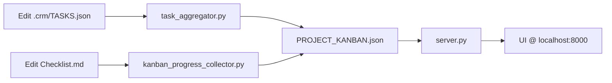

# CRM Consolidated Rules v1.0

> **Единый свод правил и договорённостей для Nexy CRM (Phase 3–5)**

---

## A) Source of Truth

| Артефакт | Путь | Назначение |
|:---------|:-----|:-----------|
| **Master Data** | `Docs/PROJECT_KANBAN.json` | Epics, Cards, Releases |
| **Registry** | `Docs/CRM_INSTRUCTION_REGISTRY.md` | Index инструкций (INS-XXX) |
| **Standard** | `Docs/CRM_MASTER_INSTRUCTION.md` | Шаблон документации |
| **Assistant Guide** | `Docs/CRM_ASSISTANT_INSTRUCTIONS.md` | Как ассистенты создают задачи |

---

## B) Contracts

### JSON Schema (`PROJECT_KANBAN.json`)
```json
{
  "meta": {},      // Required
  "config": {},    // Required
  "epics": [],     // Required
  "cards": [],     // Required
  "releases": []   // Required
}
```

### Registry Format
```markdown
| **INS-XXX** | Title | [File](./path) | Description |
```
- ID: `INS-XXX` (bold или plain)
- Path: Markdown link относительно `Docs/`

### Card Fields
| Field | Type | Required | Description |
|:------|:-----|:---------|:------------|
| `id` | string | ✅ | Unique ID (NEXY-XXX, CLI-XXX, SRV-XXX) |
| `workspace` | string | ❌ | Code territory: `client` / `server` / `null` (master) |
| `created_by` | string | ✅ | Assistant who created: `Antigravity` / `Cursor` / `Codex` |
| `modified_by` | string | ✅ | Assistant who last modified |
| `updated_at` | ISO date | ✅ | Last modification timestamp |
| `registry_ref` | string | ❌ | Link to INS-XXX for progress sync |
| `file_path` | string | ❌ | Relative path for "Open File" |

---

## C) Security

| Rule | Implementation |
|:-----|:---------------|
| No Shell Execution | `shlex.split()` + `subprocess.run(list)` |
| Path Traversal Block | `os.path.normpath()` + `startswith(ROOT)` |
| JSON Validation | Schema check before `/api/save` |
| No `/api/exec` | Disabled by policy |

---

## D) Scripts & APIs

### `server.py` (Bridge)
| Endpoint | Method | Description |
|:---------|:-------|:------------|
| `/` | GET | Serve UI |
| `/api/data` | GET | Return master JSON |
| `/api/save` | POST | Validate & save JSON |
| `/api/open_file` | POST | Open file in `CRM_EDITOR_CMD` |
| `/api/create_release` | POST | Archive cards, generate CHANGELOG |

### `kanban_progress_collector.py`
- Resolves `registry_ref` → file path via Registry
- Counts `[x]` / `[ ]` checkboxes
- Updates `progress` (%) and `evidence` (list)

### `task_aggregator.py` (Phase 5)
- Scans `client/.crm/TASKS.json` + `server/.crm/TASKS.json`
- Merges into master by `id + workspace` key
- Respects `updated_at` (newer wins)
- Never deletes master cards

---

## E) Federated Workspaces (Phase 5)

### Structure
```
Fix_new/
├── client/.crm/TASKS.json   ← CLI-XXX tasks
├── server/.crm/TASKS.json   ← SRV-XXX tasks
└── Docs/PROJECT_KANBAN.json ← Master (aggregated)
```

### Merge Rules
1. **Key**: `id` + `workspace`
2. **Update**: If local `updated_at` > master → update master
3. **Create**: New IDs are added
4. **No Delete**: Master cards without workspace are protected
5. **Isolation**: Each workspace only affects its own cards

### ID Prefixes
| Workspace | Prefix | Example |
|:----------|:-------|:--------|
| Master (Fix_new) | `NEXY-` | NEXY-001 |
| Client | `CLI-` | CLI-001 |
| Server | `SRV-` | SRV-001 |

---

## F) Workflow Summary



---

## G) Verification Checklist

- [ ] `server.py` запущен на :8000
- [ ] `/api/save` отклоняет невалидный JSON
- [ ] `/api/open_file` использует `CRM_EDITOR_CMD`
- [ ] `kanban_progress_collector.py` обновляет `progress`
- [ ] `task_aggregator.py` мержит workspace-задачи
- [ ] UI показывает workspace badge и фильтры
