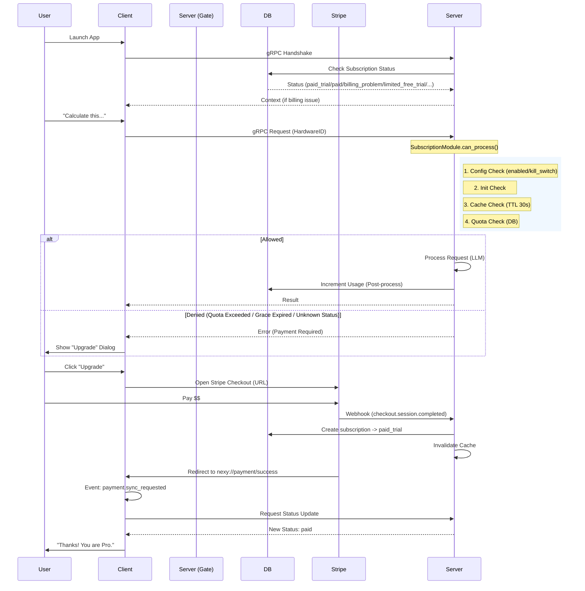

# Payment System Logic & Schema (As Implemented)

See: Docs/PAYMENT_UPDATE_CONTROLLER.md for command/fallback governance.
See: Docs/PAYMENT_REQUIREMENTS.md for ownership and server-only speech rules.

## 1. Architecture Overview (High-Level)

Система работает по принципу **Centralized Source of Truth** (Server) с реактивным клиентом.

*   **Server (`SubscriptionModule`):** Единственный владелец логики. Решает "Можно ли обработать запрос?" (`can_process`). Управляет квотами и статусами.
*   **Stripe:** Платёжный шлюз. Хранит данные карт, проводит списания.
*   **Client (`PaymentIntegration`):** Тонкий клиент. Не считает квоты. Только отображает статус (через EventBus) и перенаправляет на оплату.

### Data Flow Diagram

---

## 2. Логика Проверок (The Gate Logic)

Вся логика сосредоточена в методе `SubscriptionModule.can_process(hardware_id)`.

Порядок проверок (Waterfall):

1.  **Config Check:** если `SubscriptionConfig.enabled=False` или `kill_switch=True` → доступ разрешён (**Fail-Open**, reason=`subscription_disabled`).
2.  **Initialization Check:** если модуль включен, но не инициализирован → логируется ошибка, доступ разрешён (**Fail-Open**).
3.  **Cache Check:** in-memory кэш с TTL (`cache_ttl_seconds`). Если есть свежий результат → возврат из кэша.
4.  **Quota/Status Check (DB):**
    *   **Запрос в БД:** получаем текущий `status` и счетчики использования.
    *   **Status Logic (как в коде):**
        *   `paid_trial`, `paid`, `admin_active`, `grandfathered`: **ALLOWED** (безлимит).
        *   `billing_problem`:
            *   если `grace_period_end_at > now` → **ALLOWED** (`reason='grace_period_active'`)
            *   иначе → **DENIED** (`reason='grace_period_expired'`)
        *   `limited_free_trial`: проверка квот:
            *   `daily_used >= limit` → **DENIED** (`reason='daily_limit_exceeded'`)
            *   `weekly_used >= limit` → **DENIED** (`reason='weekly_limit_exceeded'`)
            *   `monthly_used >= limit` → **DENIED** (`reason='monthly_limit_exceeded'`)
            *   иначе → **ALLOWED** (`reason='within_quota'`)
        *   неизвестный статус → **DENIED** (`reason='unknown_status'`)
    *   **Нет записи в БД:** **ALLOWED** (`reason='new_user'`), запись создаётся позже через webhook.
5.  **Result Caching:** кэшируются только **ALLOWED** результаты.

---

## 3. Quota Management (Счетчики)

Для пользователей в статусе `limited_free_trial` действуют лимиты.

**Default Limits (Config):**
*   **Daily:** 5 запросов
*   **Weekly:** 25 запросов
*   **Monthly:** 50 запросов

**Сброс Квот (Scheduler):**
*   **Daily Reset:** Каждую ночь в 00:05 (локальное время сервера).
*   **Weekly Reset:** Каждый понедельник в 00:05.
*   **Monthly Reset:** 1-го числа каждого месяца в 00:05.

*После сброса кэш всех пользователей инвалидируется.*

---

## 4. Payment Lifecycle (Смена Статусов)

Как пользователь переходит между состояниями:

1.  **New User:** при первом запросе запись **не создаётся**. Gate возвращает `allowed=True` с `reason='new_user'`.
2.  **Trial / First Payment:**
    *   `checkout.session.completed` → если записи нет, создаётся `paid_trial`.
3.  **Paid:**
    *   `invoice.payment_succeeded` → статус `paid`.
4.  **Payment Failure:**
    *   `invoice.payment_failed` → статус `billing_problem` + `grace_period_end_at`.
    *   Пока grace не истёк → **ALLOWED**.
    *   После grace → `grace_period_check` переводит статус в `limited_free_trial`.
5.  **Subscription Updated/Deleted:**
    *   `customer.subscription.updated`:
        *   `active` → `paid`
        *   `past_due|unpaid` → `billing_problem`
        *   `canceled|incomplete_expired` → `limited_free_trial`
    *   `customer.subscription.deleted` → `limited_free_trial`

---

## 5. Client Integration Details

Клиент (`PaymentIntegration.py`) работает реактивно.

*   **Deep Links:**
    *   `nexy://payment/success` → публикует `payment.sync_requested`.
    *   `nexy://payment/cancel` → показывает уведомление об отмене.
    *   `nexy://payment/billing_problem` → показывает ошибку оплаты.
*   **EventBus:**
    *   Слушает `subscription.status_updated`.
    *   Обновляет локальный `cached_status` (UI кэш).
    *   Также запрашивает sync при `grpc.connected`.

---

## 6. Ключевые файлы (Code Reference)

*   **Logic Core:** `server/server/modules/subscription/subscription_module.py`
*   **Limits:** `server/server/modules/subscription/core/quota_checker.py`
*   **Config:** `server/server/config/unified_config.py` (`SubscriptionConfig`)
*   **Client:** `client/integration/integrations/payment_integration.py`

---

## 7. Fallbacks & Customer Portal (User Experience)

### Payment Failure / Quota Exceeded
*   **Audio Response:** отсутствует. Сервер возвращает ошибку (без генерации аудио).
*   **Error Code:** `PERMISSION_DENIED` (или аналог в gRPC ответе).
*   **Client Handling:** UI должен показать диалог “Upgrade”, когда gate вернул deny.

### Customer Portal (Managing Payment Methods)
To allow users to update their credit card or view billing history:
1.  **Service Layer:** `StripeService.create_portal_session(customer_id)` exists. It generates a temporary link to the Stripe-hosted portal.
2.  **API Gap:** Currently, **there is no API endpoint** (e.g., `POST /api/subscription/portal`) exposed in `main.py` to trigger this.
3.  **Implementation Required:**
    *   **Server:** Add `POST /api/subscription/portal` -> calls `subscription_module.create_portal_session`.
    *   **Client:** Button "Manage Subscription" -> calls API -> opens returned URL in browser.
