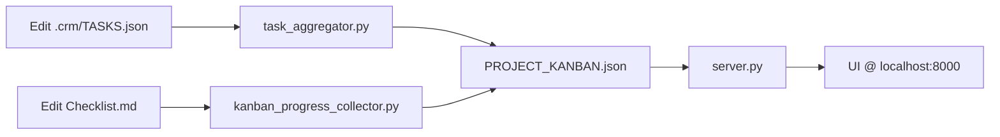
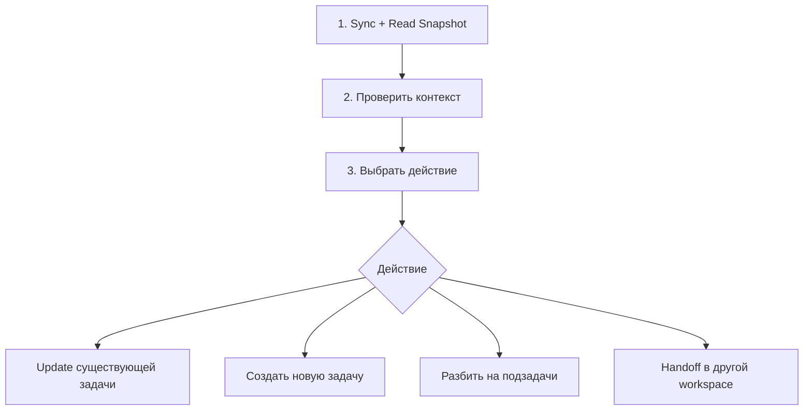
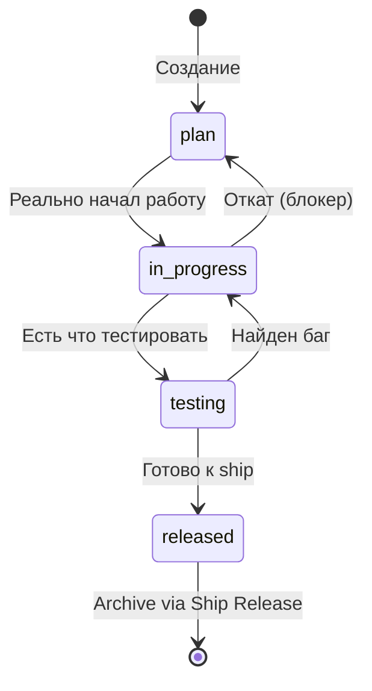
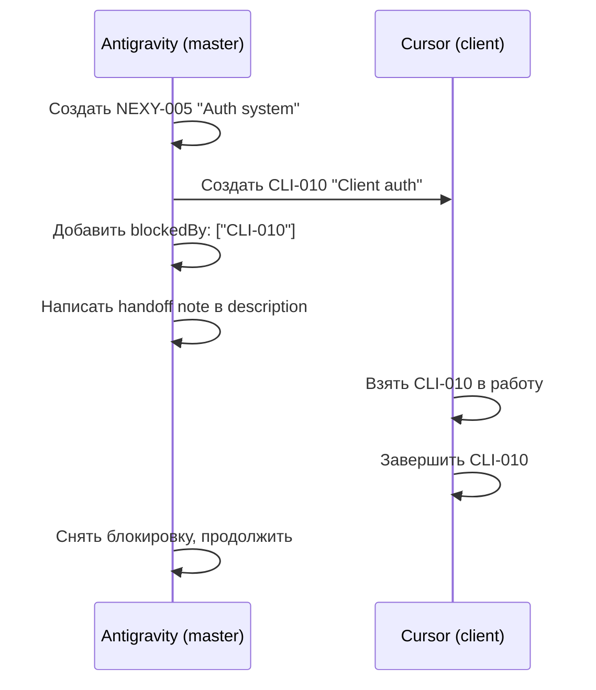
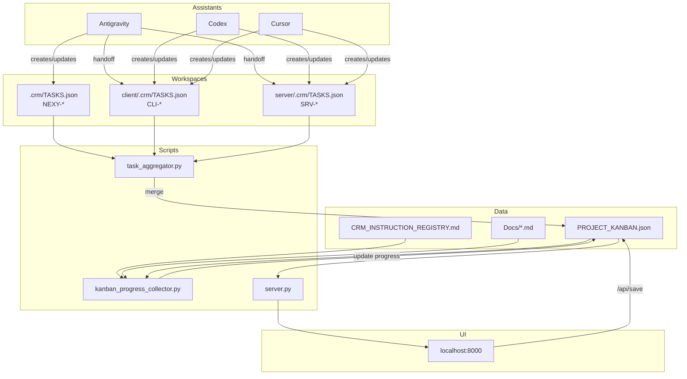
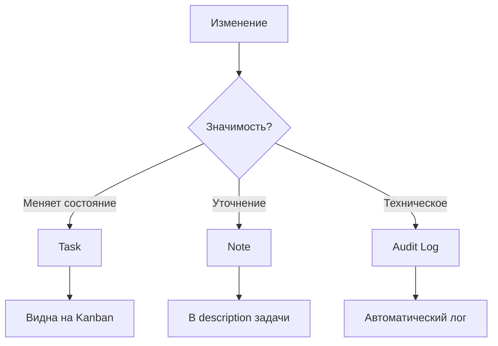

# CRM Consolidated Rules v2.0

> **Единый свод правил и договорённостей для Nexy CRM**
> **Принцип: CRM = Control Plane состояния проекта, а не журнал активности**

---

## 🚀 TL;DR — Ключевые правила для ассистентов

### Главная идея
CRM отвечает на вопросы: **где мы**, **что важно**, **что блокирует**, **что требует внимания**.  
Не фиксируем каждое действие — фиксируем изменения состояния.

### Когда создавать задачу ✅
- Влияет на поведение продукта / код / архитектуру
- Требует координации между workspace
- Занимает > 30–60 минут
- Имеет блокеры или зависимости
- Требует тестирования или релиза
- Является deliverable (не просто действие)

### Когда НЕ создавать задачу ❌
- Просто создан или подправлен документ без влияния
- Исправлена опечатка / формат
- Прочитан файл
- Вспомогательное действие внутри текущей задачи
- → Используй **Note** в description или **Audit log**

### Обязательный цикл
1. **Прочитать snapshot** (`PROJECT_KANBAN.json`)
2. **Проверить блокеры** (`blockedBy`)
3. **Только потом** — действовать

### Границы workspace
- Редактируй только свои задачи (`CLI-*` / `SRV-*` / `NEXY-*`)
- Меж-workspace работа = **handoff** с явным контекстом
- Никогда не меняй `id`, `created_by`

### При обнаружении аномалии
**СТОП** → Создать `NEXY-XXX | type: problem` → Описать проблему

---


## A) Source of Truth

| Артефакт | Путь | Назначение |
|:---------|:-----|:-----------|
| **Master Data** | `Docs/PROJECT_KANBAN.json` | Epics, Cards, Releases |
| **Registry** | `Docs/CRM_INSTRUCTION_REGISTRY.md` | Index инструкций (INS-XXX) |
| **Standard** | `Docs/CRM_MASTER_INSTRUCTION.md` | Шаблон документации |
| **Assistant Guide** | `Docs/CRM_ASSISTANT_INSTRUCTIONS.md` | Как ассистенты создают задачи |

---

## B) Contracts

### JSON Schema (`PROJECT_KANBAN.json`)
```json
{
  "meta": {},      // Required
  "config": {},    // Required
  "epics": [],     // Required
  "cards": [],     // Required
  "releases": []   // Required
}
```

### Registry Format
```markdown
| **INS-XXX** | Title | [File](./path) | Description |
```
- ID: `INS-XXX` (bold или plain)
- Path: Markdown link относительно `Docs/`

### Card Fields
| Field | Type | Required | Description |
|:------|:-----|:---------|:------------|
| `id` | string | ✅ | Unique ID (NEXY-XXX, CLI-XXX, SRV-XXX) |
| `workspace` | string | ❌ | Code territory: `client` / `server` / `null` (master) |
| `created_by` | string | ✅ | Assistant who created: `Antigravity` / `Cursor` / `Codex` |
| `modified_by` | string | ✅ | Assistant who last modified |
| `updated_at` | ISO date | ✅ | Last modification timestamp |
| `registry_ref` | string | ❌ | Link to INS-XXX for progress sync |
| `file_path` | string | ❌ | Relative path for "Open File" |

---

## C) Security

| Rule | Implementation |
|:-----|:---------------|
| No Shell Execution | `shlex.split()` + `subprocess.run(list)` |
| Path Traversal Block | `os.path.normpath()` + `startswith(ROOT)` |
| JSON Validation | Schema check before `/api/save` |
| No `/api/exec` | Disabled by policy |

---

## D) Scripts & APIs

### `server.py` (Bridge)
| Endpoint | Method | Description |
|:---------|:-------|:------------|
| `/` | GET | Serve UI |
| `/api/data` | GET | Return master JSON |
| `/api/save` | POST | Validate & save JSON |
| `/api/open_file` | POST | Open file in `CRM_EDITOR_CMD` |
| `/api/create_release` | POST | Archive cards, generate CHANGELOG |

### `kanban_progress_collector.py`
- Resolves `registry_ref` → file path via Registry
- Counts `[x]` / `[ ]` checkboxes
- Updates `progress` (%) and `evidence` (list)

### `task_aggregator.py` (Phase 5)
- Scans `client/.crm/TASKS.json` + `server/.crm/TASKS.json`
- Merges into master by `id + workspace` key
- Respects `updated_at` (newer wins)
- Never deletes master cards

---

## E) Federated Workspaces (Phase 5)

### Structure
```
Fix_new/
├── client/.crm/TASKS.json   ← CLI-XXX tasks
├── server/.crm/TASKS.json   ← SRV-XXX tasks
└── Docs/PROJECT_KANBAN.json ← Master (aggregated)
```

### Merge Rules
1. **Key**: `id` + `workspace`
2. **Update**: If local `updated_at` > master → update master
3. **Create**: New IDs are added
4. **No Delete**: Master cards without workspace are protected
5. **Isolation**: Each workspace only affects its own cards

### ID Prefixes
| Workspace | Prefix | Example |
|:----------|:-------|:--------|
| Master (Fix_new) | `NEXY-` | NEXY-001 |
| Client | `CLI-` | CLI-001 |
| Server | `SRV-` | SRV-001 |

---

## F) Workflow Summary



---

## G) Verification Checklist

- [ ] `server.py` запущен на :8000
- [ ] `/api/save` отклоняет невалидный JSON
- [ ] `/api/open_file` использует `CRM_EDITOR_CMD`
- [ ] `kanban_progress_collector.py` обновляет `progress`
- [ ] `task_aggregator.py` мержит workspace-задачи
- [ ] UI показывает workspace badge и фильтры

---

## H) Обязательный цикл работы ассистента

> **Перед любыми изменениями** ассистент обязан выполнить этот цикл:



### Шаги цикла

| Шаг | Действие | Файлы |
|:----|:---------|:------|
| **1. Sync + Read** | Прочитать master snapshot | `Docs/PROJECT_KANBAN.json` |
| **2. Check** | Проверить активную задачу, блокеры, связанные документы | `blockedBy`, `responsible_docs`, `registry_ref` |
| **3. Act** | Выбрать и выполнить действие | Соответствующий `TASKS.json` |

> [!CAUTION]
> **Запрещено** менять задачи "вслепую" без чтения snapshot!

---

## I) Правила владения (Ownership)

### Границы редактирования

| Ассистент | Может редактировать | Может создавать |
|:----------|:--------------------|:----------------|
| **Codex (client)** | `CLI-*` | `CLI-*` |
| **Codex (server)** | `SRV-*` | `SRV-*` |
| **Antigravity** | `NEXY-*` + задачи где назначен | `NEXY-*`, `CLI-*`, `SRV-*` (с handoff) |
| **Cursor** | По workspace контексту | По workspace контексту |

### Запрещено

- ❌ Править задачи другого workspace (кроме handoff)
- ❌ Менять чужие `created_by`
- ❌ Менять `id` задачи

---

## J) Контракты создания/обновления

### J.1 Создание задачи

**Required fields:**
```json
{
    "id": "CLI-003",
    "title": "Fix audio callback",
    "status": "plan",
    "created_by": "Codex",
    "modified_by": "Codex",
    "updated_at": "2026-01-08T12:00:00-05:00",
    "workspace": "client"
}
```

**Strongly recommended:**
```json
{
    "priority": "P1",
    "epicId": "EPIC-MVP",
    "description": "## Проблема\n...\n## Следующие шаги\n...",
    "responsible_docs": [{"path": "Docs/ARCHITECTURE_OVERVIEW.md", "type": "reference"}],
    "file_path": "client/audio/callback.py",
    "blockedBy": [],
    "registry_ref": "INS-007"
}
```

### J.2 Обновление задачи

**Обязательно при изменении:**
1. `modified_by` — имя ассистента
2. `updated_at` — текущее время ISO 8601
3. `description` — что сделано / что дальше / блокеры

**Никогда не менять:**
- `id`
- `created_by`

### J.3 Переходы статусов



---

## K) Definition of Done (DoD)

### Обязательные поля для P0/P1

```json
{
    "acceptance_criteria": [
        "Audio callback вызывается при получении данных",
        "Нет утечек памяти",
        "Логи не содержат ошибок"
    ],
    "test_plan": "1. Запустить приложение\n2. Активировать микрофон\n3. Проверить логи",
    "definition_of_done": "Все acceptance_criteria выполнены, тесты пройдены"
}
```

> [!IMPORTANT]
> Если этих полей нет — создать подзадачу "Дополнить критерии/план теста" и выполнить её первой!

---

## L) Связь с документацией

### Когда обязательно указывать `responsible_docs`

Задача влияет на:
- ✅ Архитектуру
- ✅ Правила ассистентов  
- ✅ Поведение системы
- ✅ Критичный баг

### Формат

```json
{
    "responsible_docs": [
        {
            "path": "Docs/STATE_CATALOG.md",
            "type": "source_of_truth",
            "description": "Оси состояния"
        },
        {
            "path": "config/unified_config.yaml",
            "type": "control",
            "description": "Feature flags"
        }
    ]
}
```

### Типы документов

| Type | Назначение | Примеры |
|:-----|:-----------|:--------|
| `source_of_truth` | Источник истины | `STATE_CATALOG.md`, `unified_config.yaml` |
| `control` | Контролирующие правила | `interaction_matrix.yaml`, `PROJECT_REQUIREMENTS.md` |
| `reference` | Справочные | `ARCHITECTURE_OVERVIEW.md` |
| `instruction` | Инструкции | `INS-XXX` из реестра |

---

## M) Подзадачи и декомпозиция

### Когда разбивать

- Задача > 1–2 часов работы
- 2+ независимых направлений

### Формат подзадач

```json
{
    "subtasks": [
        {
            "title": "Design architecture",
            "status": "released",
            "workspace": "master",
            "assigned_to": "Antigravity"
        },
        {
            "title": "Implement client-side",
            "status": "in_progress",
            "workspace": "client",
            "assigned_to": "Cursor"
        }
    ]
}
```

### Правила

- 3–9 подзадач на задачу
- Каждая — "проверяемый результат"
- Подзадачи можно распределять между workspace

---

## N) Handoff между workspace

### Процесс передачи



### Handoff Note (обязательно)

```markdown
## Handoff to Client Workspace

**Контекст:** Нужна реализация клиентской авторизации
**Файлы:** `client/auth/`, `client/config/`
**Критерии готовности:** 
- [ ] Login flow работает
- [ ] Token хранится безопасно
**Что уже сделано:** Архитектура спроектирована в NEXY-005
```

---

## O) Работа с блокерами

### Правила

1. ❌ Заблокированную задачу **нельзя** переводить в `in_progress`
2. При блокировке — одно из действий:
   - Взять blocker-задачу самому
   - Создать новую blocker-задачу
   - Эскалировать в master как "decision needed"

### Пример эскалации

```json
{
    "id": "NEXY-010",
    "title": "Decision Needed: Auth approach",
    "status": "plan",
    "priority": "P0",
    "description": "## Требуется решение\n\nCLI-010 заблокирован — нужно выбрать подход к авторизации.\n\n**Варианты:**\n1. OAuth2\n2. API Key\n\n**Blocker for:** CLI-010, SRV-008"
}
```

---

## P) Самодиагностика ошибок

### Типы проблем для детекции

| Проблема | Действие |
|:---------|:---------|
| Конфликт статусов | Создать `NEXY-*` "CRM Fix" |
| Отсутствующий `registry_ref` | Создать `NEXY-*` "Data Integrity" |
| Битый `file_path` | Исправить путь или удалить |
| Циклы в `blockedBy` | Создать `NEXY-*` "Dependency Cycle" |
| Несоответствие ID и workspace | Исправить workspace |

### При обнаружении проблемы

1. **Остановиться** — не продолжать изменения
2. **Создать задачу** — `NEXY-*` "CRM Fix / Data Integrity"
3. **Описать** — проблему и предложить исправление

---

## Q) Матрица взаимодействия компонентов



### Потоки данных

| Поток | Источник | Назначение | Триггер |
|:------|:---------|:-----------|:--------|
| Создание задачи | Assistant | `TASKS.json` | Ручное действие |
| Агрегация | `TASKS.json` (all) | `PROJECT_KANBAN.json` | Каждые 5 мин / manual |
| Синхронизация прогресса | `registry_ref` → Docs | `progress`, `evidence` | `kanban_progress_collector.py` |
| UI → Backend | Browser | `PROJECT_KANBAN.json` | `/api/save` |
| Open File | UI | Editor | `/api/open_file` |

---

## R) Минимальный формат Update Note

При обновлении `description` — достаточно:

```markdown
**Что сделал:**
- Реализовал callback handler
- Добавил логирование

**Что дальше:**
- Интегрировать с audio pipeline
- Написать тесты

**Блокеры:** нет
```

---

## S) Noise Control Policy

> **Принцип:** CRM = Control Plane состояния, не журнал активности.

### Задача создаётся ТОЛЬКО если

| Критерий | Пример |
|:---------|:-------|
| Влияет на поведение продукта/код/архитектуру | Новый модуль, фикс бага |
| Требует координации между workspace | Client + Server взаимодействие |
| Занимает > 30–60 минут | Рефакторинг, новая фича |
| Имеет блокеры или зависимости | Ждёт другую задачу |
| Требует тестирования или релиза | QA, deploy |
| Вводит решение / риск / цель | Архитектурное решение |
| Является deliverable | Конечный результат |

### Задача НЕ создаётся если

- ❌ Просто создан/подправлен документ без влияния
- ❌ Исправлена опечатка / формат
- ❌ Прочитан файл
- ❌ Вспомогательное действие внутри текущей задачи

→ Используй **Note** в description или **Audit log**.

### WIP-лимиты (Work In Progress)

> [!IMPORTANT]
> В каждом workspace допускается не более:
> - **1 задачи** со статусом `in_progress`
> - **1 задачи** со статусом `testing`

Это:
- удерживает фокус,
- предотвращает параллельную "расползшуюся" работу,
- делает snapshot читаемым.

### Правило "Одна причина — одна задача"

> Если в задаче более одной независимой причины/цели — ассистент **обязан** разделить её на подзадачи или отдельные задачи.

**Почему:**
- DoD размывается
- Прогресс становится нечестным
- Блокеры становятся неуправляемыми

### Запрет "тихих фиксов"

> [!CAUTION]
> Ассистенту **запрещено** вносить исправления в данные CRM без создания задачи `type: problem`, если исправление связано с нарушением правил или инвариантов.

Никаких "я тут чуть подправил".

---

## T) Entity Types

### Типы сущностей

CRM поддерживает не только tasks, но и другие типы для моделирования состояния проекта:

```json
{
    "type": "task | goal | problem | risk | decision"
}
```

| Type | Назначение | Отображение |
|:-----|:-----------|:------------|
| `task` | Конкретная работа | Kanban доска |
| `goal` | Стратегическая цель | Project Snapshot |
| `problem` | Текущая проблема | Project Snapshot + Alerts |
| `risk` | Потенциальный риск | Project Snapshot |
| `decision` | Принятое решение | Project Snapshot + History |

### Инвариант для `decision`

> [!WARNING]
> Тип `decision` имеет особые правила:

- ❌ НЕ имеет статуса `in_progress`
- ✅ Всегда `plan` → `released`
- ✅ После `released` **не меняется** — только новая `decision`

Это критично для истории решений и предотвращает "переписывание прошлого".

### Пример

```json
{
    "id": "NEXY-015",
    "type": "problem",
    "title": "CRM Data Inconsistency in blockedBy",
    "status": "plan",
    "priority": "P1",
    "description": "Обнаружены циклические зависимости в блокерах"
}
```

---

## U) Project Snapshot Contract

### Структура snapshot

```json
{
    "project_state": {
        "focus": "client | server | master",
        "active_goals": ["NEXY-001", "NEXY-005"],
        "current_problems": ["NEXY-015"],
        "current_risks": ["NEXY-020"],
        "top_blockers": [
            {"task": "CLI-010", "blocked_by": "NEXY-001", "impact": "high"}
        ],
        "last_sync_at": "2026-01-08T12:00:00-05:00"
    }
}
```

### Правило Snapshot Enforcement

> [!CAUTION]
> **Ассистент НЕ начинает работу, не прочитав snapshot.**

Это решает рассинхрон между ассистентами.

### Генерация snapshot

Snapshot генерируется автоматически `task_aggregator.py` на основе:
- Задач с `type: goal | problem | risk`
- Задач с `priority: P0`
- Всех блокировок (`blockedBy`)

### Что НЕ попадает в snapshot

- ❌ Notes (в description)
- ❌ Audit entries
- ❌ Подзадачи (subtasks)
- ❌ Задачи с `priority: P3`
- ❌ Задачи без блокеров и без влияния на текущий фокус

Это защищает snapshot от раздувания.

---

## V) Three-Level Change Tracking

### Уровни фиксации изменений



| Уровень | Что фиксируем | Где хранится | Видимость |
|:--------|:--------------|:-------------|:----------|
| **Task** | Изменение состояния проекта | `TASKS.json`, Kanban | Высокая |
| **Note** | Промежуточные решения, уточнения | `description` задачи | Средняя |
| **Audit** | Технические правки, служебные апдейты | `audit_log` (append-only) | Низкая |

### Примеры

**Task:**
```json
{"id": "CLI-015", "title": "Implement new audio callback", "type": "task"}
```

**Note** (в description задачи):
```markdown
**2026-01-08:** Уточнили формат данных с сервером. Решили использовать protobuf.
```

**Audit** (автоматически):
```json
{"timestamp": "2026-01-08T12:00:00Z", "action": "update", "field": "status", "old": "plan", "new": "in_progress"}
```

---

## W) Data Reliability

### Минимальные требования надёжности

| Механизм | Назначение | Реализация |
|:---------|:-----------|:-----------|
| **revision** | Версионирование | `meta.revision: 42` на master и карточках |
| **conflict detection** | Обнаружение конфликтов | HTTP 409 при `revision mismatch` |
| **atomic write** | Атомарная запись | Write to temp → rename |
| **backup** | Резервное копирование | Backup before save |
| **audit log** | История изменений | Append-only log file |

### Формат revision

```json
{
    "meta": {
        "version": "2.1.0",
        "revision": 42,
        "updated_at": "2026-01-08T12:00:00-05:00"
    }
}
```

### Conflict Detection

При сохранении через `/api/save`:
1. Клиент отправляет `revision` которую видит
2. Сервер сравнивает с текущей
3. Если `client_revision < server_revision` → **HTTP 409 Conflict**
4. Клиент должен перечитать данные и повторить

### Поведение ассистента при HTTP 409

> [!IMPORTANT]
> При получении HTTP 409 ассистент **обязан**:

1. **Перечитать snapshot** — данные изменились
2. **Повторно оценить актуальность** — действие может быть уже неактуально
3. **Может отказаться от действия** — если контекст изменился

Не "любой ценой сохранить", а **осознанно продолжить**.

### Atomic Write

```python
# Псевдокод
def save_kanban(data):
    temp_path = f"{kanban_path}.tmp"
    backup_path = f"{kanban_path}.bak"
    
    # 1. Backup
    shutil.copy(kanban_path, backup_path)
    
    # 2. Write to temp
    with open(temp_path, 'w') as f:
        json.dump(data, f)
    
    # 3. Atomic rename
    os.rename(temp_path, kanban_path)
```

---

## X) Document ↔ Task Bidirectional Link

### Задача знает свои документы

```json
{
    "responsible_docs": [
        {"path": "Docs/ARCHITECTURE_OVERVIEW.md", "type": "source_of_truth"}
    ]
}
```

### Документ знает свои задачи (meta-блок)

```markdown
---
crm_meta:
  supports_tasks: ["NEXY-001", "CLI-015"]
  type: source_of_truth
  last_reviewed: 2026-01-08
---

# Document Title
...
```

### Связь делает документацию живой

Система может показать:
- "Этот документ отвечает за эти задачи"
- "Эта задача зависит от этих документов"

---

## Y) Lifecycle & Housekeeping Policy

> **Принцип:** Не удаление, а архивация + ротация + пометка с причиной.

### Типы накопления и методы

| Тип | Проблема | Решение |
|:----|:---------|:--------|
| Старые задачи | released давно не трогали | Archive via Release |
| Мусорные черновики | plan без DoD/owner/движения | Stale → Backlog |
| Шум в audit log | Много записей | Ротация |
| Битые ссылки | Несуществующие docs/files | Problem задача |

### TTL-политика (Time To Live)

| Статус | Условие | Действие |
|:-------|:--------|:---------|
| `released` | — | Архивировать через Ship Release |
| `testing` | Без апдейтов > 14 дней | Alert "stale testing" |
| `in_progress` | Без апдейтов > 7 дней | → `plan` + note "stale" |
| `plan` | Без апдейтов > 30 дней | → `archived: true` |

> [!IMPORTANT]
> Никогда не **delete** — только **archive/move** + пометка причины.

### Поля lifecycle

```json
{
    "archived": true,
    "archived_at": "2026-01-08T12:00:00-05:00",
    "archive_reason": "stale_plan_30d",
    
    "stale": true,
    "stale_since": "2026-01-01T12:00:00-05:00",
    "stale_reason": "no_updates_7d"
}
```

| Поле | Тип | Назначение |
|:-----|:----|:-----------|
| `archived` | bool | Задача в архиве |
| `archived_at` | ISO date | Когда архивирована |
| `archive_reason` | string | Причина: `stale_plan_30d`, `manual`, `released` |
| `stale` | bool | Задача "застоялась" |
| `stale_since` | ISO date | С какого момента stale |
| `stale_reason` | string | Причина: `no_updates_7d`, `no_dod`, `no_owner` |

### UI-фильтрация (рекомендация)

**По умолчанию показывать:**
- Всё `in_progress`, `testing`
- `plan` только если:
  - `priority: P0/P1`, или
  - имеет `blockedBy`, или
  - обновлялась в последние 14 дней

**Отдельная вкладка:** "Backlog/Archived"

### `crm_housekeeper.py` — спецификация

Скрипт запускается **вручную или по расписанию**, делает только безопасные действия:

```python
# Псевдологика

def run_housekeeper():
    tasks = load_all_tasks()
    problems = []
    
    for task in tasks:
        # 1. Проверка stale
        if task.status == 'in_progress' and days_since(task.updated_at) > 7:
            task.stale = True
            task.stale_since = now()
            task.stale_reason = 'no_updates_7d'
            task.status = 'plan'  # return to plan
            add_note(task, "Auto-marked stale: no updates 7d")
        
        if task.status == 'plan' and days_since(task.updated_at) > 30:
            task.archived = True
            task.archived_at = now()
            task.archive_reason = 'stale_plan_30d'
        
        # 2. Проверка битых ссылок
        for doc in task.responsible_docs:
            if not file_exists(doc.path):
                problems.append({
                    'type': 'broken_responsible_doc',
                    'task': task.id,
                    'path': doc.path
                })
        
        if task.file_path and not file_exists(task.file_path):
            problems.append({
                'type': 'broken_file_path',
                'task': task.id,
                'path': task.file_path
            })
    
    # 3. Создать NEXY-* problem если есть нарушения
    if problems:
        create_problem_task(
            title="CRM Link Rot / Broken References",
            description=format_problems(problems)
        )
    
    save_all_tasks(tasks)
    log_to_audit(action='housekeeper_run', problems_found=len(problems))
```

> [!CAUTION]
> Housekeeper **никогда не удаляет** карточки автоматически.

### Ротация Audit Log

Audit log = append-only, но не бесконечный.

**Механизм ротации:**
```
CRM_AUDIT_LOG.ndjson
  → CRM_AUDIT_LOG.2026-01.ndjson.gz  (monthly archive)
```

Плюс агрегированные daily summaries:
```
Docs/audit/AUDIT_SUMMARY_2026-01-08.md
```

### Конфигурация housekeeping

В `meta` секции `PROJECT_KANBAN.json`:

```json
{
    "meta": {
        "housekeeping": {
            "stale_in_progress_days": 7,
            "stale_testing_days": 14,
            "stale_plan_days": 30,
            "default_visible_plan_days": 14,
            "audit_rotate_days": 30
        }
    }
}
```

---

## AA) UI Specification

### Иконки типов задач

| Type | Иконка | Где видно |
|:-----|:-------|:----------|
| `task` | 🔧 | Kanban |
| `goal` | 🎯 | Kanban + Snapshot |
| `problem` | ⚠️ | Kanban + Snapshot (alert) |
| `risk` | 🔺 | Snapshot |
| `decision` | 📌 | Snapshot + History |

### Layout карточки (UI)

```
┌─────────────────────────────────────────────────────────────┐
│ 🎯 NEXY-003 | Task Title                            P0 🟣  │
│ Type: goal                                      Epic: MVP  │
├─────────────────────────────────────────────────────────────┤
│ Status: in_progress 🔨      Progress: ████░░░░░░ 33%       │
│ Owner: Antigravity          Updated: 2026-01-08            │
├─────────────────────────────────────────────────────────────┤
│ 🚫 BLOCKED BY:                                              │
│    └─ NEXY-001 (title) — status                            │
├─────────────────────────────────────────────────────────────┤
│ 📋 SUBTASKS:                                                │
│    ✅ Completed subtask                                     │
│    🔨 In progress subtask ← current                        │
│    ⬜ Planned subtask                                       │
├─────────────────────────────────────────────────────────────┤
│ 📄 RESPONSIBLE DOCS:                                        │
│    └─ Docs/file.md (source_of_truth)                       │
├─────────────────────────────────────────────────────────────┤
│ ✅ ACCEPTANCE CRITERIA: (expandable)                        │
├─────────────────────────────────────────────────────────────┤
│ 📝 DESCRIPTION: (expandable with markdown)                  │
├─────────────────────────────────────────────────────────────┤
│ [Open File] [Edit] [Add Note]                              │
└─────────────────────────────────────────────────────────────┘
```

### Snapshot View (агрегированный)

```
┌─────────────────────────────────────────────────────────────┐
│ 📊 PROJECT SNAPSHOT                    Last sync: 12:00 UTC│
├─────────────────────────────────────────────────────────────┤
│ 🎯 ACTIVE GOALS:                                            │
│    └─ NEXY-003: CRM v2.1 Go-Live (33%)                     │
├─────────────────────────────────────────────────────────────┤
│ ⚠️ CURRENT PROBLEMS:                                        │
│    └─ (none)                                                │
├─────────────────────────────────────────────────────────────┤
│ 🔺 RISKS:                                                   │
│    └─ (none)                                                │
├─────────────────────────────────────────────────────────────┤
│ 🚫 TOP BLOCKERS:                                            │
│    └─ NEXY-003 blocked by NEXY-001 (high impact)           │
├─────────────────────────────────────────────────────────────┤
│ 📋 WIP STATUS:                                              │
│    Master: 1/1 in_progress, 0/1 testing                    │
│    Client: 0/1 in_progress, 0/1 testing                    │
│    Server: 0/1 in_progress, 0/1 testing                    │
└─────────────────────────────────────────────────────────────┘
```

---

## Z) Version History

| Version | Date | Changes |
|:--------|:-----|:--------|
| **v1.0** | 2026-01-05 | Initial rules A-G |
| **v2.0** | 2026-01-08 | TL;DR, Workflow H-R, Control Plane S-X |
| **v2.1** | 2026-01-08 | Critical refinements, Lifecycle & Housekeeping Y |
| **v2.2** | 2026-01-08 | UI Specification AA, Go-Live Checklist INS-009 |

