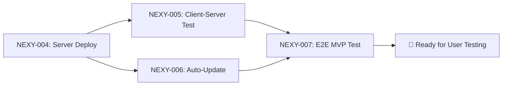

# MVP to User Testing — Roadmap

**Дата:** 2026-01-11
**Цель:** Вывести MVP на тестирование пользователя
**Статус:** 🟡 In Progress

---

## Текущее состояние

### ✅ Завершено

| Область | Статус | Подробности |
|:--------|:-------|:------------|
| **Permissions / TCC** | ✅ Done | Публичный API `AXIsProcessTrustedWithOptions`, TAL hold работает |
| **Клиентская сборка** | ✅ Done | Universal 2, нотаризация, подпись Developer ID |
| **CRM система** | ✅ Done | v2.1, revision/409, audit, snapshot |
| **First-run flow** | ✅ Done | Перезапуск после выдачи разрешений |

### 🟡 В процессе

| Область | Что нужно | Ответственный |
|:--------|:----------|:--------------|
| **Серверная миграция** | Перенести server/ на удалённый сервер | User |
| **Настройка сервера** | nginx, SSL, firewall, системные сервисы | User |
| **Тестирование связки** | Проверить client ↔ server интеграцию | Antigravity |
| **Обновления (Updates)** | Настроить auto-update mechanism | Antigravity |

---

## Новые задачи для CRM

### NEXY-004: Server Deployment
```json
{
  "id": "NEXY-004",
  "type": "task",
  "epicId": "EPIC-MVP",
  "title": "Server Deployment to Remote",
  "status": "plan",
  "priority": "P0",
  "owner": "User",
  "workspace": "master",
  "description": "## Цель\n\nПеренести серверную часть на удалённый сервер.\n\n## Subtasks\n\n1. [ ] Выбрать/подготовить VPS\n2. [ ] Скопировать server/ на VPS\n3. [ ] Настроить Python venv\n4. [ ] Настроить config.env\n5. [ ] Запустить как systemd service\n6. [ ] Настроить nginx reverse proxy\n7. [ ] Настроить SSL (Let's Encrypt)\n8. [ ] Настроить firewall\n\n## Definition of Done\n\nСервер доступен по HTTPS, API отвечает."
}
```

### NEXY-005: Client-Server Integration Test
```json
{
  "id": "NEXY-005",
  "type": "task",
  "epicId": "EPIC-MVP",
  "title": "Client-Server Integration Testing",
  "status": "plan",
  "priority": "P1",
  "owner": "Antigravity",
  "workspace": "master",
  "blockedBy": ["NEXY-004"],
  "description": "## Цель\n\nПроверить корректную работу клиентской части с удалённым сервером.\n\n## Test Scenarios\n\n1. [ ] Голосовое распознавание (streaming)\n2. [ ] Обработка команд\n3. [ ] Обработка ошибок сети\n4. [ ] Reconnect при обрыве\n5. [ ] Latency метрики\n\n## Definition of Done\n\nВсе сценарии проходят, latency < 500ms."
}
```

### NEXY-006: Auto-Update Mechanism
```json
{
  "id": "NEXY-006",
  "type": "task",
  "epicId": "EPIC-MVP",
  "title": "Configure Auto-Update System",
  "status": "plan",
  "priority": "P1",
  "owner": "Antigravity",
  "workspace": "master",
  "blockedBy": ["NEXY-004"],
  "description": "## Цель\n\nНастроить автоматическое обновление клиента.\n\n## Subtasks\n\n1. [ ] Проанализировать server/server/updates/\n2. [ ] Настроить update endpoint на сервере\n3. [ ] Проверить update check в клиенте\n4. [ ] Протестировать полный цикл обновления\n\n## Definition of Done\n\nКлиент проверяет обновления, скачивает и устанавливает."
}
```

### NEXY-007: End-to-End MVP Testing
```json
{
  "id": "NEXY-007",
  "type": "task",
  "epicId": "EPIC-MVP",
  "title": "Full E2E MVP Testing",
  "status": "plan",
  "priority": "P0",
  "owner": "User",
  "workspace": "master",
  "blockedBy": ["NEXY-005", "NEXY-006"],
  "description": "## Цель\n\nПолное тестирование MVP перед выдачей пользователям.\n\n## Test Scenarios\n\n1. [ ] Fresh install (PKG)\n2. [ ] First-run permissions flow\n3. [ ] Voice recognition + command execution\n4. [ ] Auto-update flow\n5. [ ] Crash recovery\n6. [ ] Various macOS versions (12, 13, 14)\n7. [ ] Both architectures (arm64, x86_64)\n\n## Definition of Done\n\nВсе сценарии проходят на минимум 2 устройствах."
}
```

---

## Зависимости



---

## Следующие шаги

1. **Сейчас:** Создать задачи NEXY-004..007 в CRM
2. **User:** Начать NEXY-004 (Server Deployment)
3. **После деплоя:** Выполнить NEXY-005 и NEXY-006 параллельно
4. **Финал:** NEXY-007 (E2E Testing)

---

## Связанные документы

| Документ | Назначение |
|:---------|:-----------|
| `client/RELEASE_CHECKLIST.md` | Чек-лист выпуска клиента |
| `client/PERMISSIONS_REPORT.md` | Статус разрешений |
| `Docs/PROJECT_REQUIREMENTS.md` | Требования к проекту |
| `Docs/PACKAGING_FINAL_GUIDE.md` | Инструкция по упаковке |
| `server/server/updates/` | Модуль обновлений |
