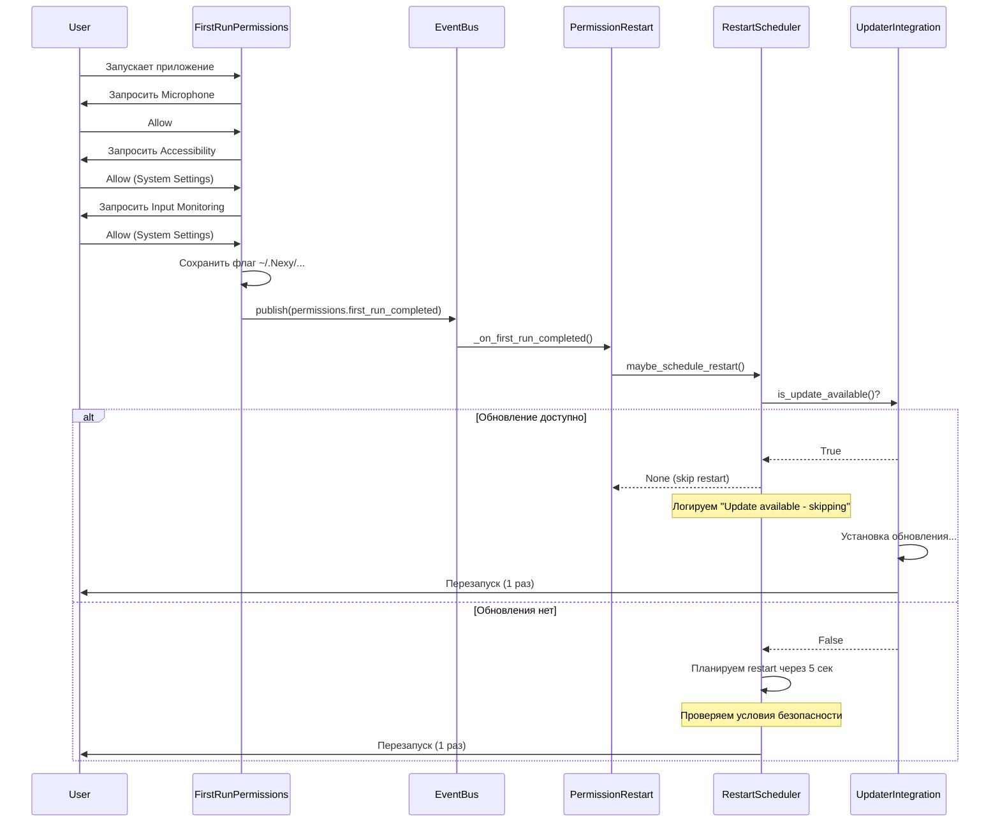

# 🔄 Permission Restart - Полная логика работы

Документация логики автоматического перезапуска после выдачи системных разрешений в Nexy AI Assistant.

**Версия**: 1.0
**Дата**: 2025-01-30
**Авторы**: AI Agent + Development Team

---

## 📋 Оглавление

1. [Общая концепция](#общая-концепция)
2. [Архитектура](#архитектура)
3. [Флаги и конфигурация](#флаги-и-конфигурация)
4. [Поток выполнения](#поток-выполнения)
5. [Взаимодействие с обновлениями](#взаимодействие-с-обновлениями)
6. [Условия перезапуска](#условия-перезапуска)
7. [Edge cases и конфликты](#edge-cases-и-конфликты)
8. [Тестирование](#тестирование)

---

## 🎯 Общая концепция

### Проблема

macOS **не применяет** системные разрешения (Accessibility, Input Monitoring) к уже работающему процессу. После выдачи разрешений через System Settings, они становятся активными только для **НОВОГО** процесса приложения.

**Последствия**:
- ❌ Клавиатура не работает (Input Monitoring не видит текущий процесс)
- ❌ Микрофон может не активироваться корректно
- ❌ Accessibility API не доступен

### Решение

**Автоматический перезапуск** приложения после того как пользователь выдал критические разрешения.

**Критические разрешения** (требуют перезапуска):
- `accessibility` - для мониторинга клавиатуры
- `input_monitoring` - для получения событий клавиш
- `microphone` - для распознавания речи
- `screen_capture` - для захвата экрана

---

## 🏗️ Архитектура

### Компоненты

```
┌─────────────────────────────────────────────────────────┐
│ FirstRunPermissionsIntegration                          │
│ • Запрашивает разрешения при первом запуске             │
│ • Публикует события: permissions.first_run_completed    │
│ • Создаёт флаг: permissions_first_run_completed.flag    │
└──────────────────────┬──────────────────────────────────┘
                       │ EventBus
                       ▼
┌─────────────────────────────────────────────────────────┐
│ PermissionRestartIntegration                            │
│ • Слушает события разрешений                            │
│ • МОНИТОРИНГ: polling каждые 3 сек (после first run)   │
│ • Создаёт синтетические transitions                     │
│ • Делегирует RestartScheduler                           │
└──────────────────────┬──────────────────────────────────┘
                       │
                       ▼
┌─────────────────────────────────────────────────────────┐
│ RestartScheduler                                        │
│ • Проверяет условия безопасности                        │
│ • Координирует с UpdaterIntegration                     │
│ • Планирует и выполняет перезапуск                      │
└──────────────────────┬──────────────────────────────────┘
                       │
                       ▼
┌─────────────────────────────────────────────────────────┐
│ MacOSRestartHandler                                     │
│ • Выполняет: open -a Nexy.app                           │
│ • Завершает: os._exit(0)                                │
└─────────────────────────────────────────────────────────┘
```

### 🆕 Два режима работы

**Режим 1: Первый запуск** (флага нет)
```
FirstRunPermissions → запрос разрешений → событие first_run_completed
                                                        ↓
                                          PermissionRestartIntegration
                                                        ↓
                                              Перезапуск приложения
```

**Режим 2: После первого запуска** (флаг существует)
```
PermissionRestartIntegration → polling каждые 3 сек → обнаружено изменение
                                                                ↓
                                                     синтетическое событие
                                                                ↓
                                                      Перезапуск приложения
```

### Взаимодействие с UpdaterIntegration

```
┌─────────────────────────────────────────────────────────┐
│ UpdaterIntegration                                      │
│ • check_for_updates() → bool                            │
│ • is_update_available() → bool (НОВОЕ)                  │
│ • is_update_in_progress() → bool                        │
└──────────────────────┬──────────────────────────────────┘
                       │ Проверяет
                       ▼
┌─────────────────────────────────────────────────────────┐
│ RestartScheduler._is_update_available()                 │
│ • Если True → НЕ планировать permission restart         │
│ • Обновление уже включает перезапуск                    │
└─────────────────────────────────────────────────────────┘
```

---

## ⚙️ Флаги и конфигурация

### Конфигурация (`unified_config.yaml`)

```yaml
integrations:
  permission_restart:
    enabled: true                      # Включить/выключить механизм
    critical_permissions:              # Разрешения требующие перезапуска
      - microphone
      - accessibility
      - input_monitoring
      - screen_capture
    restart_delay_sec: 5.0            # Задержка перед перезапуском
    max_restart_attempts: 3           # Максимум попыток
    respect_active_sessions: true     # Ждать режима SLEEPING
    respect_updates: true             # Учитывать обновления
```

### Environment Variables

| Variable | Значения | Эффект |
|----------|----------|--------|
| `NEXY_DISABLE_AUTO_RESTART` | `true`, `1`, `yes` | **Dry-run mode** - перезапуск логируется но НЕ выполняется |

### Runtime State

| Флаг | Тип | Источник | Значение |
|------|-----|----------|----------|
| `update_in_progress` | bool | UpdaterIntegration | Идёт установка обновления |
| `update_available` | bool | updater.check_for_updates() | Обновление доступно |
| `current_mode` | AppMode | StateManager | SLEEPING / LISTENING / PROCESSING |
| `restart_pending` | Task | RestartScheduler._pending_task | Перезапуск запланирован |
| `restart_attempts` | int | RestartScheduler._attempts | Счётчик попыток |
| `permissions_first_run_completed.flag` | File | Filesystem | Первый запуск завершён |
| `_monitoring_enabled` | bool | PermissionRestartIntegration | Мониторинг разрешений активен |
| `_monitoring_task` | Task | PermissionRestartIntegration | Фоновая задача polling |
| `_last_known_statuses` | Dict | PermissionRestartIntegration | Кэш статусов разрешений |

### 🆕 Механизм мониторинга разрешений

**Проблема**: После первого запуска FirstRunPermissionsIntegration больше не работает (флаг существует), но пользователь может предоставить разрешения вручную через System Settings.

**Решение**: PermissionRestartIntegration запускает фоновый polling:

1. **Условие активации**: Флаг `permissions_first_run_completed.flag` существует
2. **Интервал проверки**: 3 секунды
3. **Отслеживаемые разрешения**: `accessibility`, `input_monitoring`
4. **Механизм**:
   - Проверяет текущий статус через `check_accessibility_status()` и `check_input_monitoring_status()`
   - Сравнивает с `_last_known_statuses`
   - При изменении статуса на `GRANTED` → публикует синтетическое событие
   - Синтетическое событие обрабатывается через обычный путь (RestartScheduler)

**Логика**:
```python
# Каждые 3 секунды:
current_status = check_accessibility_status()
if current_status != last_known_status:
    if current_status == PermissionStatus.GRANTED:
        # Публикуем синтетическое событие
        publish_synthetic_event(permission, old_status, new_status)
        # → Обработка через _on_permission_event
        # → RestartScheduler.maybe_schedule_restart()
```

---

## 🔄 Поток выполнения

### 1. Первый запуск



### 2. Проверка условий безопасности

```python
async def _run_when_safe(self):
    MAX_WAIT_SECONDS = 600.0  # 10 минут таймаут

    while True:
        # 1. Проверяем таймаут
        if elapsed >= MAX_WAIT_SECONDS:
            break  # Принудительно выполняем

        # 2. Проверяем обновление
        if respect_updates and update_in_progress:
            await sleep(1)  # Ждём
            continue

        # 3. Проверяем активную сессию
        if respect_active_sessions and mode != SLEEPING:
            await sleep(1)  # Ждём
            continue

        # Все условия выполнены
        break

    # Выполняем перезапуск
    await restart_handler.trigger_restart()
```

---

## 🔄 Взаимодействие с обновлениями

### Цель

**Избежать двойного перезапуска** когда обновление доступно.

### Логика

#### Сценарий 1: Обновление доступно С НАЧАЛА ✅

```
1. Приложение запускается (первый раз)
2. Updater проверяет обновления → ЕСТЬ v1.2.0
3. Пользователь выдаёт разрешения
4. PermissionRestart → RestartScheduler.maybe_schedule_restart()
5. RestartScheduler → is_update_available()? → TRUE
6. ❌ Restart НЕ планируется (логируем "Update available")
7. Updater устанавливает обновление
8. Updater перезапускает приложение (1 раз)
9. ✅ После перезапуска: обновление v1.2.0 + разрешения работают
```

#### Сценарий 2: Обновления НЕТ ✅

```
1. Приложение запускается (первый раз)
2. Updater проверяет обновления → НЕТ
3. Пользователь выдаёт разрешения
4. PermissionRestart → RestartScheduler.maybe_schedule_restart()
5. RestartScheduler → is_update_available()? → FALSE
6. ✅ Restart планируется через 5 секунд
7. Приложение перезапускается (1 раз)
8. ✅ После перезапуска: разрешения работают
```

#### Сценарий 3: Обновление появляется ПОСЛЕ планирования ⚠️

```
1. Приложение запускается БЕЗ интернета
2. Updater → НЕТ обновлений (offline)
3. Пользователь выдаёт разрешения
4. Restart планируется (delay=5 сек)
5. ⚡ Интернет появляется
6. Updater находит обновление в фоне
7. _run_when_safe() → is_update_in_progress()? → TRUE
8. ⏳ Restart ЖДЁТ завершения обновления (до 10 минут)
9. Updater перезапускает приложение
10. ✅ ОДИН перезапуск (для обновления)
```

### Методы проверки

```python
# В UpdaterIntegration
def is_update_available(self) -> bool:
    """Проверяет, доступно ли обновление"""
    try:
        manifest = self.updater.check_for_updates()
        return manifest is not None
    except Exception:
        return False

# В RestartScheduler
def _is_update_available(self) -> bool:
    """Обёртка для вызова UpdaterIntegration"""
    if self._updater_integration is None:
        return False

    try:
        return bool(self._updater_integration.is_update_available())
    except Exception:
        return False
```

### Точки проверки

1. **maybe_schedule_restart()** - ПЕРЕД планированием
   ```python
   if respect_updates and is_update_available():
       return None  # Не планируем
   ```

2. **_run_when_safe()** - ВО ВРЕМЯ ожидания
   ```python
   if respect_updates and is_update_in_progress():
       await sleep(1)  # Ждём
       continue
   ```

---

## ✅ Условия перезапуска

### Проверки в maybe_schedule_restart()

| # | Условие | Действие если НЕ выполнено |
|---|---------|----------------------------|
| 1 | `enabled == true` | ❌ return None, логируем "disabled" |
| 2 | `respect_updates == true` И `is_update_available() == false` | ❌ return None, логируем "Update available" |
| 3 | `attempts < max_restart_attempts` | ❌ return None, логируем "Max attempts" |

### Проверки в _run_when_safe()

| # | Условие | Действие если НЕ выполнено |
|---|---------|----------------------------|
| 1 | `respect_updates == false` ИЛИ `is_update_in_progress() == false` | ⏳ Ждём 1 сек, повторяем |
| 2 | `respect_active_sessions == false` ИЛИ `current_mode == SLEEPING` | ⏳ Ждём 1 сек, повторяем |
| 3 | `elapsed < MAX_WAIT_SECONDS (600)` | ⚠️ Таймаут → выполняем принудительно |

### Таблица истинности

| enabled | respect_updates | update_available | update_in_progress | mode | Результат |
|---------|----------------|------------------|-------------------|------|-----------|
| false | * | * | * | * | ❌ НЕ планируется |
| true | true | true | * | * | ❌ НЕ планируется (skip) |
| true | true | false | true | * | ⏳ Ждёт update |
| true | true | false | false | LISTENING | ⏳ Ждёт SLEEPING |
| true | true | false | false | SLEEPING | ✅ Перезапускается |
| true | false | * | * | SLEEPING | ✅ Перезапускается (игнор update) |

---

## ⚠️ Edge cases и конфликты

### 1. check_for_updates() медленный

**Проблема**: Сетевой запрос может занять 5-30 секунд.

**Риск**: Блокировка EventBus при каждом вызове `is_update_available()`.

**Решение**:
- ✅ Вызываем только один раз в `maybe_schedule_restart()` (ПЕРЕД планированием)
- ✅ Не вызываем повторно в цикле ожидания

**Статус**: ⚠️ Требует мониторинга производительности

---

### 2. Updater медленнее чем restart_delay

**Проблема**:
```
t=0:  Разрешения выданы → restart планируется (delay=5s)
t=2:  Updater начинает проверку (медленно)
t=5:  Restart выполняется (updater ещё не нашёл обновление)
t=10: Updater находит обновление → второй перезапуск
```

**Решение А** (текущее):
- Проверяем `is_update_in_progress()` в `_run_when_safe()`
- Если update начинается во время ожидания → ждём

**Решение Б** (альтернатива):
- Увеличить `restart_delay_sec` до 15-30 секунд
- Дать время updater'у завершить проверку

**Статус**: ⚠️ Возможен двойной перезапуск в редких случаях

---

### 3. Множественные transitions

**Проблема**: ACCESSIBILITY granted → планируем restart → INPUT_MONITORING granted → планируем ещё один?

**Решение**: ✅ Дедупликация
```python
if self._pending_task and not self._pending_task.done():
    # Уже запланирован - обновляем metadata
    return request
```

**Статус**: ✅ Обработано

---

### 4. Первый запуск БЕЗ интернета

**Сценарий**:
```
1. Пользователь устанавливает приложение offline
2. Выдаёт разрешения
3. Restart выполняется (обновлений не найдено)
4. Позже появляется интернет → updater находит обновление
5. Второй перезапуск для обновления
```

**Статус**: ✅ Ожидаемое поведение (два перезапуска в таком случае приемлемы)

---

## 🧪 Тестирование

### Unit Tests

**Файл**: `tests/test_permission_restart_logic.py`

**Покрытие**:
- ✅ Сценарий 1: Update доступно → skip restart
- ✅ Сценарий 2: Update нет → планируем restart
- ✅ Сценарий 3: respect_updates=false → игнорируем update
- ✅ Сценарий 4: enabled=false → полностью отключено
- ✅ Сценарий 5: max_attempts исчерпаны
- ✅ Сценарий 6: Update появляется после планирования
- ✅ Сценарий 7: Ждём SLEEPING mode
- ✅ Сценарий 8: Dry-run mode

**Запуск**:
```bash
pytest tests/test_permission_restart_logic.py -v
```

### Ручное тестирование

**Скрипт**: `tests/manual_test_permission_restart.sh`

**Критические сценарии**:
1. 🎯 **Обновление доступно** - ОДИН перезапуск
2. 🎯 **Обновления нет** - restart через 5 сек
3. 🎯 **Race condition** - update появляется после планирования

**Запуск**:
```bash
cd tests
./manual_test_permission_restart.sh
# Выберите сценарий из меню
```

### Автоматизированная проверка

```bash
# Проверить что файлы изменены
git diff modules/permission_restart/core/restart_scheduler.py
git diff integration/integrations/updater_integration.py

# Проверить синтаксис Python
python -m py_compile modules/permission_restart/core/restart_scheduler.py
python -m py_compile integration/integrations/updater_integration.py

# Запустить линтер
pylint modules/permission_restart/core/restart_scheduler.py
pylint integration/integrations/updater_integration.py
```

---

## 📊 Матрица решений

| Условие | Вопрос | Решение | Приоритет |
|---------|--------|---------|-----------|
| Update доступно | Перезапускать? | ❌ НЕТ (ждём update restart) | 🔴 HIGH |
| Update нет | Перезапускать? | ✅ ДА (через 5 сек) | 🔴 HIGH |
| Update in progress | Ждать? | ✅ ДА (до 10 минут) | 🟡 MEDIUM |
| Mode = LISTENING | Ждать SLEEPING? | ✅ ДА (если respect_active_sessions) | 🟡 MEDIUM |
| Таймаут 10 минут | Принудительный restart? | ✅ ДА | 🟢 LOW |
| Dry-run mode | Выполнять restart? | ❌ НЕТ (только логируем) | 🟢 LOW |

---

## 🚀 Следующие шаги

### Обязательно

- [ ] Запустить unit tests
- [ ] Ручное тестирование сценариев 1, 2, 6
- [ ] Проверить производительность `check_for_updates()`

### Опционально

- [ ] Добавить кеширование результата `check_for_updates()` на 60 секунд
- [ ] Увеличить `restart_delay_sec` до 15 секунд (решение проблемы #2)
- [ ] Добавить метрики: сколько раз сработал skip из-за update
- [ ] Добавить событие `permission_restart.skipped_for_update`

---

## 📚 Ссылки

- [PERMISSION_RESTART_TEST_SCENARIOS.md](../tests/PERMISSION_RESTART_TEST_SCENARIOS.md) - Детальные сценарии тестирования
- [test_permission_restart_logic.py](../tests/test_permission_restart_logic.py) - Unit tests
- [manual_test_permission_restart.sh](../tests/manual_test_permission_restart.sh) - Скрипт ручного тестирования
- [STATE_CATALOG.md](STATE_CATALOG.md) - Каталог состояний приложения

---

**Последнее обновление**: 2025-01-30
**Версия документа**: 1.0
**Статус**: ✅ Готов к ревью
