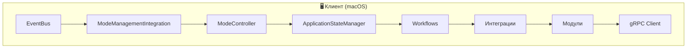
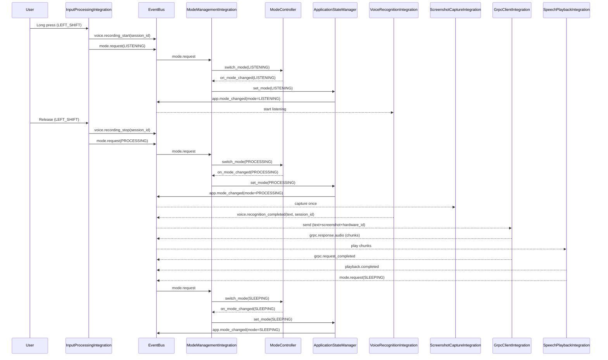
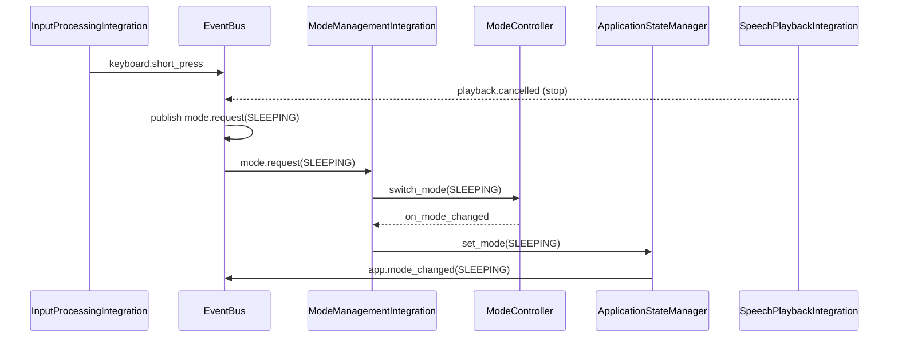

# 🧭 Nexy — Обзор Архитектуры

Этот документ — единая точка входа для понимания архитектуры, структуры и логики работы Nexy. Здесь описаны роли компонентов, жизненные циклы, события, правила централизации режимов и ожидаемые контракты между интеграциями и модулями.

**Flow Interaction Spec (канон взаимодействий):** `Docs/FLOW_INTERACTION_SPEC.md`

- Целевая аудитория: разработчики интеграций и модулей Nexy
- Уровень детализации: практический (как это реально устроено в коде)

---

## 1) Картина в целом

Nexy — модульное приложение с событийной шиной (EventBus), централизованным менеджером состояния (ApplicationStateManager) и единым контроллером режимов (ModeController) в обертке ModeManagementIntegration. Вся межмодульная коммуникация — через события, а смена режимов — через централизованные заявки.

Главный цикл режимов: SLEEPING → LISTENING → PROCESSING → SLEEPING.

## 1.1 Принципы устойчивости и устранения конфликтов

- **Request-scoped state**: состояние обработки запроса не хранится на уровне экземпляра, только внутри контекста запроса.
- **Single-flight по session_id**: один активный запрос на `session_id`, повторные отклоняются (без очереди ожидания).
- **Source of Truth**: `session_id` генерируется на входе и передается дальше без переопределений.
- **Централизация guard-логики**: ограничения (backpressure/rate limit) живут в одном слое, без дублирования.
- **Политика ошибок стрима**: ошибка до начала стрима = gRPC статус + error_message, после частичных данных = тихое завершение без смешивания данных и ошибок.

```
client/                         # 🖥️ КЛИЕНТСКАЯ ЧАСТЬ (macOS)
├─ main.py                      # 🎯 Точка входа приложения
├─ requirements.txt             # 📦 Зависимости (23 пакета, оптимизированы)
├─ run.sh                       # 🚀 Скрипт запуска
├─ config/                      # ⚙️ Конфигурация
│  ├─ unified_config.yaml       # 🎯 ЕДИНЫЙ источник конфигурации
│  ├─ unified_config_loader.py  # 🔧 Загрузчик конфигурации
│  ├─ tray_config.yaml          # 🎯 Устарел - используйте unified_config.yaml
│  └─ README.md                 # 📚 Документация конфигурации
├─ integration/                 # 🏗️ Слой интеграций (ЗАВЕРШЕН)
│  ├─ core/                     # Базовая архитектура
│  │  ├─ event_bus.py           # 📡 Система событий
│  │  ├─ event_types.py         # 🏷️ Константы типов событий (НОВЫЙ)
│  │  ├─ state_manager.py       # 🔄 Управление состоянием
│  │  ├─ state_keys.py          # 🔑 Константы ключей состояния (НОВЫЙ)
│  │  ├─ selectors.py           # 🎯 Селекторы для чтения состояния
│  │  ├─ simple_module_coordinator.py # 🎯 Главный координатор
│  │  └─ error_handler.py       # ❌ Обработка ошибок
│  ├─ integrations/             # 🔗 25 интеграций (полный список см. раздел 13)
│  │  ├─ action_execution_integration.py
│  │  ├─ autostart_manager_integration.py
│  │  ├─ browser_progress_integration.py
│  │  ├─ browser_use_integration.py
│  │  ├─ first_run_permissions_integration.py
│  │  ├─ grpc_client_integration.py
│  │  ├─ hardware_id_integration.py
│  │  ├─ input_processing_integration.py
│  │  ├─ instance_manager_integration.py
│  │  ├─ interrupt_management_integration.py
│  │  ├─ mode_management_integration.py
│  │  ├─ network_manager_integration.py
│  │  ├─ payment_integration.py
│  │  ├─ permission_restart_integration.py
│  │  ├─ screenshot_capture_integration.py
│  │  ├─ signal_integration.py
│  │  ├─ speech_playback_integration.py
│  │  ├─ tray_controller_integration.py
│  │  ├─ tts_integration.py
│  │  ├─ update_notification_integration.py
│  │  ├─ updater_integration.py
│  │  ├─ voice_recognition_integration.py
│  │  ├─ voiceover_ducking_integration.py
│  │  ├─ welcome_message_integration.py
│  │  └─ whatsapp_integration.py
│  ├─ workflows/                # ⚡ WORKFLOWS (НОВАЯ АРХИТЕКТУРА)
│  │  ├─ base_workflow.py       # 🏗️ Базовый класс
│  │  ├─ listening_workflow.py  # 🎤 Координатор LISTENING
│  │  ├─ processing_workflow.py # ⚙️ Координатор PROCESSING
│  │  ├─ workflow_config.py     # ⚙️ Конфигурация workflows
│  │  └─ README.md              # 📚 Документация workflows
│  └─ tests/                    # 🧪 Тесты интеграции
├─ modules/                     # 🧩 20 модулей (без знания EventBus)
│  ├─ action_errors/             # ⚠️ Обработка ошибок MCP действий
│  ├─ autostart_manager/        # ⚡ Автозапуск приложения
│  ├─ browser_progress/         # 🌐 Обработка прогресса браузера
│  ├─ grpc_client/              # 📡 gRPC клиент
│  ├─ hardware_id/              # 🆔 Идентификация устройства
│  ├─ input_processing/         # ⌨️ Обработка ввода
│  ├─ instance_manager/         # 🔒 Защита от дублирования экземпляров
│  ├─ interrupt_management/     # ⚡ Управление прерываниями
│  ├─ mcp_action/               # 🎯 Выполнение MCP команд (open_app/close_app)
│  ├─ mode_management/          # 🔄 Управление режимами
│  ├─ network_manager/          # 🌐 Мониторинг сети
│  ├─ permission_restart/        # 🔄 Автоматический перезапуск после разрешений
│  ├─ permissions/              # 🔐 Системные разрешения + first_run модули
│  ├─ screenshot_capture/       # 📸 Захват экрана
│  ├─ signals/                  # 🎵 Акустические сигналы
│  ├─ speech_playback/          # 🔊 Воспроизведение речи
│  ├─ tray_controller/          # 🎯 Управление tray иконкой
│  ├─ updater/                  # 🔄 НОВАЯ система обновлений (HTTP + DMG)
│  ├─ voice_recognition/        # 🎤 Распознавание речи
│  ├─ voiceover_control/        # ♿ Управление VoiceOver (macOS)
│  └─ welcome_message/          # 🔊 Приветственное сообщение
├─ assets/                      # 🎨 Ресурсы приложения
│  └─ icons/                    # 🎯 Иконки для tray
└─ Docs/                        # 📚 Документация
   ├─ ARCHITECTURE_OVERVIEW.md  # 🏗️ Обзор архитектуры
   ├─ PRODUCT_CONCEPT.md        # 💡 Концепция продукта и UX
   ├─ CURRENT_STATUS_REPORT.md  # 📊 Актуальные статусы и тесты
   ├─ GLOBAL_DELIVERY_PLAN.md   # 🚀 План поставки / Azure / AppCast
   ├─ PERMISSIONS_REPORT.md     # 🔐 Статусы TCC / first-run
   ├─ PACKAGING_FINAL_GUIDE.md  # 📦 Инструкция по сборке PKG
   └─ PRE_PACKAGING_VERIFICATION.md  # ✅ Чек-листы перед упаковкой

```

Серверная часть описана отдельно: `server/server/Docs/ARCHITECTURE_OVERVIEW.md`.

---

## 2) Основные роли и ответственность

### 🖥️ **КЛИЕНТСКАЯ ЧАСТЬ (macOS)**

- EventBus (integration/core/event_bus.py)
  - Централизованная событийная шина (publish/subscribe, приоритеты)
  - Изолирует компоненты, предотвращает плотные связки

- ApplicationStateManager (integration/core/state_manager.py)
  - Истинное текущее состояние приложения (режимы/история/данные)
  - **Единый источник истины для session_id** - все интеграции используют `get_current_session_id()` и `update_session_id()`
  - Публикует события смены режима: `app.mode_changed`, `app.state_changed` (только при изменении режима)
  - `set_mode()` - для изменения режима (публикует `app.mode_changed`)
  - `update_session_id()` - для синхронизации session_id БЕЗ публикации событий (предотвращает ложные прерывания)
  - Не решает КАК переключать режимы — только фиксирует результат

- ModeController (modules/mode_management/core/mode_controller.py)
  - Единая логика переходов между режимами (карта переходов, обработчики, метрики)
  - Асинхронно сериализует переходы, предотвращает гонки

- ModeManagementIntegration (integration/integrations/mode_management_integration.py)
  - Центральный «рубильник» режимов
  - Принимает заявки `mode.request` и делегирует ModeController
  - По колбэку контроллера вызывает `state_manager.set_mode(...)` для публикации
  - Жесткие таймауты PROCESSING отключены (заменены на Workflows)

- Workflows (integration/workflows/)
  - **ListeningWorkflow** - координатор LISTENING режима (дебаунс, умные таймауты)
  - **ProcessingWorkflow** - координатор PROCESSING (capture→grpc→playback→SLEEPING)
  - **BaseWorkflow** - общая базовая логика для всех workflows
  - Event-driven переходы вместо жестких таймаутов

- Интеграции (integration/integrations/*)
  - Адаптируют конкретные модули под событийный контракт
  - НЕ изменяют режим напрямую; только публикуют `mode.request`

- Модули (client/modules/*)
  - Самодостаточная функциональность (захват, распознавание, аудио и т.п.)
  - Не знают про EventBus/режимы; их «поведение в режимах» подключается через интеграции

### 🖥️ **Серверная часть**

Серверная архитектура, роли модулей и gRPC контракты описаны в `server/server/Docs/ARCHITECTURE_OVERVIEW.md`.

---

## 3) Dependency Enforcement & Contracts

Для поддержания модульности и предотвращения циклических зависимостей, проект использует строгие правила (Enforced by `scripts/check_dependency_violations.py`):

1. **Core Independence**: `integration/core` (EventBus, StateManager) НЕ зависит от конкретных интеграций.
2. **Integrations Layering**: Интеграции зависят от Core и Modules, но НЕ друг от друга.
3. **Modules Isolation**: Модули (`client/modules/*`) изолированы и не знают про EventBus/Integrations.
4. **Runtime Enforcement**: (Планируется) Runtime-проверка импортов при старте.

## 3.1) Quality Gates (Lint/CI)

- `ruff` включён в `scripts/pre_build_gate.sh` в режиме soft‑block (WARN) до снижения текущего lint‑debt.
- После снижения debt переводим `ruff` в hard‑block (ошибки блокируют сборку).
- Канонический consolidated scan: `scripts/problem_scan.sh` (ruff + basedpyright + verify scripts + pytest + priority report).
- Канонический release/CI блокер: `scripts/problem_scan_gate.sh`.
  - Решение блокировки принимает только по `blocking_issues` из `build_logs/problem_scan_latest.json`.
  - Для релизного режима обязателен `REQUIRE_BASEDPYRIGHT_IN_SCAN=true` (status должен быть `ok`).

---

## 4) Централизация режимов (Single Source of Truth)

- AppMode: единый импорт из `modules/mode_management` (дубликаты запрещены)
- Запрос смены режима: только событием `mode.request`
- Реальная смена режима: только через `ModeManagementIntegration → ModeController`
- Публикация факта смены: только `ApplicationStateManager.set_mode(...)`

Контракт запроса:

```python
await event_bus.publish("mode.request", {
  "target": AppMode.LISTENING,   # или SLEEPING / PROCESSING
  "source": "<integration|module>",
  # опционально: session_id, priority, data
})
```

Контракт уведомления:

```python
# Факт смены режима
await event_bus.publish("app.mode_changed", {"mode": AppMode.LISTENING})

# Мост (временный): старый формат для совместимости
await event_bus.publish("app.state_changed", {"old_mode": ..., "new_mode": ...})
```

Правила переходов (по умолчанию):
- SLEEPING → LISTENING
- LISTENING → PROCESSING, SLEEPING
- PROCESSING → SLEEPING

Таймауты PROCESSING: жесткие таймауты отключены, переходы управляются Workflows по событиям.

---

## 4) Главные потоки данных (PTT от клавиши до ответа)

**Источник истины:** [`FLOW_INTERACTION_SPEC.md`](FLOW_INTERACTION_SPEC.md) — разделы 4.4 (PTT/Listening Flow) и 4.5 (Processing Flow).

Основные потоки:
- **PTT Flow**: SLEEPING → LISTENING → PROCESSING → SLEEPING (см. разделы 4.4-4.5 канона)
- **Interrupt Flow**: `interrupt.request` → `grpc.request_cancel` (publisher: InterruptManagement) → `playback.cancelled` (publisher: SpeechPlaybackIntegration) (см. раздел 4.6 канона)

Детальная последовательность событий, контракты payload и требования к координации описаны в каноническом документе.

---

## 5) Событийный контракт (основные темы)

**Источник истины:** [`FLOW_INTERACTION_SPEC.md`](FLOW_INTERACTION_SPEC.md) — раздел 3 (Контракты событий).

Канонические контракты включают:
- Режимы (`mode.request`, `app.mode_changed`)
- Голос/распознавание (`voice.recording_*`, `voice.recognition_*`)
- gRPC (`grpc.request_*`, `grpc.response.*`)
- Воспроизведение (`playback.*`)
- Прерывания (`interrupt.request`, `grpc.request_cancel`, `playback.cancelled`)
- Разрешения (`permissions.*`)
- Обновления (`updater.*`)
- Сеть (`network.*`)
- И другие события

Полные спецификации payload, обязательные/опциональные поля и правила использования описаны в каноническом документе.

---

## 6) Правила предотвращения гонок и конфликтов

- Переключения режимов выполняются через `ModeController` (внутри — `asyncio.Lock`) → одно переключение за раз
- Источники заявок маркируются `source` (+ опционально `priority`) — конфликты решаются в ModeManagementIntegration
- Никаких прямых `state_manager.set_mode(...)` за пределами ModeManagementIntegration
- При внешней смене (на время миграции) ModeManagementIntegration синхронизирует свой контроллер по `app.mode_changed`

---

## 6.1) Константы для предотвращения опечаток (StateKeys и EventTypes)

Для повышения качества кода и предотвращения опечаток в ключевых строках введены централизованные константы:

### StateKeys (integration/core/state_keys.py)

Константы для ключей `state_manager.get_state_data()` / `set_state_data()`:

```python
from integration.core.state_keys import StateKeys

# Вместо строковых литералов:
# state_manager.get_state_data("first_run_in_progress", False)  ❌

# Используйте константы:
state_manager.get_state_data(StateKeys.FIRST_RUN_IN_PROGRESS, False)  # ✅
```

**Доступные константы:**
- `FIRST_RUN_IN_PROGRESS`, `FIRST_RUN_REQUIRED`, `FIRST_RUN_COMPLETED`
- `PERMISSIONS_RESTART_PENDING`, `PERMISSIONS_RESTART_COMPLETED_FALLBACK`
- `PTT_PRESSED`, `UPDATE_IN_PROGRESS`

### EventTypes (integration/core/event_types.py)

Константы для типов событий EventBus:

```python
from integration.core.event_types import EventTypes

# Вместо строковых литералов:
# await event_bus.subscribe("app.mode_changed", handler)  ❌

# Используйте константы:
await event_bus.subscribe(EventTypes.APP_MODE_CHANGED, handler)  # ✅
```

**Категории событий (60+ констант):**
- **Application**: `APP_STARTUP`, `APP_SHUTDOWN`, `APP_MODE_CHANGED`
- **Voice**: `VOICE_RECORDING_START`, `VOICE_RECORDING_STOP`, `VOICE_MIC_OPENED`
- **gRPC**: `GRPC_REQUEST_COMPLETED`, `GRPC_REQUEST_FAILED`
- **Playback**: `PLAYBACK_STARTED`, `PLAYBACK_COMPLETED`
- **Permissions**: `PERMISSIONS_CHANGED`, `PERMISSIONS_FIRST_RUN_COMPLETED`
- И другие

**Правило для PR:** Все новые подписки/публикации должны использовать константы из `StateKeys` и `EventTypes`.

---


## 7) Конфигурация и расширяемость

- UnifiedConfigLoader — единый источник конфигураций интеграций и модулей
- Добавление нового модуля:
  1) Создать модуль в `client/modules/<name>` без знания EventBus
  2) Создать интеграцию в `client/integration/integrations/<name>_integration.py`
  3) Подписаться/публиковать нужные события, запросы режимов только через `mode.request`
  4) Добавить инициализацию/запуск в `SimpleModuleCoordinator`

- Расширение правил переходов:
  - Зарегистрировать новые `ModeTransition` в ModeManagementIntegration (или в конфиге)
  - Для специальных переходов — указать `action`, `priority`, `timeout`

  - Для специальных переходов — указать `action`, `priority`, `timeout`

---

## 7.1) Feature Flags & Conditional Loading (Оптимизация)

Клиент использует Factory-pattern для условной загрузки тяжелых интеграций (`integration_factory.py`).

**1. Память и производительность:**
- `browser.enabled=false` → `BrowserUseIntegration` не создаётся. Процесс Playwright/Chrome не запускается (экономия ~200MB RAM).
- `payment.enabled=false` → `PaymentIntegration` не создаётся.

**2. UI & Tray:**
- Меню трея строится динамически.
- `payment.enabled=false` → Пункт "Manage Subscription" скрыт.

**3. Execution Guards:**
- `ActionExecutionIntegration` проверяет флаги перед выполнением.
- Даже если сервер пришлет `open_browser`, клиент отклонит команду с ошибкой `feature_disabled`.

---

## 8) Запуск и жизненный цикл

- SimpleModuleCoordinator управляет инициализацией/стартом/остановкой
  - Создаёт EventBus, StateManager, ErrorHandler
  - Поднимает фоновой asyncio loop и прикрепляет к EventBus
  - Создаёт и запускает интеграции (в т.ч. ModeManagementIntegration)
  - Прикрепляет EventBus к StateManager для публикации событий смены режимов

**Порядок создания/запуска интеграций**:
- Централизован в `IntegrationFactory.STARTUP_ORDER`
- Координатор использует `IntegrationFactory.get_startup_order(...)`
- Условные интеграции (feature‑flags) фильтруются по факту наличия

Последовательность (упрощенно):
1) Создание core-компонентов → 2) Запуск фонового loop → 2.5) **Настройка критичных подписок** (_setup_critical_subscriptions) → 3) Создание интеграций → 4) initialize() → 5) start() → 6) Остальные подписки EventBus

**КРИТИЧНО:** Подписки на события `permissions.first_run_*` настраиваются в шаге 2.5 (ДО инициализации интеграций), чтобы не потерять события, публикуемые FirstRunPermissionsIntegration.initialize() при обнаружении флага перезапуска. См. ADR_PERMISSION_EVENT_RACE_FIX.md для деталей.

**ВАЖНО:** FirstRunPermissionsIntegration создаётся ПОСЛЕДНЕЙ в `_create_integrations()`, но запускается 4-й в `startup_order` (после tray). Это обеспечивает правильную последовательность: tray готов → first_run_permissions → permission_restart.

---

## 9) Диагностика и ошибки

- ErrorHandler публикует/логирует ошибки с категорией и важностью
- Критические точки логирования:
  - Заявки на режим: входящие `mode.request`
  - Смена режимов: `app.mode_changed` (+ метрики ModeController)
  - Таймаут PROCESSING: принудительный возврат
  - Прерывания: `interrupt.request`, отмены, результаты

Рекомендации:
- Логируйте `source` и `session_id` для трассировки путей
- Не публикуйте «дублирующие» факты смены режима — только StateManager
- Используйте `state_manager.get_current_session_id()` для чтения session_id (единый источник истины)
- Используйте `state_manager.update_session_id()` для синхронизации session_id БЕЗ публикации событий
- Используйте `state_manager.set_mode()` только для изменения режима (публикует `app.mode_changed`)

— Завершение PROCESSING
- Сигналом завершения служит `grpc.request_completed` (получен end‑of‑stream) либо `playback.completed`
- Рекомендуется: `ModeManagementIntegration`/workflow PROCESSING переводит приложение в SLEEPING по одному из сигналов (что наступит раньше), а таймаут используется как защита

— Аутентификация gRPC (план)
- Вызовы gRPC должны поддерживать `metadata.authorization: Bearer <token>`
- Токен хранится в macOS Keychain (Auth/Chat — отложено)

---

## 10) Инварианты и чек‑лист для PR

- [ ] В коде интеграций нет прямых `set_mode(...)`
- [ ] Все запросы на смену режима идут через `mode.request`
- [ ] Импорт `AppMode` — только из `modules/mode_management`
- [ ] Подписки/публикации соответствуют контракту событий
- [ ] Новые переходы зарегистрированы в ModeManagementIntegration

---

## 11) Полезные файлы и ссылки

### 🔗 **Источники истины для состояния и правил (см. `.cursorrules` раздел 1.1):**
- **STATE_CATALOG.md** — единый источник истины для всех осей состояния (permissions.mic, device.input, network, firstRun, appMode)
  - Включает таблицу ownership (владельцы осей и артефактов)
  - См. `Docs/STATE_CATALOG.md`
- **interaction_matrix.yaml** — правила взаимодействия осей с приоритетами (hard_stop, graceful, preference)
  - Синхронизирован с STATE_CATALOG.md
  - См. `config/interaction_matrix.yaml`
- **gateways.py** — логика принятия решений на основе осей
  - Реализует правила из interaction_matrix.yaml
  - См. `integration/core/gateways.py`

---

- **Текущий статус:** `Docs/CURRENT_STATUS_REPORT.md`
- **План развертывания:** `Docs/GLOBAL_DELIVERY_PLAN.md`
- **Права и first-run:** `PERMISSIONS_REPORT.md`, `Docs/first_run_flow_spec.md`
- **План упаковки:** `Docs/PACKAGING_FINAL_GUIDE.md` + `Docs/PRE_PACKAGING_VERIFICATION.md`
- **Концепция продукта:** `Docs/PRODUCT_CONCEPT.md`
- **STATE_CATALOG (оси состояния):** `Docs/STATE_CATALOG.md` — единый источник истины для осей состояния и таблица ownership
- **Interaction Matrix (правила):** `config/interaction_matrix.yaml` — правила взаимодействия осей с приоритетами (синхронизирован с STATE_CATALOG.md)
- **ADR: AVFoundation миграция:** `Docs/ADRs/ADR_2025-01-XX_avfoundation_audio_migration.md`

### 🏗️ **Клиентская архитектура:**
- **Workflows документация:** `client/integration/workflows/README.md`
- **Координатор:** `client/integration/core/simple_module_coordinator.py`
- **Контроллер режимов:** `client/modules/mode_management/core/mode_controller.py`
- **Менеджер состояния:** `client/integration/core/state_manager.py`
- **Конфигурация:** `config/unified_config.yaml`

### 🖥️ **Серверная архитектура:**
См. `server/server/Docs/ARCHITECTURE_OVERVIEW.md`.

Если чего‑то не хватает в этом документе — предложите правки, мы обновим «источник истины» по архитектуре.

---

## 12) Каталог модулей

### 💻 **КЛИЕНТСКИЕ МОДУЛИ (client/modules) - 25 МОДУЛЕЙ**

_macOS автоматически управляет активными аудиоустройствами, поэтому отдельный менеджер больше не требуется._
- `action_errors` — обработка ошибок MCP действий: типизированные ошибки для open_app/close_app, локализованные сообщения.
- `autostart_manager` — автозапуск приложения: LaunchAgent управление, Login Items, bundle_id подход, совместимость с обновлениями.
- `browser_automation` — НОВЫЙ: клиентский модуль browser-use для AI-управляемой автоматизации браузера. Выполняет задачи локально, отправляет статистику токенов на сервер.
- `browser_progress` — обработка прогресса: типы событий и статусы выполнения задач браузера (Feature F-2025-015).
- `grpc_client` — низкоуровневый gRPC клиент, отправка запросов на сервер, управление соединением/ретраями.
- `hardware_id` — стабильный аппаратный идентификатор, кэш/TTL, фоновые обновления.
- `input_processing` — клавиатурные события (Quartz/pynput), детекция LONG/SHORT/RELEASE, конфиг порогов.
- `instance_manager` — защита от дублирования экземпляров: файловые блокировки, PID проверка, TOCTOU защита, аудио-сигналы для незрячих.
- `interrupt_management` — координация прерываний (типы/приоритеты/история), API для остановки записи/воспроизведения.
- `mcp_action` — выполнение MCP команд от ассистента: open_app/close_app через macOS AppleScript/NSWorkspace.
- `mode_management` — `ModeController`, типы, режимы (S/L/P), обработчики и метрики переходов.
- `network_manager` — мониторинг сети (ping/HTTP), события статуса, снапшоты.
- `permissions` — проверка и запрос системных разрешений (микрофон/захват экрана/сеть/уведомления) + модули first_run для системы первого запуска.
- `permission_restart` — ядро автоперезапуска: детектор переходов, планировщик и macOS рестарт-хендлер, взаимодействие только через EventBus.
- `screenshot_capture` — кроссплатформенный захват экрана, конфигурация качества/размера; на macOS — bridge/CLI fallback.
- `signals` — акустические сигналы: listen_start/done/error/cancel + duplicate_instance.
- `speech_playback` — последовательное воспроизведение аудио чанков, буферизация, управление устройством.
- `telegram` — клиентский модуль Telegram‑интеграции (MCP команды, события).
- `tray_controller` — UI-иконка/меню, статусы для режимов.
- `updater` — НОВАЯ система обновлений: HTTP манифест, DMG файлы, миграция в ~/Applications, 3 уровня безопасности (SHA256 + Ed25519 + codesign).
- `voice_recognition` — запись/распознавание речи, симулятор/реальный движок, таймауты, отмена.
- `voiceover_control` — управление VoiceOver на macOS: умное отключение/включение через Command+F5, отслеживание состояния, диагностика.
- `welcome_message` — приветственное сообщение: серверная генерация приветствия при запуске, конфигурируемые параметры.
- `whatsapp` — клиентский модуль WhatsApp‑интеграции (MCP команды, события).
- `messages` — интеграция с Apple Messages (iMessage/SMS): чтение и отправка сообщений, поиск контактов через AppleScript и SQLite. Требует Full Disk Access для доступа к `chat.db`.

### 🖥️ **Серверные модули и мониторинг**

Описание серверных модулей, мониторинга и gRPC сервиса — в `server/server/Docs/ARCHITECTURE_OVERVIEW.md`.

**Ключевой модуль (сервер): `browser_use` (Proxy)** (Feature ID: F-2025-015)
- Проксирует задачи на клиент: сервер получает команду -> передает клиенту -> клиент выполняет.
- Не выполняет браузерную автоматизацию на сервере (оптимизация ресурсов).
- Получает отчеты об использовании токенов от клиента.

**Ключевой модуль (клиент): `messages`** (Feature ID: F-2025-016)
- MCP-сервер для интеграции с Apple Messages (iMessage/SMS)
- Позволяет читать и отправлять сообщения через голосовые команды
- Использует локальные базы данных (`chat.db`) и AppleScript для взаимодействия
- Требует Full Disk Access для доступа к `chat.db`
- MCP команды: `read_messages`, `send_message`, `find_contact`
- Голосовая обратная связь: озвучивает содержимое сообщения и имя получателя после отправки


---

## 13) Каталог интеграций

### 🖥️ **КЛИЕНТСКИЕ ИНТЕГРАЦИИ (client/integration/integrations) - 25 ИНТЕГРАЦИЙ**

- `action_execution_integration.py`
  - Назначение: выполнение MCP команд от ассистента (open_app, close_app).
  - Подписки: `mcp.command_request`, `action.execute_request`.
  - Публикует: `action.execution_started|completed|failed`, результат выполнения команды.

- `autostart_manager_integration.py`
  - Назначение: управление автозапуском - LaunchAgent, Login Items, bundle_id подход.
  - Подписки: `app.startup`, `autostart.request`, `autostart.status_check`.
  - Публикует: `autostart.status_checked`, события управления автозапуском.
  - КРИТИЧНО: запускается ПОСЛЕДНИМ и НЕ БЛОКИРУЮЩИМ.

- `browser_progress_integration.py`
  - Назначение: обработка событий прогресса browser-use от сервера (Feature F-2025-015).
  - Подписки: `browser.progress` (от gRPC).
  - Публикует: логирует steps/tasks, трекает активные задачи.

- `browser_use_integration.py`
  - Назначение: НОВЫЙ - интеграция клиентского browser-use модуля с EventBus.
  - Подписки: `browser.task_request`, `app.shutdown`.
  - Публикует: `browser.started|completed|failed|cancelled`, события жизненного цикла браузера.

- `first_run_permissions_integration.py`
  - Назначение: система первого запуска с умными паузами для получения разрешений.
  - Подписки: `app.startup`, `permissions.*`.
  - Публикует: `permissions.first_run_*`, события первого запуска.

- `grpc_client_integration.py`
  - Назначение: агрегирует `text + screenshot + hardware_id`, отправляет StreamRequest, транслирует ответы в события.
  - Подписки: `voice.recognition_completed`, `screenshot.captured`, `hardware.id_*`, `keyboard.short_press` (cancel), `interrupt.request`, `network.status_changed`, `app.shutdown`.
  - Публикует: `grpc.request_started|completed|failed`, `grpc.response.audio`.

- `hardware_id_integration.py`
  - Назначение: получение и кэширование hardware_id; ответы по запросу.
  - Подписки: `app.startup`, `hardware.id_request`, `hardware.id_refresh`, `app.shutdown`.
  - Публикует: `hardware.id_obtained`, `hardware.id_response`, `hardware.id_error`.

- `input_processing_integration.py`
  - Назначение: PTT-клавиатура, генерирует `voice.recording_start/stop`, заявки на режим LISTENING/PROCESSING.
  - Подписки: внутренние колбэки от KeyboardMonitor, `voice.recognition_*` (fail/timeout).
  - Публикует: `keyboard.press/short_press/long_press/release`, `voice.recording_start/stop`, `mode.request(LISTENING|PROCESSING|SLEEPING)`.

- `instance_manager_integration.py`
  - Назначение: защита от дублирования экземпляров - блокирующая проверка при запуске, файловые блокировки, PID валидация.
  - Подписки: `app.startup`, `app.shutdown`, `instance.check_request`.
  - Публикует: `instance.status_checked`, `signal.duplicate_instance` (аудио-сигнал для незрячих).
  - КРИТИЧНО: запускается ПЕРВЫМ и БЛОКИРУЮЩИМ - при дублировании вызывает `sys.exit(1)`.

- `interrupt_management_integration.py`
  - Назначение: координация прерываний (типы/приоритеты/история), API для остановки записи/воспроизведения.
  - Подписки: `keyboard.short_press`, `voice.recognition_*`, `playback.*`, `app.shutdown`.
  - Публикует: `interrupt.request`, `interrupt.completed`, `mode.request(SLEEPING)`.

- `mode_management_integration.py`
  - Назначение: единый «рубильник» режимов; принимает `mode.request`, делегирует `ModeController`, публикует факт через `StateManager`.
  - Подписки: `mode.request`, `app.mode_changed`, мосты `keyboard.*`, `grpc.request_*`, `playback.*`, `interrupt.request`.
  - Публикует: при успехе — `app.mode_changed` (через StateManager), вспомогательные мосты.

- `network_manager_integration.py`
  - Назначение: мониторинг сети, снапшоты, события смены.
  - Подписки: `app.startup`, `app.shutdown`.
  - Публикует: `network.status_snapshot`, `network.status_changed`.

- `permission_restart_integration.py`
  - Назначение: автоматический перезапуск клиента после выдачи критических разрешений (микрофон, accessibility, input monitoring, screen capture).
  - Подписки: `permissions.changed`, `permissions.status_checked`.
  - Публикует: `permission_restart.scheduled`, `permission_restart.executing`.
  - Логика: использует `modules.permission_restart` для детекции и планирования, ждёт окончания LISTENING/PROCESSING и отсутствия обновлений (`UpdaterIntegration`).

- `screenshot_capture_integration.py`
  - Назначение: один скриншот при входе в PROCESSING; CLI‑fallback при отсутствии модуля.
  - Подписки: `app.mode_changed`, `voice.recording_stop`, `permissions.*` статусы.
  - Публикует: `screenshot.captured` (jpeg/webp), `screenshot.error`.

- `signal_integration.py`
  - Назначение: воспроизведение акустических сигналов для обратной связи.
  - Подписки: `signal.request`, события, требующие звуковой индикации.
  - Публикует: `signal.completed|failed`.

- `speech_playback_integration.py`
  - Назначение: воспроизведение аудио чанков ответа, корректное завершение/отмена.
  - Подписки: `grpc.response.audio`, `grpc.request_completed|failed`, `keyboard.short_press`, `interrupt.request`, `app.shutdown`.
  - Публикует: `playback.started|completed|failed|cancelled`, `mode.request(SLEEPING)` по завершению/ошибке/тишине.

- `tray_controller_integration.py`
  - Назначение: отображение статуса/меню в трее.
  - Подписки: `app.mode_changed`, `keyboard.*`, `voice.mic_opened|closed`.
  - Публикует: `tray.status_updated`.

- `tts_integration.py`
  - Назначение: **фоллбэк** локальной генерации речи через macOS `say` команду.
  - Используется как резервный механизм: если сервер EdgeTTS недоступен или возвращает ошибку, клиент переключается на локальный TTS.
  - Подписки: `speech.playback.request` (при фоллбэке).
  - Публикует: `tts.completed|failed`, аудио воспроизводится через системный `say`.
  - Поток: `grpc.tts_request` → `GrpcClientIntegration` пытается сервер EdgeTTS → при ошибке публикует `speech.playback.request` → `TTSIntegration` воспроизводит локально.

- `update_notification_integration.py`
  - Назначение: уведомления о доступных обновлениях.
  - Подписки: `updater.update_available`, события обновлений.
  - Публикует: события уведомлений пользователя.

- `updater_integration.py`
  - Назначение: НОВАЯ система обновлений - HTTP манифест, DMG файлы, миграция в ~/Applications, проверка обновлений при запуске и по расписанию.
  - Подписки: `app.startup`, `app.shutdown`, `updater.check_manual`.
  - Публикует: события обновлений, автоматическая миграция при первом запуске.

- `voice_recognition_integration.py`
  - Назначение: запуск/остановка распознавания, публикация результатов.
  - Подписки: `mode.switch` (если используется), внутренние старт/стоп записи, таймеры; реагирует на смену режима.
  - Публикует: `voice.recognition_started|completed|failed|timeout`, `mode.request(SLEEPING)` при fail/timeout.

- `voiceover_ducking_integration.py`
  - Назначение: умное управление VoiceOver для пользователей с нарушениями зрения - автоматическое отключение/включение VoiceOver при работе с приложением.
  - Подписки: `app.mode_changed`, `keyboard.press`, `app.shutdown`.
  - Публикует: события управления VoiceOver, диагностические сообщения.
  - Логика: запоминает изначальное состояние VoiceOver, отключает при LISTENING/PROCESSING, восстанавливает при SLEEPING.

- `welcome_message_integration.py`
  - Назначение: приветственное сообщение при запуске — запрос серверной генерации и воспроизведение приветствия.
  - Подписки: `app.startup`, `speech_playback.ready`.
  - Публикует: события воспроизведения приветствия, диагностические сообщения.
  - Логика: воспроизводит приветствие после инициализации всех компонентов.

- `payment_integration.py`
  - Назначение: НОВЫЙ - интеграция системы подписок и оплаты.
  - Подписки: `payment.sync_requested`, `subscription.status_check`, `app.startup`.
  - Публикует: `subscription.status_updated`, события синхронизации статуса подписки.

Инвариант: все смены режимов запрашиваются только через `mode.request`; факт смены — только от StateManager.

### 🖥️ **Серверные интеграции**

Описание серверных интеграций — в `server/server/Docs/ARCHITECTURE_OVERVIEW.md`.

---

## 14) Диаграммы (Mermaid)

Быстрые схемы для понимания потоков и централизации. GitHub рендерит диаграммы Mermaid, в IDE можно открыть Markdown Preview.

### 🏗️ **Архитектура клиента**



### 🔄 **PTT: SLEEPING → LISTENING → PROCESSING → SLEEPING (happy path)**



Короткое нажатие (interrupt): немедленный возврат в SLEEPING



Централизация смены режима

```mermaid
flowchart LR
    subgraph Integrations
      A[InputProcessing] -->|mode.request| MM
      B[VoiceRecognition] -->|mode.request| MM
      C[SpeechPlayback] -->|mode.request| MM
      D[Permissions] -->|mode.request| MM
      E[Interrupts] -->|mode.request| MM
    end
    MM[ModeManagementIntegration]\n(принимает заявки) --> MC[ModeController]\n(правила переходов)
    MC -->|callback| SM[ApplicationStateManager]\nset_mode()
    SM --> EB[EventBus]\napp.mode_changed
    EB --> Consumers[Все подписчики]
```
