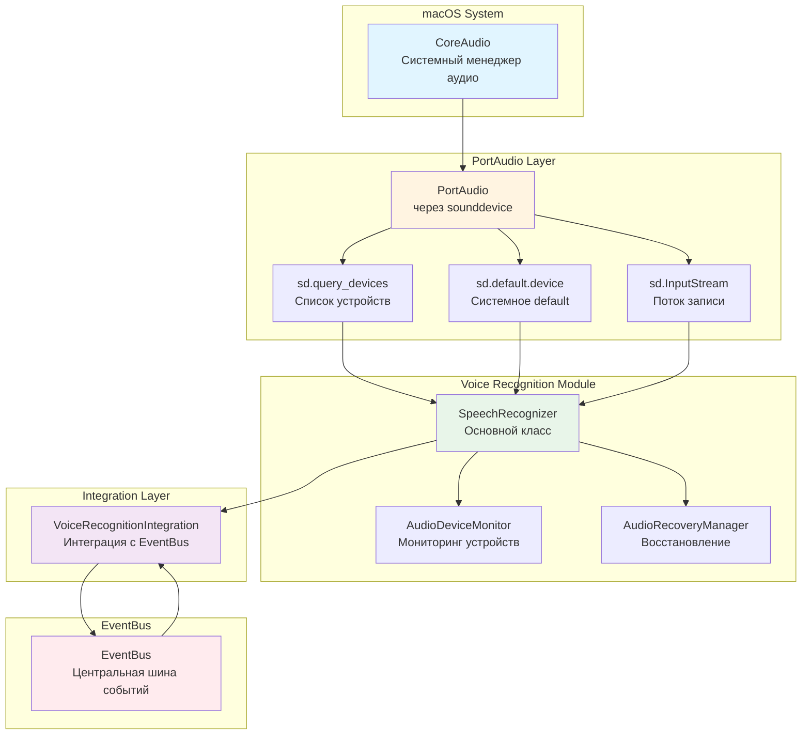

# Архитектура аудиосистемы Nexy

## Обзор

Аудиосистема Nexy построена на основе библиотеки `sounddevice` (обёртка над PortAudio), которая работает поверх CoreAudio на macOS. Система обеспечивает обнаружение устройств, выбор оптимального устройства, активацию микрофона и получение информации об устройствах.

## Компоненты системы

### 1. Уровень обнаружения устройств

```
┌─────────────────────────────────────────────────────────────┐
│                    macOS CoreAudio                          │
│  (Системный менеджер аудио устройств)                      │
└──────────────────────┬──────────────────────────────────────┘
                       │
                       ▼
┌─────────────────────────────────────────────────────────────┐
│                    PortAudio (через sounddevice)            │
│  - sd.query_devices() - список всех устройств               │
│  - sd.default.device - системное default устройство         │
│  - sd.query_hostapis() - список Host API                   │
└──────────────────────┬──────────────────────────────────────┘
                       │
                       ▼
┌─────────────────────────────────────────────────────────────┐
│              SpeechRecognizer (модуль)                      │
│  - _get_system_default_input_index()                        │
│  - _select_default_input_device()                           │
│  - _prepare_input_device()                                  │
└──────────────────────┬──────────────────────────────────────┘
```

### 2. Процесс выявления аудиосистемы

```
┌─────────────────────────────────────────────────────────────┐
│  ШАГ 1: Получение системного default устройства            │
│                                                             │
│  1.1. sd.default.device[0] → input device ID              │
│  1.2. Если не работает → macOS API (SwitchAudioSource)    │
│  1.3. Получение имени устройства от macOS                 │
│  1.4. Поиск ID по имени в sd.query_devices()              │
└──────────────────────┬──────────────────────────────────────┘
                       │
                       ▼
┌─────────────────────────────────────────────────────────────┐
│  ШАГ 2: Кэширование устройств                              │
│                                                             │
│  - _device_name_to_id_cache: Dict[str, int]                │
│  - Обновление при смене устройств                          │
│  - Инвалидация при обнаружении изменений                   │
└──────────────────────┬──────────────────────────────────────┘
                       │
                       ▼
┌─────────────────────────────────────────────────────────────┐
│  ШАГ 3: Классификация устройств                            │
│                                                             │
│  Приоритет (меньше = лучше):                                │
│  0. Built-in (встроенный микрофон Mac)                     │
│  1. Проводные устройства                                   │
│  2. Bluetooth устройства                                    │
│  3. Remote (iPhone/iPad через Continuity)                  │
│  4. Прочие                                                  │
└─────────────────────────────────────────────────────────────┘
```

### 3. Процесс выбора устройства

```
┌─────────────────────────────────────────────────────────────┐
│  _select_default_input_device(strict=True)                 │
│                                                             │
│  1. Получение системного default через                     │
│     _get_system_default_input_index()                      │
│                                                             │
│  2. Формирование списка кандидатов:                        │
│     - default_input (приоритет 1)                          │
│     - Альтернативные (если strict=False)                   │
│                                                             │
│  3. Проверка каждого кандидата:                           │
│     - sd.query_devices(device_id, 'input')                 │
│     - _device_is_available() - проверка доступности        │
│     - _set_portaudio_default_input() - установка default   │
│                                                             │
│  4. Возврат (device_id, device_info)                       │
└─────────────────────────────────────────────────────────────┘
```

### 4. Процесс активации микрофона

```
┌─────────────────────────────────────────────────────────────┐
│  _prepare_input_device()                                    │
│                                                             │
│  1. Получение device_id и device_info через                │
│     _select_default_input_device()                          │
│                                                             │
│  2. Извлечение параметров устройства:                      │
│     - samplerate = device_info['default_samplerate']        │
│     - channels = device_info['max_input_channels']         │
│     - latency = device_info['default_low_input_latency']   │
│                                                             │
│  3. Определение формата для Bluetooth:                      │
│     - Используем формат устройства (не принуждаем)         │
│     - Предпочитаем моно для BT                              │
│                                                             │
│  4. Сохранение информации:                                 │
│     - input_device_id (RUNTIME)                            │
│     - input_device_name (PRIMARY)                           │
│     - actual_input_rate, actual_input_channels              │
└──────────────────────┬──────────────────────────────────────┘
                       │
                       ▼
┌─────────────────────────────────────────────────────────────┐
│  _run_listening()                                           │
│                                                             │
│  1. Формирование списка кандидатов устройств:              │
│     - _build_device_priority(primary_device)                 │
│                                                             │
│  2. Для каждого кандидата (с retry):                       │
│     a. Получение device_info через sd.query_devices()       │
│     b. Определение таймингов (BT vs проводные):            │
│        - first_chunk_timeout: 3.5s (BT) / 2.0s (default)   │
│        - retry_delay: 1.2s (BT) / 0.8s (default)            │
│        - bt_prestart_delay: 0.5s (для Error 89)             │
│                                                             │
│     c. Создание потока:                                     │
│        stream = sd.InputStream(                              │
│            device=device_id,                                │
│            samplerate=actual_input_rate,                     │
│            channels=actual_input_channels,                   │
│            blocksize=chunk_size,                            │
│            callback=audio_callback                           │
│        )                                                     │
│                                                             │
│     d. Запуск потока:                                       │
│        - stream.start()                                      │
│        - Ожидание первого чанка (timeout)                  │
│        - Проверка на пустые чанки (CoreAudio overload)     │
│                                                             │
│  3. Обработка ошибок:                                       │
│     - PortAudioError → retry с другим устройством          │
│     - TimeoutError → retry с увеличенным timeout            │
│     - Error 89 (BT) → задержка + retry                      │
└─────────────────────────────────────────────────────────────┘
```

### 5. Мониторинг устройств

```
┌─────────────────────────────────────────────────────────────┐
│  AudioDeviceMonitor                                          │
│                                                             │
│  - check_interval: 0.5s (проверка каждые 500мс)            │
│  - Мониторинг в отдельном потоке                            │
│                                                             │
│  Процесс:                                                    │
│  1. Получение текущего default через sd.default.device[0]    │
│  2. Сравнение с предыдущим устройством                       │
│  3. Если изменилось → callback _on_device_changed()          │
│                                                             │
│  Callback:                                                   │
│  - Сравнение по ИМЕНИ (не ID!)                               │
│  - Инвалидация кэша устройств                               │
│  - Перезапуск потока при реальной смене устройства          │
└─────────────────────────────────────────────────────────────┘
```

### 6. Получение информации об устройстве

```
┌─────────────────────────────────────────────────────────────┐
│  device_info = sd.query_devices(device_id, 'input')         │
│                                                             │
│  Структура device_info:                                      │
│  {                                                           │
│    'name': str,                    # Имя устройства        │
│    'default_samplerate': float,     # Частота дискретизации │
│    'max_input_channels': int,      # Макс. каналов          │
│    'default_low_input_latency': float,  # Низкая задержка   │
│    'default_high_input_latency': float, # Высокая задержка  │
│    'hostapi': int,                  # Host API ID          │
│  }                                                           │
│                                                             │
│  Дополнительная информация:                                 │
│  - host_apis = sd.query_hostapis()                          │
│    - 'name': 'Core Audio' (macOS)                          │
│    - 'default_input_device': int                            │
│    - 'default_output_device': int                          │
└─────────────────────────────────────────────────────────────┘
```

## Поток данных

### Полный цикл работы с микрофоном

```
┌─────────────────────────────────────────────────────────────┐
│  1. ИНИЦИАЛИЗАЦИЯ                                            │
│     VoiceRecognitionIntegration.initialize()                 │
│     └─> SpeechRecognizer.__init__()                        │
│         └─> AudioDeviceMonitor.__init__()                   │
│             └─> _init_current_device()                     │
│                 └─> sd.default.device[0]                    │
└──────────────────────┬──────────────────────────────────────┘
                       │
                       ▼
┌─────────────────────────────────────────────────────────────┐
│  2. ЗАПУСК ПРОСЛУШИВАНИЯ                                    │
│     voice.recording_start event                              │
│     └─> VoiceRecognitionIntegration._on_recording_start()  │
│         └─> SpeechRecognizer.start_listening()              │
│             └─> _run_listening()                           │
│                 ├─> _prepare_input_device()                │
│                 │   ├─> _select_default_input_device()     │
│                 │   │   └─> _get_system_default_input_index()│
│                 │   │       └─> sd.default.device[0]       │
│                 │   └─> sd.query_devices(device_id)        │
│                 │                                           │
│                 └─> sd.InputStream(...)                     │
│                     └─> stream.start()                      │
│                         └─> audio_callback()               │
│                             └─> Обработка аудио данных      │
└──────────────────────┬──────────────────────────────────────┘
                       │
                       ▼
┌─────────────────────────────────────────────────────────────┐
│  3. МОНИТОРИНГ УСТРОЙСТВ                                    │
│     AudioDeviceMonitor._monitor_loop()                      │
│     ├─> Проверка каждые 0.5s                               │
│     ├─> sd.default.device[0]                                │
│     └─> Если изменилось → _on_device_changed()             │
│         └─> Перезапуск потока (если имя изменилось)        │
└─────────────────────────────────────────────────────────────┘
```

## Особенности реализации

### 1. Идентификация устройств

- **PRIMARY идентификатор**: `device_name` (строка) - стабильный, используется для логики и сравнений
- **RUNTIME идентификатор**: `device_id` (int) - для sounddevice API, может меняться при переподключении

### 2. Кэширование устройств

- `_device_name_to_id_cache: Dict[str, int]` - маппинг имя → ID
- Инвалидация при смене устройств
- Обновление через `sd.query_devices()` без `sd._terminate()` (опасно для потоков)

### 3. Обработка Bluetooth устройств

- Увеличенные таймауты (3.5s вместо 2.0s)
- Задержка перед стартом (0.5s для Error 89)
- Увеличенный retry_delay (1.2s вместо 0.8s)
- Использование формата устройства (не принуждение)

### 4. Восстановление при ошибках

- `AudioRecoveryManager` - автоматическое восстановление при "тишине" CoreAudio
- Пороги восстановления:
  - 10 пустых чанков → мягкий reprime
  - 50 пустых чанков → пересоздание с 44.1kHz
  - 100 пустых чанков → переключение устройства
  - 150+ пустых чанков → ffmpeg-probe + системное исправление

## Интеграция с EventBus

```
┌─────────────────────────────────────────────────────────────┐
│  VoiceRecognitionIntegration                                 │
│                                                             │
│  Подписки:                                                   │
│  - voice.recording_start → _on_recording_start()           │
│  - voice.recording_stop → _on_recording_stop()              │
│  - keyboard.short_press → _on_cancel_request()              │
│  - app.mode_changed → _on_app_mode_changed()                │
│  - permissions.first_run_* → блокировка активации            │
│                                                             │
│  Публикации:                                                 │
│  - voice.mic_opened (при recording_start)                   │
│  - voice.recognition_started                                │
│  - voice.recognition_completed                              │
│  - voice.recognition_failed                                 │
│  - voice.mic_closed                                         │
└─────────────────────────────────────────────────────────────┘
```

## Схема взаимодействия компонентов



## Ключевые файлы

- `modules/voice_recognition/core/speech_recognizer.py` - основной класс распознавания
- `modules/voice_recognition/core/audio_device_monitor.py` - мониторинг устройств
- `modules/voice_recognition/core/audio_recovery_manager.py` - восстановление при ошибках
- `integration/integrations/voice_recognition_integration.py` - интеграция с EventBus
- `modules/speech_playback/core/player.py` - воспроизведение аудио
- `modules/speech_playback/macos/core_audio.py` - работа с CoreAudio

## Примечания

1. **Не используем `sd._terminate()` / `sd._initialize()`** - это уничтожает все PortAudio потоки (включая OUTPUT)
2. **Сравнение устройств по имени**, а не по ID - ID может меняться при переподключении
3. **Bluetooth устройства требуют специальной обработки** - увеличенные таймауты и задержки
4. **Мониторинг устройств в отдельном потоке** - не блокирует основной поток
5. **Автоматическое восстановление** - при обнаружении "тишины" CoreAudio автоматически восстанавливает поток

