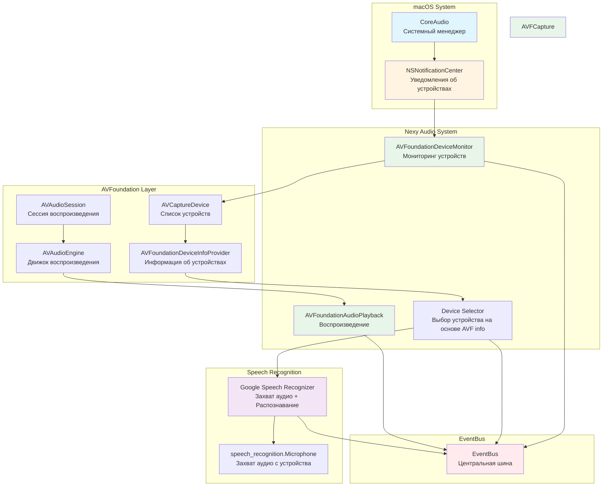

# Предложение: Архитектура аудиосистемы на AVFoundation

## Проблема

Текущая схема с polling через `sounddevice` не надежно обнаруживает новые устройства при подключении. Это приводит к:
- Задержкам в обнаружении новых устройств (до 0.5s и более)
- Пропуску событий подключения/отключения устройств
- Необходимости перезапуска приложения для обновления списка устройств

## Решение: AVFoundation для мониторинга и захвата аудио

AVFoundation предоставляет нативные API macOS для:
1. **Мгновенного обнаружения устройств** через `NSNotificationCenter`
2. **Получения информации об устройствах** через `AVCaptureDevice` (ID, имя, формат)
3. **Воспроизведения аудио** через `AVAudioPlayer` / `AVAudioEngine`

**ВАЖНО**: AVFoundation НЕ захватывает аудио напрямую. Он только предоставляет информацию об устройстве, которую использует Google Speech Recognizer для выбора и захвата аудио.

## Архитектура

### 1. Мониторинг устройств через AVFoundation

```
┌─────────────────────────────────────────────────────────────┐
│  AVFoundationDeviceMonitor (НОВЫЙ)                          │
│                                                             │
│  Двойной механизм мониторинга:                              │
│                                                             │
│  1. NSNotificationCenter (мгновенное обнаружение):          │
│     - AVCaptureDeviceWasConnectedNotification               │
│     - AVCaptureDeviceWasDisconnectedNotification             │
│     - AVCaptureDeviceWasAddedNotification                    │
│     - AVCaptureDeviceWasRemovedNotification                  │
│                                                             │
│  2. Polling (постоянная проверка каждые 1-2 секунды):      │
│     - Проверка списка устройств через AVCaptureDevice       │
│     - Сравнение с предыдущим списком                        │
│     - Обнаружение новых/удаленных устройств                 │
│                                                             │
│  Преимущества комбинированного подхода:                     │
│  ✅ Мгновенное обнаружение через уведомления (0ms)          │
│  ✅ Надежность через polling (fallback если уведомления     │
│     не сработали или пропущены)                             │
│  ✅ Полная информация об устройстве (AVCaptureDevice)       │
│  ✅ Постоянный мониторинг (каждые 1-2 секунды)              │
└──────────────────────┬──────────────────────────────────────┘
                       │
                       ▼
┌─────────────────────────────────────────────────────────────┐
│  Callback: _on_device_changed()                             │
│  - Тип изменения: CONNECTED / DISCONNECTED / DEFAULT_CHANGED│
│  - Источник: NSNotificationCenter или Polling              │
│  - Инвалидация кэша устройств                               │
│  - Перезапуск потока при реальной смене устройства         │
└─────────────────────────────────────────────────────────────┘
```

### 2. Получение информации об устройстве через AVFoundation

```
┌─────────────────────────────────────────────────────────────┐
│  AVFoundationDeviceInfoProvider (НОВЫЙ)                     │
│                                                             │
│  Компоненты:                                                │
│  1. AVCaptureDevice - получение списка устройств           │
│  2. AVCaptureDevice.DiscoverySession - поиск устройств      │
│  3. Информация об устройстве:                               │
│     - uniqueID (идентификатор устройства)                    │
│     - localizedName (имя устройства)                       │
│     - modelID (модель устройства)                            │
│     - manufacturer (производитель)                           │
│     - supportedFormats (поддерживаемые форматы)             │
│     - activeFormat (текущий формат)                          │
│                                                             │
│  Процесс:                                                    │
│  1. Получение списка устройств через AVCaptureDevice        │
│  2. Получение системного default устройства                 │
│  3. Извлечение информации об устройстве (ID, имя, формат)   │
│  4. Маппинг AVFoundation device → sounddevice device ID     │
│  5. Передача информации в Google Speech Recognizer          │
└──────────────────────┬──────────────────────────────────────┘
                       │
                       ▼
┌─────────────────────────────────────────────────────────────┐
│  Передача информации об устройстве                         │
│                                                             │
│  AVFoundation Device Info → Device Selector                 │
│                                                             │
│  Информация передается:                                      │
│  - device_unique_id (AVFoundation)                          │
│  - device_name (для маппинга на sounddevice)                │
│  - device_format (sample_rate, channels)                     │
│  - device_position (built-in, external, bluetooth)         │
└──────────────────────┬──────────────────────────────────────┘
                       │
                       ▼
┌─────────────────────────────────────────────────────────────┐
│  Google Speech Recognizer                                   │
│                                                             │
│  Получает: информацию об устройстве                         │
│                                                             │
│  Использует:                                                │
│  - speech_recognition.Microphone(device_index=...)          │
│  - Или speech_recognition.Microphone(device_id=...)        │
│  - recognizer.listen(source) - захват аудио                 │
│  - recognizer.recognize_google(audio_data, language=...)    │
│                                                             │
│  ВАЖНО: Google Speech Recognizer сам захватывает аудио!    │
│  AVFoundation только предоставляет информацию об устройстве│
└─────────────────────────────────────────────────────────────┘
```

### 3. Воспроизведение Output аудио через AVFoundation

```
┌─────────────────────────────────────────────────────────────┐
│  AVFoundationOutputDeviceMonitor (НОВЫЙ)                    │
│                                                             │
│  Мониторинг output устройств:                               │
│  - NSNotificationCenter: AVAudioSessionRouteChangeNotification│
│  - Polling каждые 1-2 секунды (проверка текущего output)  │
│  - Обнаружение смены системного default output             │
│                                                             │
│  Callback: _on_output_device_changed()                      │
│  - Тип изменения: OUTPUT_CONNECTED / OUTPUT_DISCONNECTED   │
│  - Новое устройство: device_name, device_UID                │
│  - Триггер пересоздания AVAudioEngine                      │
└──────────────────────┬──────────────────────────────────────┘
                       │
                       ▼
┌─────────────────────────────────────────────────────────────┐
│  AVFoundationAudioPlayback (НОВЫЙ)                           │
│                                                             │
│  Компоненты:                                                │
│  1. AVAudioSession - сессия воспроизведения                │
│  2. AVAudioEngine - движок воспроизведения (для потоков)   │
│  3. AVAudioPlayerNode - узел воспроизведения                │
│  4. AVAudioPCMBuffer - буфер для аудио данных               │
│                                                             │
│  Процесс:                                                    │
│  1. Получение системного default output через AVAudioSession│
│  2. Настройка категории: .playback                         │
│  3. Создание AVAudioEngine (автоматически использует        │
│     системный default output)                               │
│  4. Подключение AVAudioPlayerNode к outputNode             │
│  5. Конвертация аудио чанков: numpy → AVAudioPCMBuffer     │
│  6. Планирование и воспроизведение через scheduleBuffer()  │
│  7. Автоматическое переключение при смене устройства       │
│                                                             │
│  Преимущества:                                              │
│  ✅ Правильный выбор устройства (системный default)        │
│  ✅ Автоматическое переключение при смене устройства       │
│  ✅ Низкая задержка (нативный API)                         │
│  ✅ Поддержка различных форматов                            │
│  ✅ Последовательное воспроизведение чанков                 │
└─────────────────────────────────────────────────────────────┘
```

## Полная схема взаимодействия



## Детальная схема получения информации об устройстве и захвата аудио

```
┌─────────────────────────────────────────────────────────────┐
│  ШАГ 1: Инициализация AVFoundation                         │
│                                                             │
│  1.1. Подписка на уведомления:                              │
│       NSNotificationCenter.default.addObserver(             │
│           forName: .AVCaptureDeviceWasConnected,            │
│           object: nil,                                      │
│           queue: .main                                      │
│       ) { notification in                                  │
│           // Новое устройство подключено                    │
│           onDeviceConnected(device)                        │
│       }                                                     │
│                                                             │
│  1.2. Получение списка устройств:                          │
│       let devices = AVCaptureDevice.DiscoverySession(       │
│           deviceTypes: [.microphone],                      │
│           mediaType: .audio,                                │
│           position: .unspecified                           │
│       ).devices                                            │
└──────────────────────┬──────────────────────────────────────┘
                       │
                       ▼
┌─────────────────────────────────────────────────────────────┐
│  ШАГ 2: Выбор устройства                                   │
│                                                             │
│  2.1. Получение системного default:                        │
│       let defaultDevice = AVCaptureDevice.default(          │
│           for: .audio                                      │
│       )                                                     │
│                                                             │
│  2.2. Или выбор по имени/ID:                               │
│       let device = devices.first { $0.uniqueID == id }     │
│                                                             │
│  2.3. Проверка доступности:                                │
│       if device.isConnected && !device.isSuspended {       │
│           // Устройство доступно                           │
│       }                                                     │
└──────────────────────┬──────────────────────────────────────┘
                       │
                       ▼
┌─────────────────────────────────────────────────────────────┐
│  ШАГ 3: Создание сессии захвата                            │
│                                                             │
│  3.1. Создание сессии:                                     │
│       let session = AVCaptureSession()                     │
│                                                             │
│  3.2. Создание input устройства:                           │
│       let input = try AVCaptureDeviceInput(device: device)  │
│       session.addInput(input)                               │
│                                                             │
│  3.3. Создание output для аудио данных:                     │
│       let output = AVCaptureAudioDataOutput()              │
│       output.setSampleBufferDelegate(self, queue: queue)   │
│       session.addOutput(output)                             │
│                                                             │
│  3.4. Настройка формата:                                    │
│       let format = device.activeFormat                      │
│       // Используем формат устройства                       │
└──────────────────────┬──────────────────────────────────────┘
                       │
                       ▼
┌─────────────────────────────────────────────────────────────┐
│  ШАГ 4: Запуск сессии и получение данных                  │
│                                                             │
│  4.1. Запуск сессии:                                       │
│       session.startRunning()                                │
│                                                             │
│  4.2. Callback получения данных:                           │
│       func captureOutput(                                  │
│           _ output: AVCaptureOutput,                       │
│           didOutput sampleBuffer: CMSampleBuffer,          │
│           from connection: AVCaptureConnection              │
│       ) {                                                   │
│           // Конвертация CMSampleBuffer → numpy array      │
│           let audioData = convertToNumpy(sampleBuffer)     │
│           // Передача в Google Speech Recognizer           │
│           onAudioDataReceived(audioData)                   │
│       }                                                     │
└──────────────────────┬──────────────────────────────────────┘
                       │
                       ▼
┌─────────────────────────────────────────────────────────────┐
│  ШАГ 5: Конвертация и передача в Google SR                 │
│                                                             │
│  5.1. Конвертация CMSampleBuffer:                           │
│       - Извлечение AudioBufferList из CMSampleBuffer        │
│       - Конвертация в numpy array (int16, mono, 16kHz)     │
│                                                             │
│  5.2. Передача в Google Speech Recognizer:                  │
│       recognizer.recognize_google(                          │
│           audio_data,                                       │
│           language="ru-RU"                                 │
│       )                                                     │
└─────────────────────────────────────────────────────────────┘
```

## Детальная схема воспроизведения (Output аудио)

### Полный цикл работы Output аудио

```
┌─────────────────────────────────────────────────────────────┐
│  ШАГ 1: Мониторинг output устройств                         │
│                                                             │
│  1.1. Подписка на уведомления об изменении output:         │
│       NSNotificationCenter.default.addObserver(             │
│           forName: .AVAudioSessionRouteChangeNotification, │
│           object: nil,                                      │
│           queue: .main                                      │
│       ) { notification in                                  │
│           // Output устройство изменилось                   │
│           onOutputDeviceChanged(newRoute)                  │
│       }                                                     │
│                                                             │
│  1.2. Polling (каждые 1-2 секунды):                        │
│       - Проверка текущего output устройства                │
│       - Сравнение с предыдущим устройством                  │
│       - Обнаружение изменений                               │
│                                                             │
│  1.3. Получение текущего output устройства:                │
│       let session = AVAudioSession.sharedInstance()        │
│       let currentRoute = session.currentRoute              │
│       let outputPort = currentRoute.outputs.first           │
│       let deviceName = outputPort?.portName                │
│       let deviceUID = outputPort?.uid                      │
└──────────────────────┬──────────────────────────────────────┘
                       │
                       ▼
┌─────────────────────────────────────────────────────────────┐
│  ШАГ 2: Выбор output устройства                             │
│                                                             │
│  2.1. Получение системного default output:                  │
│       let session = AVAudioSession.sharedInstance()        │
│       let defaultRoute = session.currentRoute               │
│       // macOS автоматически использует системный default   │
│                                                             │
│  2.2. Или явный выбор устройства:                           │
│       // Получение списка доступных output устройств       │
│       let availableOutputs = AVAudioSession.sharedInstance() │
│           .availableInputs  // Для output используем другой │
│                             // API или системный default   │
│                                                             │
│  2.3. Настройка AVAudioSession:                            │
│       let session = AVAudioSession.sharedInstance()        │
│       try session.setCategory(.playback,                    │
│           mode: .default,                                   │
│           options: [])                                      │
│       try session.setActive(true)                           │
│                                                             │
│  2.4. Проверка текущего output устройства:                 │
│       let currentOutput = session.currentRoute.outputs.first│
│       logger.info("Output: \(currentOutput?.portName)")    │
└──────────────────────┬──────────────────────────────────────┘
                       │
                       ▼
┌─────────────────────────────────────────────────────────────┐
│  ШАГ 3: Создание AVAudioEngine                              │
│                                                             │
│  3.1. Создание engine:                                     │
│       let engine = AVAudioEngine()                          │
│                                                             │
│  3.2. Получение output node (автоматически подключен):     │
│       let outputNode = engine.outputNode                    │
│       // outputNode автоматически подключен к системному    │
│       // default output устройству                          │
│                                                             │
│  3.3. Создание player node:                                │
│       let playerNode = AVAudioPlayerNode()                  │
│       engine.attach(playerNode)                            │
│                                                             │
│  3.4. Подключение player node к output:                    │
│       let audioFormat = AVAudioFormat(                      │
│           commonFormat: .pcmFormatInt16,                    │
│           sampleRate: 48000,                                │
│           channels: 1,                                       │
│           interleaved: false                                │
│       )                                                     │
│       engine.connect(                                       │
│           playerNode,                                       │
│           to: engine.mainMixerNode,                        │
│           format: audioFormat                               │
│       )                                                     │
│       engine.connect(                                       │
│           engine.mainMixerNode,                            │
│           to: outputNode,                                   │
│           format: audioFormat                               │
│       )                                                     │
│                                                             │
│  3.5. Запуск engine:                                        │
│       try engine.start()                                    │
│       // Engine автоматически использует текущее системное  │
│       // output устройство                                 │
└──────────────────────┬──────────────────────────────────────┘
                       │
                       ▼
┌─────────────────────────────────────────────────────────────┐
│  ШАГ 4: Воспроизведение аудио                              │
│                                                             │
│  4.1. Подготовка аудио данных:                              │
│       let audioBuffer = AVAudioPCMBuffer(                   │
│           pcmFormat: audioFormat,                          │
│           frameCapacity: frameCount                          │
│       )                                                     │
│       // Заполнение buffer данными из gRPC чанков          │
│       // Конвертация numpy array → AVAudioPCMBuffer        │
│                                                             │
│  4.2. Планирование воспроизведения:                         │
│       playerNode.scheduleBuffer(                            │
│           audioBuffer,                                      │
│           at: nil,  // Немедленно                          │
│           completionHandler: {                              │
│               // Callback при завершении чанка              │
│               onChunkCompleted()                            │
│           }                                                 │
│       )                                                     │
│                                                             │
│  4.3. Запуск воспроизведения:                               │
│       if !playerNode.isPlaying {                           │
│           playerNode.play()                                 │
│       }                                                     │
│                                                             │
│  4.4. Последовательное воспроизведение чанков:              │
│       // Каждый новый чанк планируется через scheduleBuffer│
│       // AVAudioPlayerNode автоматически воспроизводит     │
│       // чанки последовательно                             │
└──────────────────────┬──────────────────────────────────────┘
                       │
                       ▼
┌─────────────────────────────────────────────────────────────┐
│  ШАГ 5: Обработка смены output устройства                  │
│                                                             │
│  5.1. Обнаружение смены (через уведомление или polling):   │
│       if outputDeviceChanged {                              │
│           // Новое устройство обнаружено                   │
│       }                                                     │
│                                                             │
│  5.2. Остановка текущего воспроизведения:                   │
│       playerNode.stop()                                     │
│       engine.stop()                                         │
│                                                             │
│  5.3. Пересоздание engine с новым устройством:             │
│       // AVAudioEngine автоматически использует новое       │
│       // системное default устройство                      │
│       engine = AVAudioEngine()                             │
│       // Повторная настройка (ШАГ 3)                        │
│                                                             │
│  5.4. Возобновление воспроизведения:                       │
│       // Продолжение с того места где остановились          │
│       // или начало нового чанка                           │
└─────────────────────────────────────────────────────────────┘
```

## Интеграция Output аудио с текущей системой

### Поток данных от gRPC до воспроизведения

```
┌─────────────────────────────────────────────────────────────┐
│  1. Получение аудио чанков от gRPC                          │
│                                                             │
│  grpc.response.audio event                                  │
│  └─> SpeechPlaybackIntegration._on_audio_chunk()            │
│      └─> Данные: bytes, dtype, sample_rate, channels        │
└──────────────────────┬──────────────────────────────────────┘
                       │
                       ▼
┌─────────────────────────────────────────────────────────────┐
│  2. Декодирование и конвертация                             │
│                                                             │
│  bytes → numpy array (int16 или float32)                   │
│  └─> Обработка формата (WAV header, endianness)           │
│  └─> Подготовка для воспроизведения                         │
└──────────────────────┬──────────────────────────────────────┘
                       │
                       ▼
┌─────────────────────────────────────────────────────────────┐
│  3. Выбор метода воспроизведения                            │
│                                                             │
│  Проверка доступности AVFoundation:                        │
│  ├─> Если доступен → AVFoundationAudioPlayback             │
│  └─> Если недоступен → SequentialSpeechPlayer (sounddevice)│
└──────────────────────┬──────────────────────────────────────┘
                       │
                       ▼
┌─────────────────────────────────────────────────────────────┐
│  4. Воспроизведение через AVFoundation                      │
│                                                             │
│  AVFoundationAudioPlayback:                                 │
│  ├─> Проверка текущего output устройства                   │
│  ├─> Конвертация: numpy array → AVAudioPCMBuffer           │
│  ├─> playerNode.scheduleBuffer(audioBuffer)                │
│  ├─> playerNode.play()                                      │
│  └─> Воспроизведение через системное default устройство    │
└──────────────────────┬──────────────────────────────────────┘
                       │
                       ▼
┌─────────────────────────────────────────────────────────────┐
│  5. Мониторинг и переключение устройств                     │
│                                                             │
│  AVFoundationOutputDeviceMonitor:                           │
│  ├─> Обнаружение смены output устройства                    │
│  ├─> Остановка текущего воспроизведения                     │
│  ├─> Пересоздание AVAudioEngine с новым устройством         │
│  └─> Возобновление воспроизведения                          │
└─────────────────────────────────────────────────────────────┘
```

### Вариант 1: Постепенная миграция (рекомендуется)

```
┌─────────────────────────────────────────────────────────────┐
│  Текущая система (sounddevice)                              │
│  └─> Fallback если AVFoundation недоступен                 │
│                                                             │
│  Новая система (AVFoundation)                              │
│  └─> Основной метод если доступен                           │
│                                                             │
│  Логика выбора:                                             │
│  1. Проверка доступности AVFoundation (PyObjC)             │
│  2. Если доступен → используем AVFoundation                │
│  3. Если недоступен → fallback на sounddevice               │
└─────────────────────────────────────────────────────────────┘
```

### Вариант 2: Гибридный подход

```
┌─────────────────────────────────────────────────────────────┐
│  Мониторинг устройств: AVFoundation (мгновенное)          │
│  Информация об устройстве: AVFoundation (нативный API)     │
│  Захват аудио: Google Speech Recognizer (через Microphone)│
│  Воспроизведение Output: AVFoundation (правильный выбор)  │
│                                                             │
│  Fallback на sounddevice:                                   │
│  - Если AVFoundation недоступен                             │
│  - Если требуется совместимость с существующим кодом        │
└─────────────────────────────────────────────────────────────┘
```

### Интеграция с SequentialSpeechPlayer

```
┌─────────────────────────────────────────────────────────────┐
│  SequentialSpeechPlayer (текущий)                            │
│                                                             │
│  Методы воспроизведения:                                    │
│  1. sounddevice.OutputStream (текущий)                     │
│  2. AVFoundationAudioPlayback (новый, если доступен)        │
│                                                             │
│  Логика выбора:                                             │
│  - Проверка доступности AVFoundation                        │
│  - Если доступен → используем AVFoundation                  │
│  - Если недоступен → используем sounddevice                 │
│                                                             │
│  Общий интерфейс:                                           │
│  - add_audio_data(audio_data, metadata)                     │
│  - start_playback()                                         │
│  - stop_playback()                                          │
│  - resync_output_device()  # Переключение устройства      │
└─────────────────────────────────────────────────────────────┘
```

## Преимущества AVFoundation

### 1. Мониторинг устройств
- ✅ **Мгновенное обнаружение** - через NSNotificationCenter (0ms задержка)
- ✅ **Постоянный мониторинг** - polling каждые 1-2 секунды для надежности
- ✅ **Двойной механизм** - уведомления + polling (fallback если уведомления пропущены)
- ✅ **Надежность** - системные уведомления macOS + постоянная проверка
- ✅ **Полная информация** - AVCaptureDevice предоставляет всю информацию об устройстве

### 2. Получение информации об устройстве
- ✅ **Нативный API** - прямая работа с CoreAudio через AVFoundation
- ✅ **Правильный выбор устройства** - использует системный default
- ✅ **Полная информация** - ID, имя, формат, производитель
- ✅ **Маппинг на sounddevice** - для совместимости с Google Speech Recognizer

### 3. Воспроизведение
- ✅ **Правильный выбор устройства** - автоматически использует системный default
- ✅ **Автоматическое переключение** - при смене output устройства
- ✅ **Поддержка форматов** - различные форматы аудио
- ✅ **Низкая задержка** - нативный API

## Реализация

### Необходимые зависимости

```python
# PyObjC для работы с AVFoundation
PyObjC>=9.0
pyobjc-framework-AVFoundation>=9.0
pyobjc-framework-CoreAudio>=9.0
```

### Структура модулей

```
modules/
├── voice_recognition/
│   ├── core/
│   │   ├── avfoundation_device_monitor.py      # НОВЫЙ: мониторинг через AVFoundation
│   │   ├── avfoundation_device_info_provider.py # НОВЫЙ: получение информации об устройстве
│   │   └── speech_recognizer.py                # Обновлен: использует AVFoundation для выбора устройства
│   └── ...
└── speech_playback/
    ├── core/
    │   ├── avfoundation_audio_playback.py  # НОВЫЙ: воспроизведение через AVFoundation
    │   └── player.py                        # Обновлен: использует AVFoundation если доступен
    └── ...
```

## Риски и ограничения

### Риски
1. **Зависимость от PyObjC** - требуется установка PyObjC и фреймворков
2. **Совместимость** - может потребоваться обновление зависимостей
3. **Тестирование** - необходимо протестировать на различных устройствах
4. **Миграция** - постепенная миграция требует поддержки обоих методов

### Ограничения
1. **Только macOS** - AVFoundation доступен только на macOS
2. **PyObjC** - требует знания Objective-C/Swift API
3. **Отладка** - сложнее отлаживать нативный код

## План внедрения

### Этап 1: Мониторинг устройств (приоритет 1)
- [ ] Создать `AVFoundationDeviceMonitor`
- [ ] Реализовать подписку на NSNotificationCenter уведомления
- [ ] Реализовать polling каждые 1-2 секунды (настраиваемый интервал)
- [ ] Добавить сравнение списков устройств для обнаружения изменений
- [ ] Интегрировать в `SpeechRecognizer`
- [ ] Добавить fallback на `AudioDeviceMonitor` (если AVFoundation недоступен)
- [ ] Тестирование на различных устройствах (подключение/отключение)

### Этап 2: Получение информации об устройстве (приоритет 2)
- [ ] Создать `AVFoundationDeviceInfoProvider`
- [ ] Добавить маппинг AVFoundation device → sounddevice device_id
- [ ] Интегрировать с Google Speech Recognizer (передача device_id)
- [ ] Тестирование выбора правильного устройства

### Этап 3: Воспроизведение Output аудио (приоритет 3)
- [ ] Создать `AVFoundationOutputDeviceMonitor` (мониторинг output устройств)
- [ ] Создать `AVFoundationAudioPlayback` (воспроизведение через AVAudioEngine)
- [ ] Реализовать подписку на `AVAudioSessionRouteChangeNotification`
- [ ] Реализовать polling output устройств (каждые 1-2 секунды)
- [ ] Реализовать автоматическое переключение при смене устройства
- [ ] Добавить конвертацию numpy array → AVAudioPCMBuffer
- [ ] Интегрировать в `SequentialSpeechPlayer`
- [ ] Тестирование на различных output устройствах (подключение/отключение)

## Упрощенная схема работы (для понимания)

### Текущая схема (sounddevice)
```
Пользователь подключает устройство
    ↓
Polling каждые 0.5s проверяет sd.default.device
    ↓
Обнаружение через 0.5s (или позже)
    ↓
Обновление списка устройств
    ↓
Перезапуск потока
```

### Новая схема (AVFoundation) - Двойной механизм
```
Пользователь подключает устройство
    ↓
┌─────────────────────────────────────────┐
│  Механизм 1: NSNotificationCenter       │
│  macOS отправляет уведомление мгновенно  │
│  ↓                                       │
│  AVFoundationDeviceMonitor получает      │
│  уведомление мгновенно (0ms)             │
└─────────────────────────────────────────┘
    ↓
┌─────────────────────────────────────────┐
│  Механизм 2: Polling (каждые 1-2 сек)  │
│  Постоянная проверка списка устройств   │
│  ↓                                       │
│  Сравнение с предыдущим списком          │
│  ↓                                       │
│  Обнаружение новых/удаленных устройств  │
│  (fallback если уведомления пропущены)   │
└─────────────────────────────────────────┘
    ↓
Обновление списка устройств
    ↓
Автоматический перезапуск потока
```

### Схема получения информации об устройстве и захвата аудио
```
AVFoundationDeviceInfoProvider
    ↓
Получение информации об устройстве (ID, имя, формат)
    ↓
Маппинг AVFoundation device → sounddevice device_id
    ↓
Передача device_id в Google Speech Recognizer
    ↓
speech_recognition.Microphone(device_index=device_id)
    ↓
Google Speech Recognizer сам захватывает аудио
    ↓
recognizer.listen(source) → recognizer.recognize_google(audio)
```

### Схема воспроизведения Output аудио
```
AVFoundationOutputDeviceMonitor
    ↓
Мониторинг output устройств (уведомления + polling каждые 1-2s)
    ↓
Обнаружение системного default output устройства
    ↓
AVAudioSession.setCategory(.playback)
    ↓
AVAudioEngine создание и настройка
    ↓
AVAudioPlayerNode подключение к outputNode
    ↓
Получение аудио чанков из gRPC
    ↓
Конвертация: numpy array → AVAudioPCMBuffer
    ↓
playerNode.scheduleBuffer() → playerNode.play()
    ↓
Воспроизведение через системное default устройство
    ↓
При смене устройства: автоматическое переключение
    ↓
Остановка → Пересоздание engine → Возобновление
```

### Схема воспроизведения
```
AVFoundationAudioPlayback
    ↓
Выбор output устройства (системный default)
    ↓
AVAudioSession.setCategory(.playback)
    ↓
AVAudioEngine.start()
    ↓
AVAudioPlayerNode.scheduleBuffer(audioBuffer)
    ↓
playerNode.play()
    ↓
Воспроизведение через выбранное устройство
```

## Выводы

AVFoundation предоставляет надежное решение для:
1. **Мгновенного обнаружения устройств** - через NSNotificationCenter
2. **Получения информации об устройствах** - нативный API с правильным выбором устройства
3. **Воспроизведения** - автоматический выбор и переключение устройств

**Ключевой момент**: AVFoundation получает информацию об устройстве, а Google Speech Recognizer использует эту информацию для выбора и захвата аудио через `speech_recognition.Microphone`.

Рекомендуется **постепенная миграция** с fallback на sounddevice для совместимости.

## Ключевые отличия от текущей системы

| Аспект | Текущая (sounddevice) | Новая (AVFoundation) |
|--------|----------------------|---------------------|
| **Обнаружение устройств** | Polling каждые 0.5s | Двойной механизм: NSNotificationCenter (мгновенно) + Polling каждые 1-2s |
| **Задержка обнаружения** | 0.5s - несколько секунд | 0ms (через уведомления) или 1-2s (через polling) |
| **Нагрузка на CPU** | Постоянный polling (sounddevice) | Polling через AVFoundation (более эффективный) + уведомления |
| **Выбор устройства** | Через PortAudio (может быть устаревшим) | Через системный default macOS |
| **Захват аудио** | sounddevice.InputStream | Google Speech Recognizer (через speech_recognition.Microphone) |
| **Информация об устройстве** | sounddevice.query_devices() | AVFoundation (AVCaptureDevice) |
| **Воспроизведение** | sounddevice.OutputStream | AVAudioEngine + AVAudioPlayerNode |
| **Автоматическое переключение** | Требует перезапуска | Автоматическое при смене устройства |
| **Зависимости** | sounddevice (PortAudio) | PyObjC + AVFoundation |
| **Совместимость** | Кроссплатформенная | Только macOS |

