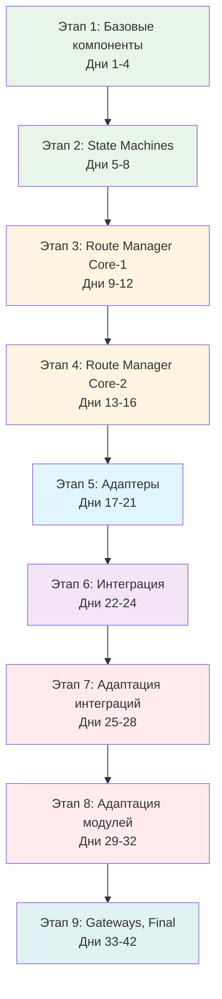

# План последовательности реализации аудиосистемы

**Статус**: Обязательный порядок реализации  
**Версия**: 1.0  
**Дата**: 2025-01-XX  
**Основан на**: `AUDIO_MIGRATION_MASTER_SPECIFICATION.md`, `AUDIO_MIGRATION_PR_PLAN.md`

---

## 📋 Общая структура

**9 этапов, 42 дня, 9 PR**

Каждый этап зависит от предыдущих. Нарушение порядка может привести к ошибкам компиляции и тестов.

---

## 🎯 Этап 1: Базовые компоненты (PR 1)

**Ветка**: `feature/avfoundation-audio-stage1-contracts-mapping`  
**Дни**: 1-4  
**Зависимости**: Нет

### День 1-2: contracts.py

**Файл**: `modules/voice_recognition/core/avfoundation/contracts.py`

**Порядок реализации**:
1. Создать файл
2. Реализовать `Confidence` enum
3. Реализовать `DeviceTransport` enum
4. Реализовать `DeviceSignature` dataclass
5. Реализовать `RouteSnapshot` dataclass
6. Реализовать `MappingResult` dataclass
7. Добавить методы: `__str__()`, `input_changed()`, `output_changed()`, `is_usable()`

**Тесты**: `tests/test_avfoundation_contracts.py`
- Создать параллельно с реализацией

**Критерии готовности**:
- [ ] Линтер проходит
- [ ] Тесты проходят (≥80% покрытие)
- [ ] Все типы определены

---

### День 3-4: mapping.py

**Файл**: `modules/voice_recognition/core/avfoundation/mapping.py`

**Порядок реализации**:
1. Создать файл
2. Импортировать `contracts.py`
3. Реализовать `normalize_device_name()`
4. Реализовать `detect_transport()`
5. Реализовать `build_signature()`
6. Реализовать `find_portaudio_match()`
7. Реализовать `get_device_index()`
8. Реализовать кэширование
9. Реализовать `clear_cache()`

**Тесты**: `tests/test_avfoundation_mapping.py`
- Создать параллельно с реализацией

**Критерии готовности**:
- [ ] Линтер проходит
- [ ] Тесты проходят (≥80% покрытие)
- [ ] Тесты на реальных устройствах (Bluetooth/USB/Built-in)

---

## 🎯 Этап 2: State Machines (PR 2)

**Ветка**: `feature/avfoundation-audio-stage2-state-machines`  
**Дни**: 5-8  
**Зависимости**: Этап 1 (contracts.py)

### День 5-6: input_state_machine.py

**Файл**: `modules/voice_recognition/core/avfoundation/input_state_machine.py`

**Порядок реализации**:
1. Создать файл
2. Импортировать `contracts.py`
3. Реализовать `InputState` enum
4. Реализовать `InputStateMachine` dataclass
5. Реализовать `transition_to()`
6. Реализовать `update_heartbeat()`
7. Реализовать `check_heartbeat()`
8. Реализовать `can_retry()`
9. Реализовать `get_retry_backoff_sec()`
10. Реализовать `should_rollback()`

**Тесты**: `tests/test_avfoundation_state_machines.py` (input часть)

---

### День 7-8: output_state_machine.py

**Файл**: `modules/voice_recognition/core/avfoundation/output_state_machine.py`

**Порядок реализации**:
1. Создать файл
2. Импортировать `contracts.py`
3. Реализовать `OutputState` enum
4. Реализовать `OutputStateMachine` dataclass
5. Реализовать `transition_to()`
6. Реализовать `check_recreate_timeout()`
7. Реализовать `can_retry()`
8. Реализовать `get_retry_backoff_sec()`

**Тесты**: `tests/test_avfoundation_state_machines.py` (output часть)

---

## 🎯 Этап 3: Route Manager Core - Part 1 (PR 3)

**Ветка**: `feature/avfoundation-audio-stage3-route-manager-core-1`  
**Дни**: 9-12  
**Зависимости**: Этап 1 (contracts.py, mapping.py), Этап 2 (state machines)

### День 9-10: debounce_manager.py

**Файл**: `modules/voice_recognition/core/avfoundation/debounce_manager.py`

**Порядок реализации**:
1. Создать файл
2. Импортировать `contracts.py`
3. Реализовать `DebounceConfig` dataclass
4. Реализовать `DebounceManager` класс
5. Реализовать `get_debounce_delay_ms()`
6. Реализовать `reset_device()`
7. Реализовать `clear_all()`

**Тесты**: `tests/test_avfoundation_route_manager.py` (debounce часть)

---

### День 11-12: decision_engine.py

**Файл**: `modules/voice_recognition/core/avfoundation/decision_engine.py`

**Порядок реализации**:
1. Создать файл
2. Импортировать `contracts.py`
3. Реализовать `Decision` enum
4. Реализовать `DecisionContext` dataclass
5. Реализовать `DecisionEngine` класс
6. Реализовать `decide_route_manager_reconcile()` с правилами:
   - Hard stop: first_run, restart_pending, update_in_progress
   - Hard stop: mic denied
   - Graceful: device_busy → retry
   - Graceful: network_offline → degrade
   - NOOP: нет изменений
   - START: нормальные условия
7. Реализовать `format_decision_log()` (канонический формат)

**Тесты**: `tests/test_avfoundation_route_manager.py` (decision часть)
- Обязательно: ≥12 pairwise тестов + 2 негативных

---

## 🎯 Этап 4: Route Manager Core - Part 2 (PR 4)

**Ветка**: `feature/avfoundation-audio-stage3-route-manager-core-2`  
**Дни**: 13-16  
**Зависимости**: Этап 1, Этап 2, Этап 3 (debounce, decision)

### День 13-14: reconcile_engine.py

**Файл**: `modules/voice_recognition/core/avfoundation/reconcile_engine.py`

**Порядок реализации**:
1. Создать файл
2. Импортировать `contracts.py`, `mapping.py`
3. Реализовать `ReconcileResult` dataclass
4. Реализовать `ReconcileEngine` класс
5. Реализовать `create_snapshot()`
6. Реализовать `determine_desired_route()` (priority: user → system → fallback)
7. Реализовать `compare_routes()`

**Тесты**: `tests/test_avfoundation_route_manager.py` (reconcile часть)

---

### День 15-16: route_manager.py

**Файл**: `modules/voice_recognition/core/avfoundation/route_manager.py`

**Порядок реализации**:
1. Создать файл
2. Импортировать все зависимости (contracts, mapping, state machines, engines)
3. Реализовать `AudioRouteManager` класс
4. Реализовать `__init__()`
5. Реализовать `set_event_loop()`
6. Реализовать `set_callbacks()`
7. Реализовать `reconcile_routes()` с single-flight механизмом
8. Реализовать `_apply_input_change()`
9. Реализовать `_apply_output_change()`
10. Реализовать `get_active_input_device()`
11. Реализовать `get_active_output_device()`

**Тесты**: `tests/test_avfoundation_route_manager.py` (основной)

---

## 🎯 Этап 5: Адаптеры (PR 5)

**Ветка**: `feature/avfoundation-audio-stage4-adapters`  
**Дни**: 17-21  
**Зависимости**: Этап 1 (contracts.py, mapping.py)

### День 17-18: avf_monitor.py

**Файл**: `modules/voice_recognition/core/avfoundation/adapters/avf_monitor.py`

**Порядок реализации**:
1. Создать файл
2. Проверить доступность PyObjC
3. Импортировать `contracts.py`, `mapping.py`
4. Реализовать `DeviceInfo` dataclass
5. Реализовать `AVFoundationDeviceMonitor` класс
6. Реализовать `_setup_notifications()` (NSNotificationCenter)
7. Реализовать `routeChanged_()` (notification handler)
8. Реализовать `_query_devices()` (AVFoundation query)
9. Реализовать `_process_device_changes()`
10. Реализовать `start_monitoring()` (dual mechanism: notifications + polling)
11. Реализовать `_monitor_loop()` (polling thread)
12. Реализовать `stop_monitoring()`
13. Реализовать `get_current_devices()`

**Тесты**: `tests/test_avfoundation_adapters.py` (monitor часть)

---

### День 19-20: avf_output.py

**Файл**: `modules/voice_recognition/core/avfoundation/adapters/avf_output.py`

**Порядок реализации**:
1. Создать файл
2. Проверить доступность PyObjC
3. Импортировать `contracts.py`
4. Реализовать `ChunkInfo` dataclass
5. Реализовать `AVFoundationAudioPlayback` класс
6. Реализовать `initialize()` (AVAudioEngine setup)
7. Реализовать `_numpy_to_pcm_buffer()` (конвертация)
8. Реализовать sample rate conversion (16kHz → 48kHz)
9. Реализовать channel conversion
10. Реализовать `play_chunk()`
11. Реализовать очередь чанков (max 5MB, 5s)
12. Реализовать `stop_playback()`
13. Реализовать `shutdown()`

**Тесты**: `tests/test_avfoundation_adapters.py` (output часть)

---

### День 21: google_input.py

**Файл**: `modules/voice_recognition/core/avfoundation/adapters/google_input.py`

**Порядок реализации**:
1. Создать файл
2. Импортировать `contracts.py`, `speech_recognition`
3. Реализовать `GoogleInputController` класс
4. Реализовать `get_microphone()` (с device_index или system default)
5. Реализовать `update_device()`
6. Реализовать `get_current_device()`

**Тесты**: `tests/test_avfoundation_adapters.py` (input часть)

---

## 🎯 Этап 6: Интеграция (PR 6)

**Ветка**: `feature/avfoundation-audio-stage5-integration`  
**Дни**: 22-24  
**Зависимости**: Этапы 1-5 (все компоненты готовы)

### День 22-23: audio_route_manager_integration.py

**Файл**: `integration/integrations/audio_route_manager_integration.py`

**Порядок реализации**:
1. Создать файл
2. Импортировать все зависимости (RouteManager, адаптеры, EventBus, StateManager)
3. Реализовать `AudioRouteManagerIntegration` класс
4. Реализовать `__init__()` с проверкой feature flags
5. Реализовать `initialize()`:
   - Проверка kill-switch
   - Проверка feature flags
   - Инициализация компонентов
   - Подписки на события
   - Запуск мониторинга
6. Реализовать `start()`
7. Реализовать `stop()`
8. Реализовать `_on_reconcile_requested()`
9. Реализовать `_create_snapshot()` (из state_manager)
10. Реализовать `_create_decision_context()` (из Snapshot)
11. Реализовать callbacks (_on_input_start, _on_input_stop, _on_output_recreate)
12. Реализовать обработчики событий (_on_device_changed, _on_first_run_started, etc.)
13. Реализовать `get_active_input_device()`
14. Реализовать `get_active_output_device()`

**Тесты**: `tests/integration/test_audio_route_manager.py`

---

### День 24: simple_module_coordinator.py

**Файл**: `integration/core/simple_module_coordinator.py`

**Порядок реализации**:
1. Добавить импорт `AudioRouteManagerIntegration`
2. Найти метод `_create_integrations()`
3. Добавить создание `AudioRouteManagerIntegration` после `speech_playback`
4. Добавить проверку зависимостей (voice_recognition, speech_playback)
5. Обновить `startup_order` (добавить `'audio_route_manager'` после `'speech_playback'`)

**Тесты**: Обновить `tests/test_init_order.py`

---

## 🎯 Этап 7: Адаптация существующих интеграций (PR 7)

**Ветка**: `feature/avfoundation-audio-stage6-adapt-integrations`  
**Дни**: 25-28  
**Зависимости**: Этап 6 (AudioRouteManagerIntegration готов)

### День 25-26: voice_recognition_integration.py

**Файл**: `integration/integrations/voice_recognition_integration.py`

**Порядок реализации**:
1. Добавить проверку feature flag `audio_system.avfoundation_route_manager_enabled`
2. Получить ссылку на `AudioRouteManagerIntegration` (через coordinator или dependency injection)
3. Обновить `_on_recording_start()`:
   - Если feature flag включен → получить device_index от RouteManager
   - Использовать `GoogleInputController` для получения Microphone
   - Fallback на старую логику (если флаг выключен)
4. Обновить `_on_recording_stop()` (если нужно)
5. Убрать прямые вызовы `sd.default.device` (если есть)

**Тесты**: Обновить существующие тесты

---

### День 27-28: speech_playback_integration.py

**Файл**: `integration/integrations/speech_playback_integration.py`

**Порядок реализации**:
1. Добавить проверку feature flag `audio_system.avfoundation_output_enabled`
2. Получить ссылку на `AVFoundationAudioPlayback` (через RouteManager или dependency injection)
3. Обновить `_on_audio_chunk()`:
   - Если feature flag включен → использовать `AVFoundationAudioPlayback`
   - Конвертация numpy → AVAudioPCMBuffer
   - Fallback на старую логику (если флаг выключен)
4. Обновить очередь чанков (если нужно)

**Тесты**: Обновить существующие тесты

---

## 🎯 Этап 8: Адаптация модулей (PR 8)

**Ветка**: `feature/avfoundation-audio-stage7-adapt-modules`  
**Дни**: 29-32  
**Зависимости**: Этап 7 (интеграции адаптированы)

### День 29-30: speech_recognizer.py

**Файл**: `modules/voice_recognition/core/speech_recognizer.py`

**Порядок реализации**:
1. Добавить проверку feature flag
2. Получить `device_index` от RouteManager (через интеграцию)
3. Использовать `GoogleInputController` для получения Microphone
4. Убрать прямые вызовы `sd.default.device`
5. Убрать использование `AudioDeviceMonitor` (или оставить для fallback)
6. Сохранить fallback на старую логику

**Тесты**: Обновить существующие тесты

---

### День 31-32: player.py

**Файл**: `modules/speech_playback/core/player.py`

**Порядок реализации**:
1. Добавить проверку feature flag
2. Использовать `AVFoundationAudioPlayback` вместо `sounddevice.OutputStream`
3. Конвертация форматов (numpy → AVAudioPCMBuffer)
4. Обновить очередь чанков
5. Сохранить fallback на старую логику

**Тесты**: Обновить существующие тесты

---

## 🎯 Этап 9: Gateways, State Catalog, Тестирование (PR 9)

**Ветка**: `feature/avfoundation-audio-stage8-9-final`  
**Дни**: 33-42  
**Зависимости**: Этапы 1-8 (вся система готова)

### День 33-34: gateways.py

**Файл**: `integration/core/gateways.py`

**Порядок реализации**:
1. Добавить функцию `decide_route_manager_reconcile(snapshot: Snapshot) -> Decision`
2. Реализовать правила из `interaction_matrix.yaml`:
   - Hard stop: first_run, restart_pending, update_in_progress
   - Graceful: device_busy, network_offline
3. Канонический формат decision-логов
4. Интеграция с `DecisionEngine` из RouteManager

**Тесты**: Обновить `tests/test_gateways.py`
- ≥12 pairwise тестов + 2 негативных

---

### День 35: STATE_CATALOG.md

**Файл**: `Docs/STATE_CATALOG.md`

**Порядок реализации**:
1. Добавить оси `audio.input.device` и `audio.output.device`
2. Обновить таблицу ownership
3. Обновить метрики
4. Обновить правила взаимодействия

---

### День 36-40: Интеграционное тестирование

**Файл**: `tests/integration/test_audio_route_manager.py`

**Порядок реализации**:
1. Создать файл
2. Реализовать сценарий: Happy path
3. Реализовать сценарий: Device changed
4. Реализовать сценарий: Blocking conditions (first_run, restart_pending, update_in_progress)
5. Реализовать сценарий: Fallback (AVFoundation недоступен)
6. Реализовать сценарий: Mapping failures (LOW/NONE confidence)
7. Реализовать сценарий: Network offline (degrade)
8. Реализовать сценарий: Device busy (retry)

**Критерии готовности**:
- [ ] Все сценарии проходят
- [ ] Метрики проверяются
- [ ] Decision-логи проверяются

---

### День 41-42: Документация

**Файлы**:
- `modules/voice_recognition/core/avfoundation/README.md`
- `Docs/AUDIO_SYSTEM_ARCHITECTURE.md`
- `modules/voice_recognition/INTEGRATION_GUIDE.md`
- `modules/speech_playback/INTEGRATION_GUIDE.md`

**Порядок реализации**:
1. Создать/обновить README для avfoundation модуля
2. Обновить архитектурную документацию
3. Обновить руководства по интеграции
4. Добавить примеры использования

---

## 📊 Визуализация последовательности



---

## 🔗 Зависимости между этапами

| Этап | Зависит от | Критичные зависимости |
|------|------------|----------------------|
| 1 | - | Нет |
| 2 | 1 | contracts.py |
| 3 | 1, 2 | contracts.py, state machines |
| 4 | 1, 2, 3 | contracts.py, mapping.py, state machines, debounce, decision |
| 5 | 1 | contracts.py, mapping.py |
| 6 | 1-5 | Все компоненты RouteManager |
| 7 | 6 | AudioRouteManagerIntegration |
| 8 | 7 | Адаптированные интеграции |
| 9 | 1-8 | Вся система |

---

## ⚠️ Критичные моменты последовательности

### Нельзя пропускать этапы

1. **Этап 1 обязателен первым** - все остальные зависят от contracts.py и mapping.py
2. **Этап 2 обязателен перед Этапом 3** - state machines нужны для RouteManager
3. **Этап 3-4 обязательны перед Этапом 6** - RouteManager должен быть готов
4. **Этап 5 может быть параллельным с Этапом 3-4** - адаптеры независимы от RouteManager core
5. **Этап 6 обязателен перед Этапом 7** - интеграция должна быть готова
6. **Этап 7 обязателен перед Этапом 8** - модули зависят от интеграций

### Можно делать параллельно

- **Этап 5 (Адаптеры)** может быть параллельным с **Этапом 3-4** (Route Manager Core)
- **Тесты** создаются параллельно с реализацией каждого компонента

---

## ✅ Чек-лист перед началом каждого этапа

### Обязательные проверки

- [ ] Все зависимости предыдущих этапов готовы
- [ ] Тесты предыдущих этапов проходят
- [ ] Линтер проходит
- [ ] Feature flags проверены (все `false`)

### Рекомендуемые проверки

- [ ] Code review предыдущих PR пройден
- [ ] Документация предыдущих этапов обновлена

---

## 🚀 Команды для начала каждого этапа

### Общий шаблон

```bash
cd /Users/sergiyzasorin/Fix_new/client

# 1. Проверить готовность
scripts/prepare_audio_migration.sh
python3 scripts/verify_audio_migration_compliance.py

# 2. Создать ветку для этапа
git checkout -b feature/avfoundation-audio-stage<N>-<name>

# 3. Начать реализацию согласно плану
# (см. детальный план в AUDIO_MIGRATION_PR_PLAN.md)
```

---

## 📋 Итоговая таблица последовательности

| Этап | PR | Дни | Файлов | Зависимости | Можно параллельно |
|------|----|-----|--------|-------------|-------------------|
| 1 | PR 1 | 1-4 | 2 новых | Нет | - |
| 2 | PR 2 | 5-8 | 2 новых | Этап 1 | - |
| 3 | PR 3 | 9-12 | 2 новых | Этапы 1-2 | Этап 5 |
| 4 | PR 4 | 13-16 | 2 новых | Этапы 1-3 | Этап 5 |
| 5 | PR 5 | 17-21 | 3 новых | Этап 1 | Этапы 3-4 |
| 6 | PR 6 | 22-24 | 1 новый + 1 изменение | Этапы 1-5 | - |
| 7 | PR 7 | 25-28 | 2 изменения | Этап 6 | - |
| 8 | PR 8 | 29-32 | 2 изменения | Этап 7 | - |
| 9 | PR 9 | 33-42 | 2 изменения + docs | Этапы 1-8 | - |

---

## 🎯 Критерии готовности к следующему этапу

### После каждого этапа

- [ ] Все задачи этапа выполнены
- [ ] Тесты проходят (≥80% покрытие)
- [ ] Линтер проходит
- [ ] PR создан и готов к review
- [ ] Code review пройден (для предыдущих этапов)

### Перед началом следующего этапа

- [ ] Предыдущий PR замержен
- [ ] Зависимости проверены
- [ ] Ветка обновлена (git pull)

---

## ✅ Итог

**План последовательности реализации готов.**

- 9 этапов в строгом порядке
- Зависимости определены
- Критичные моменты выделены
- Чек-листы для каждого этапа

**Следующий шаг**: Начать с Этапа 1, День 1-2 (создание `contracts.py`)

---

**Этот документ является частью нормативной документации и обязателен для следования.**

