# Схема работы логики аудиосистемы на AVFoundation

**Дата**: 2025-01-XX  
**Версия**: 1.0  
**Статус**: Предварительная схема для планирования реализации

---

## 📊 Общая архитектура системы

```mermaid
graph TB
    subgraph "macOS System Layer"
        CoreAudio[CoreAudio<br/>Системный менеджер аудио]
        NSNotification[NSNotificationCenter<br/>Уведомления о устройствах]
        AVAudioSession[AVAudioSession<br/>Системные маршруты]
    end
    
    subgraph "AVFoundation Layer"
        AVFMonitor[AVFoundationDeviceMonitor<br/>Мониторинг устройств]
        AVFOutput[AVFoundationAudioPlayback<br/>Воспроизведение]
        DeviceMapper[DeviceMapper<br/>AVFoundation → PortAudio]
    end
    
    subgraph "Route Manager Layer"
        RouteManager[AudioRouteManager<br/>Центральный координатор]
        ReconcileEngine[ReconcileEngine<br/>Сравнение состояний]
        DecisionEngine[DecisionEngine<br/>Принятие решений]
        DebounceManager[DebounceManager<br/>Задержки событий]
        InputSM[InputStateMachine<br/>Состояния input]
        OutputSM[OutputStateMachine<br/>Состояния output]
    end
    
    subgraph "Integration Layer"
        RouteManagerInt[AudioRouteManagerIntegration<br/>Интеграция с EventBus]
        VoiceRecInt[VoiceRecognitionIntegration<br/>Адаптированная]
        SpeechPlayInt[SpeechPlaybackIntegration<br/>Адаптированная]
    end
    
    subgraph "Module Layer"
        SpeechRecognizer[SpeechRecognizer<br/>Распознавание речи]
        GoogleInput[GoogleInputController<br/>Адаптер для GSR]
        SequentialPlayer[SequentialSpeechPlayer<br/>Адаптированный плеер]
        AudioRecovery[AudioRecoveryManager<br/>Восстановление]
    end
    
    subgraph "EventBus"
        EventBus[EventBus<br/>Центральная шина событий]
    end
    
    subgraph "State Management"
        StateManager[ApplicationStateManager<br/>Управление состоянием]
        Selectors[Selectors<br/>Проверка состояний]
        Gateways[Gateways<br/>Принятие решений]
    end
    
    %% macOS → AVFoundation
    CoreAudio --> AVFMonitor
    NSNotification --> AVFMonitor
    AVAudioSession --> AVFOutput
    
    %% AVFoundation → Route Manager
    AVFMonitor --> DeviceMapper
    DeviceMapper --> RouteManager
    AVFOutput --> RouteManager
    
    %% Route Manager внутренние связи
    RouteManager --> ReconcileEngine
    RouteManager --> DecisionEngine
    RouteManager --> DebounceManager
    RouteManager --> InputSM
    RouteManager --> OutputSM
    
    %% Route Manager → Integration
    RouteManager --> RouteManagerInt
    RouteManagerInt --> EventBus
    
    %% Integration → Modules
    RouteManagerInt --> VoiceRecInt
    RouteManagerInt --> SpeechPlayInt
    VoiceRecInt --> SpeechRecognizer
    SpeechRecognizer --> GoogleInput
    SpeechPlayInt --> SequentialPlayer
    SequentialPlayer --> AVFOutput
    SpeechRecognizer --> AudioRecovery
    
    %% EventBus связи
    EventBus --> RouteManagerInt
    EventBus --> VoiceRecInt
    EventBus --> SpeechPlayInt
    EventBus --> StateManager
    
    %% State Management связи
    StateManager --> Selectors
    Selectors --> Gateways
    Gateways --> DecisionEngine
    
    style RouteManager fill:#e1f5ff
    style RouteManagerInt fill:#fff4e1
    style EventBus fill:#ffebee
    style AVFMonitor fill:#e8f5e9
    style AVFOutput fill:#e8f5e9
```

---

## 🔄 Поток данных: Input (Микрофон)

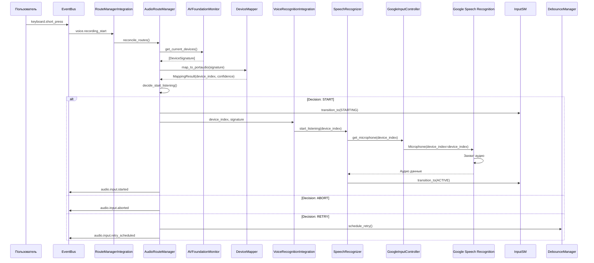

---

## 🔄 Поток данных: Output (Воспроизведение)

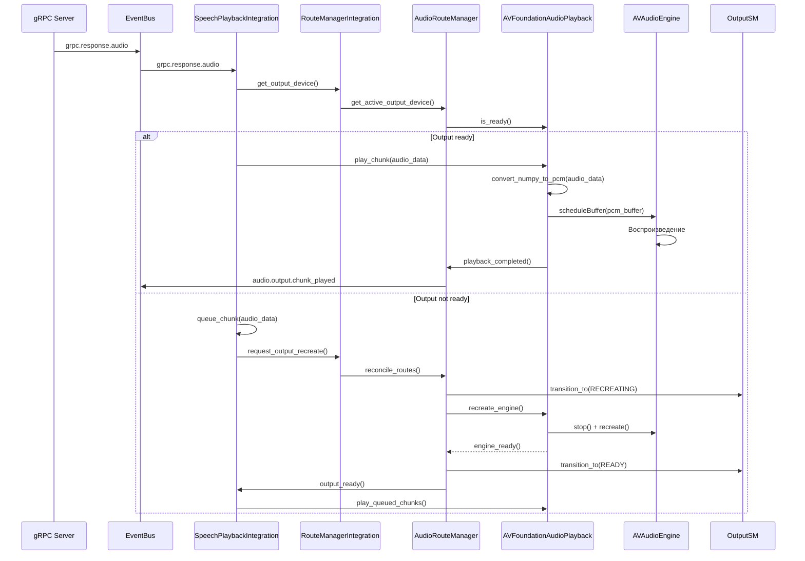

---

## 🔄 Reconcile Loop (Центральная логика)

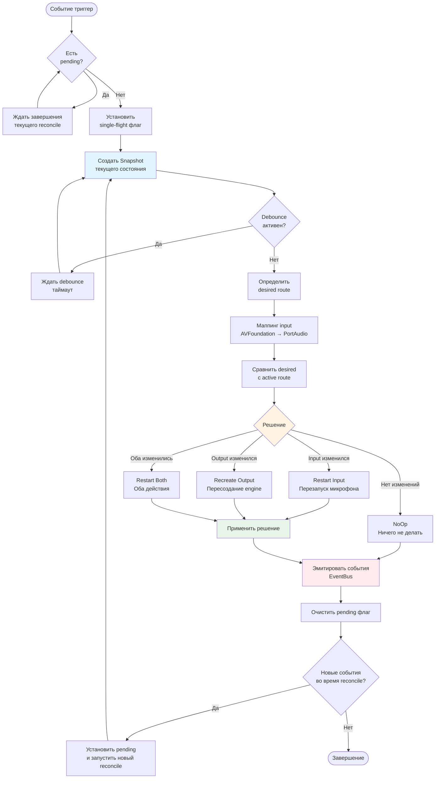

---

## 🔄 State Machines: Input

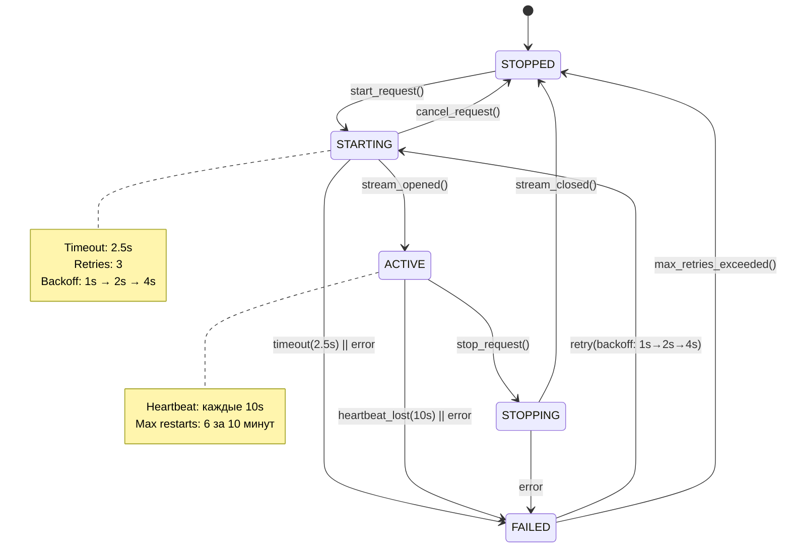

---

## 🔄 State Machines: Output

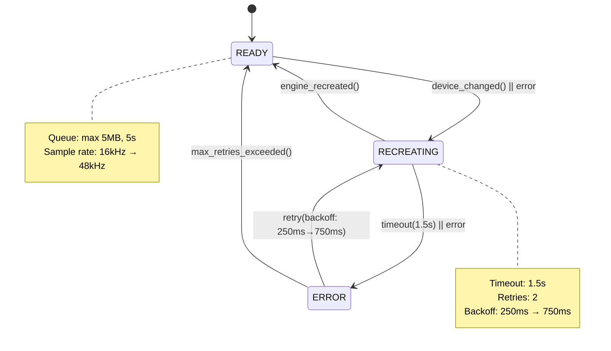

---

## 🔄 EventBus: События RouteManager

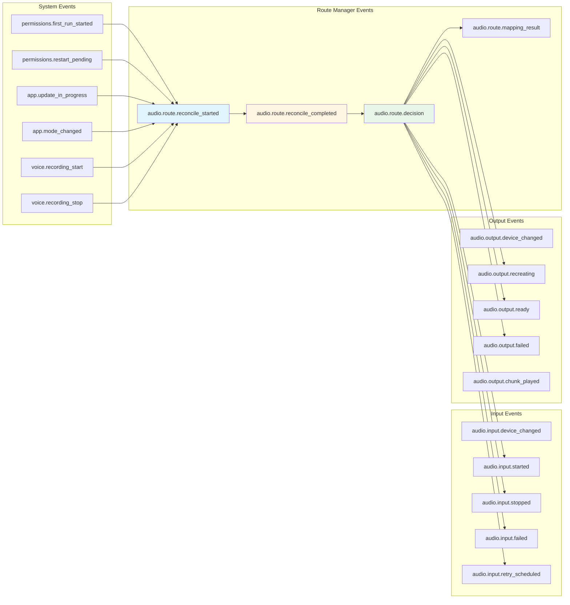

---

## 🔄 Интеграция с существующими модулями

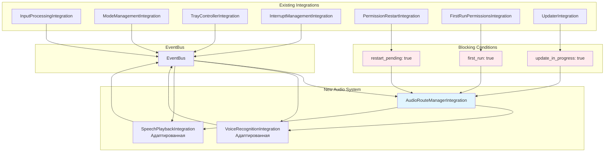

---

## 🔄 Device Monitoring: Двойной механизм

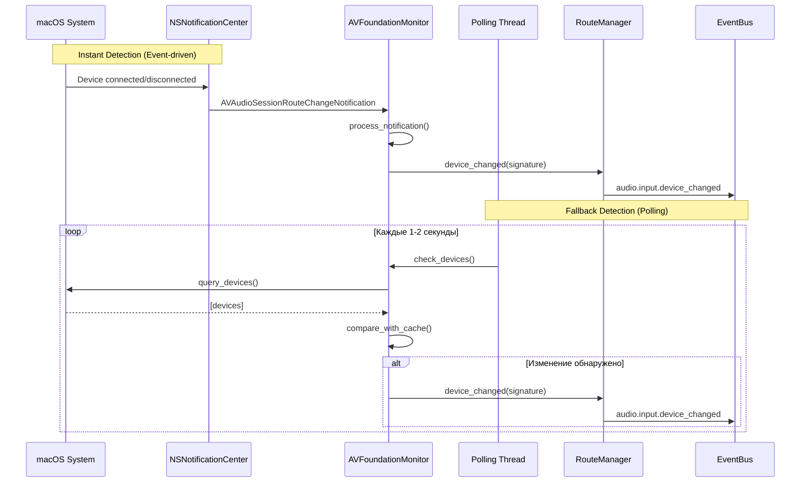

---

## 🔄 Device Mapping: AVFoundation → PortAudio

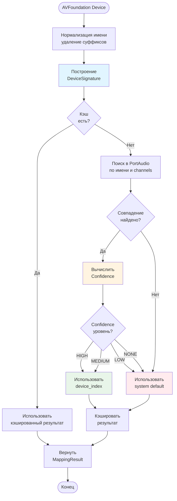

---

## 🔄 Decision Engine: Правила из interaction_matrix.yaml

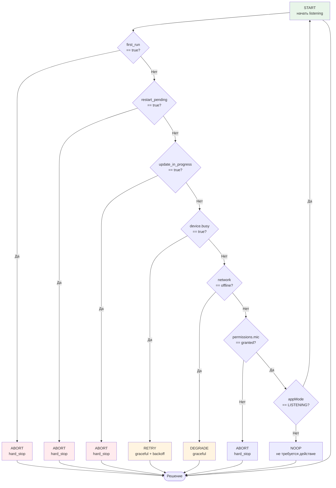

---

## 🔄 Полный цикл: От события до действия

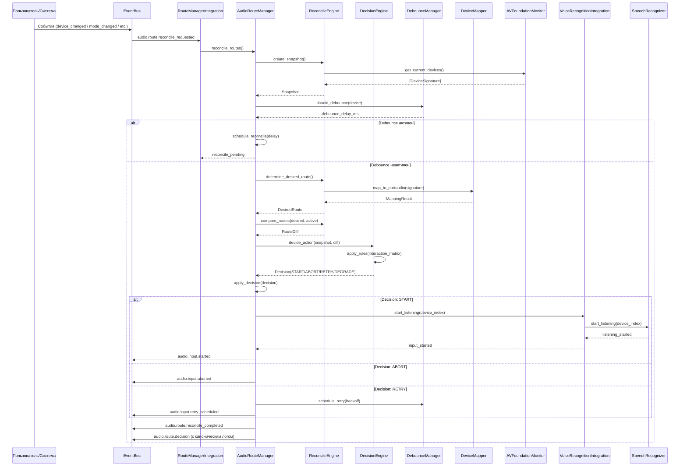

---

## 📋 Ключевые принципы работы

### 1. Единственная точка решений
- **RouteManager** - единственный компонент, принимающий решения о маршрутизации
- Все события только триггерят `reconcile_routes()`
- Никакой логики на событиях напрямую

### 2. Single-flight механизм
- Одновременно выполняется только один reconcile
- Новые события → `pending = True`
- После завершения → reconcile с актуальным snapshot

### 3. Debounce per-device
- Bluetooth: 200ms → 1200ms (max)
- USB: 100ms → 600ms (max)
- Built-in: 100ms → 200ms (max)

### 4. Fallback стратегии
- Если AVFoundation недоступен → старая система (sounddevice)
- Если mapping LOW/NONE → system default
- Если устройство исчезло → последнее рабочее устройство

### 5. Блокировки
- `first_run: true` → hard_stop (блокирует RouteManager)
- `restart_pending: true` → hard_stop
- `update_in_progress: true` → hard_stop

### 6. Канонический формат логов
```
decision=<start|abort|retry|degrade> ctx={mic=...,screen=...,device=...,network=...,firstRun=...,appMode=...} source=route_manager duration_ms=<int>
```

---

## 🎯 Итоговая схема взаимодействия

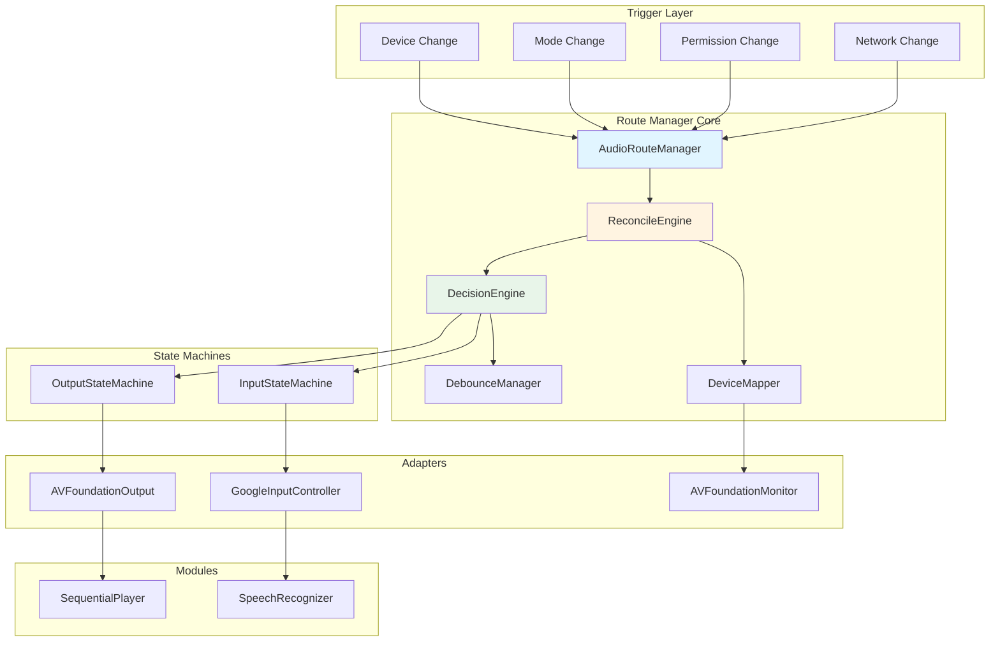

---

## ✅ Выводы

1. **Централизованное управление**: RouteManager - единственная точка решений
2. **Event-driven архитектура**: Все через EventBus
3. **Reconcile loop**: Постоянное сравнение desired vs active
4. **Fallback стратегии**: На каждом уровне
5. **Блокировки**: Критические состояния блокируют RouteManager
6. **Debounce**: Per-device задержки для стабильности
7. **State machines**: Четкие переходы состояний
8. **Канонические логи**: Единый формат для всех решений

---

**Эта схема служит основой для реализации всех компонентов.**

