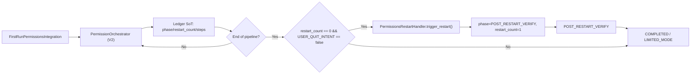

# Task Brief: First-run Restart Centralization Governance Plan

## 1. Цель документа
- Зафиксировать единый контракт first-run и restart.
- Убрать конфликты условий/флагов/дублирующих конфигураций.
- Определить, что остается, что замораживается, что удаляется.
- Дать внедренческий план с проверяемыми критериями.

---

## 2. Target Architecture (канон)

### 2.1 Единый owner
- Единственный owner решения о restart: `modules/permissions/v2/orchestrator.py`.
- Любые restart-решения вне V2 для permission-flow считаются недопустимыми.

### 2.2 Source of Truth
- Runtime SoT: `permission_ledger.json` (`phase`, `restart_count`, `steps`, `current_step`).
- Quit SoT: `StateKeys.USER_QUIT_INTENT` в `ApplicationStateManager`.

### 2.3 Канонический first-run flow
1. `Phase.FIRST_RUN` стартует pipeline.
2. Каждый permission step живет по timebox-правилу:
   - фиксированная длительность шага `15s`;
   - по истечении шага pipeline идет дальше независимо от granted/denied.
3. После завершения последнего шага:
   - если `restart_count == 0` и `USER_QUIT_INTENT == false`, выполняется ровно 1 restart.
4. После trigger:
   - фиксируется `restart_count=1`, `phase=POST_RESTART_VERIFY`.
5. После post-restart verify:
   - переход в `COMPLETED` (или `LIMITED_MODE` по политике hard-fail).
6. После `restart_count >= 1`:
   - любой auto-restart path блокируется.

---

## 3. Restart Decision Contract

### 3.1 Разрешено вызвать restart только если
- caller = V2 orchestrator;
- pipeline first-run завершен (последний step обработан);
- `restart_count == 0`;
- `USER_QUIT_INTENT == false`;
- updater не в active-update состоянии.

### 3.2 Запрещено
- restart mid-pipeline;
- restart из legacy `permission_restart_integration` при `permissions_v2.enabled=true`;
- повторный restart после первого выполненного (`restart_count >= 1`);
- restart после пользовательского `Quit`.

---

## 4. Flag/Config Governance

### 4.1 Оставить (Keep, active)
- `integrations.permissions_v2.enabled=true`
- `integrations.permissions_v2.advance_on_timeout=true`
- `integrations.permissions_v2.default_step_timeout_s=15.0`
- `integrations.permissions_v2.order`
- `integrations.permissions_v2.steps.*` (тайминги шагов, criticality, mode)
- `integrations.permissions_v2.restart.delay_sec` (техническая задержка)
- `integrations.permissions_v2.restart.require_all_hard_pass=true`
- `integrations.permissions_v2.restart.require_needs_restart=false` (ваш текущий целевой сценарий: один restart после полного pipeline)
- `NEXY_KS_FIRST_RUN_RESTART` (экстренный kill-switch)
- `NEXY_DISABLE_AUTO_RESTART` (dry-run для диагностики)
- `StateKeys.USER_QUIT_INTENT` (guard для отмены restart при user quit)

### 4.2 Заморозить (Freeze, не использовать для решений)
- `permissions.first_run.*` legacy batch-поля:
  - `batch_size`
  - `enable_batching`
  - `batch_restart_delay_sec`
- `features.use_events_for_restart_pending` (не должен влиять на V2 restart contract)
- `features.ks_first_run_normalization` (legacy guard для permission_restart integration)
- `permissions_first_run_completed.flag` (cache/telemetry only, не decision source)
- `integrations.permission_restart.enabled` (оставить только как совместимость на переходный период, без runtime влияния в V2 режиме)

### 4.3 Удалить (Remove) после стабилизации
- Конфиг и условные ветки legacy restart внутри V2-потока:
  - `integrations.permission_restart.*` как runtime owner для permissions flow.
- Legacy event-path `permissions.first_run_restart_pending` как источник restart-решения.
- Дублирующие проверки `restart_pending` для принятия restart-решений вне orchestrator.
- Документные флаги без runtime-использования:
  - `NEXY_FEATURE_FIRST_RUN_V2`
  - `NEXY_FEATURE_PERMISSION_RESTART_V2`

### 4.4 Инвентарь first-run/restart флагов (фактический статус)
- **Runtime-used (фактически читаются кодом)**:
  - `integrations.permissions_v2.enabled`
  - `integrations.permissions_v2.advance_on_timeout`
  - `integrations.permissions_v2.default_step_timeout_s`
  - `integrations.permissions_v2.restart.*`
  - `features.ks_first_run_normalization` (только legacy permission_restart path)
  - `NEXY_DISABLE_AUTO_RESTART`
  - `NEXY_KS_FIRST_RUN_RESTART`
  - `StateKeys.USER_QUIT_INTENT`
- **Legacy/compat-only (должны быть frozen)**:
  - `permissions.first_run.batch_size`
  - `permissions.first_run.enable_batching`
  - `permissions.first_run.batch_restart_delay_sec`
  - `features.use_events_for_restart_pending`
  - `integrations.permission_restart.*`
- **Doc-only/unused in runtime gate (кандидаты на удаление из реестра)**:
  - `NEXY_FEATURE_FIRST_RUN_V2`
  - `NEXY_FEATURE_PERMISSION_RESTART_V2`

---

## 5. Что чистим в коде (dedup cleanup)

### 5.1 Централизация restart
- `modules/permissions/v2/orchestrator.py`
  - оставить единственный trigger point;
  - enforce guard: `restart_count`, `USER_QUIT_INTENT`, end-of-pipeline.

### 5.2 Отключение legacy owner
- `integration/integrations/permission_restart_integration.py`
  - при `permissions_v2.enabled=true` не подписываться на restart-триггерящие permission события;
  - не планировать restart-задачи.

### 5.3 Чистый stop/cancel
- `integration/integrations/first_run_permissions_integration.py`
  - `stop()` обязан вызывать stop/cancel V2 integration task.

### 5.4 Quit race guard
- `modules/tray_controller/core/tray_controller.py`
  - гарантировать доставку `quit_clicked` до фактического terminate (bounded wait).

---

## 6. Схема взаимодействия

---

## 7. Требования (Requirements)

1. Ровно один auto-restart после полного first-run pipeline.
2. После этого auto-restart запрещен навсегда для данной install-сессии ledger.
3. `Quit` пользователя всегда приоритетнее auto-restart.
4. Все restart-решения принимаются в одном месте (V2 orchestrator).
5. Любые legacy restart ветки не влияют на решение в V2 режиме.
6. Флаги и конфиги, не участвующие в решении, удаляются или переводятся в freeze-state.

---

## 8. Критерии приемки (DoD)

### 8.1 Функциональные
- Fresh install:
  - каждый шаг first-run завершается по 15s timebox;
  - после последнего шага происходит ровно 1 restart.
- После первого рестарта:
  - повторные перезапуски не происходят при последующих стартах/выходах.
- При user quit до restart:
  - restart не выполняется.

### 8.2 Логические
- В логах есть только один переход `restart_count: 0 -> 1`.
- Нет restart scheduling из legacy integration при V2 enabled.
- Нет competing owners restart decision.

### 8.3 Технические
- Unit/Integration tests:
  - `single_restart_only`
  - `no_restart_after_first_restart`
  - `quit_cancels_pending_restart`
  - `legacy_restart_path_disabled_when_v2_enabled`

---

## 9. План внедрения (Rollout)

### Phase 1: Contract hardening
- Зафиксировать V2 timeout policy (15s).
- Добавить hard guards в orchestrator.
- Отключить legacy restart scheduling в V2 режиме.

### Phase 2: Cleanup
- Убрать/заморозить дублирующие конфиги.
- Удалить dead branches restart_pending legacy.
- Обновить `Docs/FEATURE_FLAGS.md` по итоговому списку keep/freeze/remove.
- Добавить предупреждение в startup-логи, если frozen/legacy флаги выставлены.

### Phase 3: Validation
- Прогон целевых тестов.
- Smoke на fresh install/restart/quit.
- Проверка логов на single-owner behavior.

### Phase 4: Final prune
- Физически удалить legacy restart paths после релиза стабилизации.
- Удалить doc-only флаги из `Docs/FEATURE_FLAGS.md`.
- Оставить только минимальный runtime-набор first-run/restart флагов.

---

## 11. Матрица Keep/Freeze/Remove (исполняемая)

| Flag/Config | Статус | Причина | Действие |
|---|---|---|---|
| `integrations.permissions_v2.enabled` | Keep | Главный gate V2 | Оставить активным |
| `integrations.permissions_v2.advance_on_timeout` | Keep | Таймбокс-политика шага | Оставить активным |
| `integrations.permissions_v2.default_step_timeout_s` | Keep | 15s policy | Выставить 15.0 |
| `integrations.permissions_v2.restart.delay_sec` | Keep | Технический delay | Оставить |
| `integrations.permissions_v2.restart.require_all_hard_pass` | Keep | Контроль полноты first-run | Оставить `true` |
| `integrations.permissions_v2.restart.require_needs_restart` | Keep | Ваша целевая логика | Оставить `false` |
| `NEXY_DISABLE_AUTO_RESTART` | Keep | Диагностика/dry-run | Оставить |
| `NEXY_KS_FIRST_RUN_RESTART` | Keep | Emergency kill-switch | Оставить |
| `permissions.first_run.batch_size` | Freeze | Legacy batching conflict | Игнорировать в V2 |
| `permissions.first_run.enable_batching` | Freeze | Legacy batching conflict | Игнорировать в V2 |
| `permissions.first_run.batch_restart_delay_sec` | Freeze | Legacy batching conflict | Игнорировать в V2 |
| `features.use_events_for_restart_pending` | Freeze | Не должен управлять restart | Не использовать для решений |
| `features.ks_first_run_normalization` | Freeze | Legacy guard | Убрать влияние в V2 |
| `integrations.permission_restart.*` | Remove | Второй owner restart | Удалить после переходного релиза |
| `NEXY_FEATURE_FIRST_RUN_V2` | Remove | Doc-only, не runtime gate | Удалить из реестра |
| `NEXY_FEATURE_PERMISSION_RESTART_V2` | Remove | Doc-only, не runtime gate | Удалить из реестра |

---

## 12. Визуальная индикация и последовательность событий (обязательный контракт)

### 12.1 Контракт "закрашивания" (tray color/status)
- First-run события не вводят отдельный tray-режим.
- Иконка всегда остается в одном из 3 канонических статусов, синхронизированных с `app.mode_changed`.
- Цвета/статусы:
  - `SLEEPING` = серый
  - `LISTENING` = синий
  - `PROCESSING` = оранжевый
- Запрет:
- отдельный статус/цвет для first-run;
- прямое изменение цвета из произвольных модулей;
  - индикация только через `TrayControllerIntegration` и его event-contract.

### 12.2 Контракт последовательности first-run/restart
1. `permissions.first_run_started`
2. V2 шаги разрешений по `permissions_v2.order` (timebox 15s/шаг)
3. Конец pipeline
4. Решение restart в едином owner (V2 orchestrator)
5. Если `restart_count==0 && USER_QUIT_INTENT==false` -> `trigger_restart()`
6. После рестарта: `POST_RESTART_VERIFY`
7. Финал: `COMPLETED`/`LIMITED_MODE`

### 12.3 Анти-конфликтные правила
- Любая логика restart вне V2 owner недопустима.
- Любая визуальная логика блокировки вне `TrayControllerIntegration` недопустима.
- Иконка обязана оставаться в 3-режимной модели независимо от first-run событий.

---

## 10. Риски и меры
- Риск: скрытая зависимость legacy path.
  - Мера: сначала freeze + warning logs, затем удаление.
- Риск: race между quit и restart.
  - Мера: `USER_QUIT_INTENT` guard + bounded quit dispatch + idempotent restart_count gate.
- Риск: рассинхрон docs/config/code.
  - Мера: обновление `Docs/FEATURE_FLAGS.md` и checks в одном PR.

---

## 10.1 Scope Boundaries (чтобы не ломать лишние части)

### In-Scope (разрешено менять)
- `modules/permissions/v2/orchestrator.py`
- `modules/permissions/v2/integration.py`
- `integration/integrations/first_run_permissions_integration.py`
- `integration/integrations/permission_restart_integration.py` (только V2/legacy gating)
- `config/unified_config.yaml` (только секции `integrations.permissions_v2*` и freeze/remove legacy restart flags)
- `Docs/FEATURE_FLAGS.md` (только first-run/restart флаги)
- `modules/tray_controller/core/tray_types.py` и `integration/integrations/tray_controller_integration.py` (уже ограничено 3 режимами)

### Out-of-Scope (запрещено трогать в этой задаче)
- Audio pipeline (`modules/speech_playback`, `modules/voice_recognition`, `audio_system` блоки)
- Input hotkey logic (`modules/input_processing/keyboard/*`)
- gRPC/network transport logic
- Updater business-logic (кроме read-only guard проверки busy state)
- MCP actions / browser / messages / whatsapp
- Packaging scripts, кроме явно требуемой sync-правки по флагам

### Non-Goals
- Не менять UX flow разрешений вне заданной timebox-модели.
- Не вводить новые состояния режима/индикации (только 3 tray режима).
- Не делать реархитектуру EventBus/StateManager.

---

## 10.2 Safety Invariants (обязательные проверки перед merge)

1. **Single Owner Invariant**
   - restart decision только в V2 orchestrator.
2. **No Extra State Invariant**
   - не добавлять новые runtime flags/state axes для first-run/restart.
3. **3-Mode UI Invariant**
   - tray статусы только `SLEEPING|LISTENING|PROCESSING`.
4. **Idempotency Invariant**
   - `restart_count` может измениться только `0 -> 1`.
5. **Quit Priority Invariant**
   - при `USER_QUIT_INTENT=true` restart не запускается.
6. **Isolation Invariant**
   - изменения ограничены In-Scope файлами.

---

## 10.3 Safe Rollout Strategy (минимальный риск)

### PR-1 (Contract only, без удаления кода)
- Включить hard guards (`restart_count`, `USER_QUIT_INTENT`).
- Выключить legacy restart scheduling при V2 enabled (feature-gated).
- Выставить timeout policy (`15s`) в config.

### PR-2 (Freeze + observability)
- Заморозить legacy restart configs (read but ignore, warning logs).
- Добавить проверку конфликта флагов на startup.
- Добавить/обновить тесты single-restart/quit-cancel.

### PR-3 (Final cleanup)
- Удалить dead legacy branches после стабильного прогона.
- Почистить `Docs/FEATURE_FLAGS.md` от doc-only/unused first-run flags.

---

## 10.4 File-Level Change Budget

- Не более 6-8 рабочих файлов в одном PR.
- Не смешивать в одном PR:
  - бизнес-логику restart,
  - визуальные изменения tray,
  - unrelated refactoring.
- Каждый PR должен иметь:
  - список затронутых In-Scope файлов;
  - явный список “что сознательно не тронуто”.

---

## 13. Test Strategy (обязательная)

### 13.1 Последовательность тестирования (строго по порядку)

1. **Static/Contract Preflight**
   - Проверка конфиг-контракта first-run/restart.
   - Проверка отсутствия `TrayStatus` вне 3 канонических режимов.
   - Проверка, что legacy restart path не активируется при `permissions_v2.enabled=true`.

2. **Unit Tests (owner-level)**
   - `PermissionOrchestrator`: single-restart gate, quit-priority gate, timeout-step contract.
   - `FirstRunPermissionsIntegration`: корректный stop/cancel без фоновых хвостов.
   - `PermissionRestartIntegration`: no-op в V2 режиме.

3. **Integration Tests (event-contract)**
   - Проверка цепочки событий:
     - `permissions.first_run_started` -> pipeline -> end-of-pipeline decision -> restart.
   - Проверка, что нет competing restart owner.
   - Проверка 3-режимной индикации tray без extra статусов.

4. **Scenario/E2E Smoke**
   - Fresh install -> first-run -> 1 restart -> stable subsequent launches.
   - Quit-before-restart scenario -> restart cancelled.
   - Re-launch loop (N times) -> no additional auto-restart.

5. **Regression Suite**
   - Таргетные тесты + быстрый smoke на соседних In-Scope интеграциях.

### 13.2 Interaction Points Matrix (точки взаимодействия и проверки)

| Producer | Consumer | Contract | Failure Risk | Validation |
|---|---|---|---|---|
| `FirstRunPermissionsIntegration` | `PermissionOrchestrator` | запуск first-run pipeline | двойной старт | unit + integration |
| `PermissionOrchestrator` | `PermissionsRestartHandler` | единственный trigger restart | duplicate restart | unit guard + integration |
| `SimpleModuleCoordinator` | `StateManager.USER_QUIT_INTENT` | quit-priority guard | race quit vs restart | unit + scenario |
| `PermissionRestartIntegration` (legacy) | V2 runtime | должен быть изолирован/no-op | competing owner | integration + log assertion |
| `TrayControllerIntegration` | tray UI | только 3 режима | extra mode regression | static check + integration |

### 13.3 Correctness Gates (чтобы не было сломанных частей хода)

Перед merge PR считается валидным только если:
1. Нет новых путей restart decision вне V2 orchestrator.
2. `restart_count` изменяется только `0 -> 1`.
3. При `USER_QUIT_INTENT=true` restart не выполняется.
4. В tray нет статусов кроме `SLEEPING|LISTENING|PROCESSING`.
5. Legacy restart path в V2 режиме не планирует restart.
6. Изменения не выходят за `In-Scope`.

### 13.4 Минимальный набор тестов (блокирующий)

- `single_restart_only`
- `no_restart_after_first_restart`
- `quit_cancels_pending_restart`
- `legacy_restart_path_disabled_when_v2_enabled`
- `tray_three_modes_only`
- `first_run_timeout_step_contract_15s`

### 13.5 Evidence Bundle (что приложить к PR)

1. Список измененных файлов (с подтверждением In-Scope).
2. Логи/артефакты прохождения блокирующих тестов.
3. Короткий trace событий сценария:
   - `first_run_started -> ... -> restart_count 0->1 -> completed`.
4. Явный раздел "что не затронуто".
