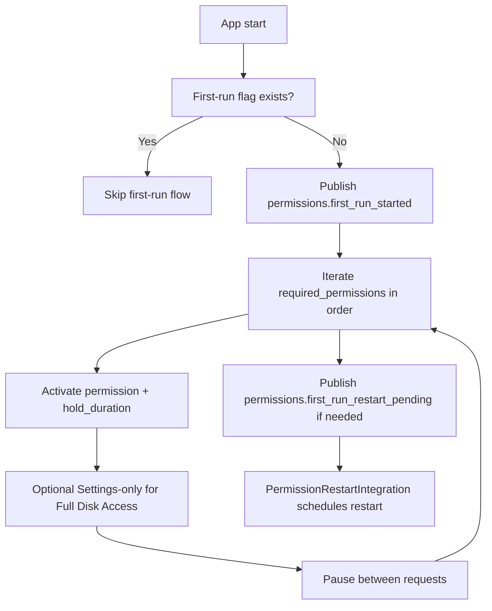

# First-Run Flow Specification (macOS Client)

## Overview
The "first run" experience prepares the Nexy client for normal operation by:
- requesting all required macOS privacy permissions sequentially (no status pre-checks);
- enforcing a permission order defined by `integrations.permissions.required_permissions` (config-driven);
- activating each permission with a fixed hold window (`permissions.first_run.activation_hold_duration_sec`) and a pause between requests (`pause_between_requests_sec`);
- using dialog-only activators for promptable permissions; Full Disk Access uses Settings-only;
- persisting flags as a cache (not a hard stop) for completed permission attempts;
- restarting the app after newly granted critical permissions so subsystems observe the new state.

The flow is coordinated by `FirstRunPermissionsIntegration` and `PermissionRestartIntegration`, with the `SimpleModuleCoordinator` orchestrating state.

---

## Permission Activation APIs (Updated 2026-01-13)

| Permission | API | Notes |
|------------|-----|-------|
| **Microphone** | `sounddevice.InputStream` | Opens mic → triggers system dialog |
| **Accessibility** | `CGRequestPostEventAccess()` | Triggers system dialog |
| **Input Monitoring** | `IOHIDRequestAccess(kIOHIDRequestTypeListenEvent)` | IOKit API, triggers system dialog |
| **Screen Capture** | `CGRequestScreenCaptureAccess()` via `ScreenCapturePermissionManager` | CoreGraphics API |
| **Contacts** | `CNContactStore.requestAccessForEntityType` | Contacts dialog |
| **Full Disk Access** | System Settings (open URL) | Settings-only |

### ⚠️ Known Issues (Fixed)

**Accessibility Prompt (2026-01-18)**
- **Decision:** Keep dialog-based Accessibility activation as-is; no Settings fallback.

**Duplicate App Instances (Fixed 2026-01-13)**  
- **Problem:** Python subprocess inside .app bundle caused TAL (Terminate After Launch)
- **Solution:** Removed subprocess, use direct API calls

---

## Diagram



Notes:
- No status pre-checks are performed during first-run.
- Restart is blocked during first-run until `restart_pending` is set.

---

## Sequence

1. **Launch**  
   - `SimpleModuleCoordinator.initialize()` attaches a background loop and initialises integrations.  
   - `FirstRunPermissionsIntegration.start()` runs early, before voice-recognition/audio chains.

2. **Eligibility Check**  
   - The "first run" flag is treated as a cache and controls whether the flow runs.

3. **Permission Requests (Order + Dialog-Only)**  
   - Order source: `config/unified_config.yaml` → `integrations.permissions.required_permissions`.
   - Если список отсутствует/пустой — first-run flow прерывается (нет fallback-списка).
   - For each permission in order, the integration:
     1. Calls the activation helper to trigger the **system dialog** (dialog-only).  
     2. Holds for `activation_hold_duration_sec`.  
     3. Applies a pause (`pause_between_requests_sec`) before the next permission.
   - **Full Disk Access**: opens System Settings only (no dialog available).
   - The integration requests **all** permissions in the list (no status checks).

4. **Flow Completion**  
   - After all permissions are processed, the integration:
     - writes `permissions_first_run_completed.flag` after the sequential loop;  
     - sets `permissions_restart_pending` in `ApplicationStateManager`;  
     - publishes `permissions.first_run_restart_pending` (eventBus) if any critical permission was newly granted (`integrations.permission_restart.critical_permissions`).

5. **Restart Initiation**  
   - `SimpleModuleCoordinator` catches the restart-pending signal and invokes `PermissionRestartIntegration`.  
   - Handler strategy:  
     1. If running from a PyInstaller bundle (`sys.frozen`), call `os.execv` to replace the current process.  
     2. Otherwise run `open -n -a /Applications/Nexy.app`.  
     3. Persist `restart_completed.flag` in the user data directory when the new instance comes up.

6. **Post-Restart Launch**  
   - On the next start, the integration clears `restart_completed.flag` and emits `permissions.first_run_completed`.

---

## Canonical Files

| File | Purpose |
|------|---------|
| `modules/permissions/first_run/activator.py` | Triggers permission dialogs via macOS APIs |
| `modules/permissions/first_run/status_checker.py` | Checks permission status (no prompt) |
| `integration/integrations/first_run_permissions_integration.py` | Orchestrates permission flow |
| `config/unified_config.yaml` | Defines `required_permissions` list |

---

## Flags & Persistence

| Flag / File | Location | When Created | Purpose |
|-------------|----------|--------------|---------|
| `permissions_first_run_completed.flag` | `~/Library/Application Support/Nexy/` | After successful permission loop | Marks that first-run permissions were attempted. |
| `restart_completed.flag` | same directory | When the post-first-run instance starts | Confirms that the restart took place. |

---

## Testing Commands

Reset permissions for clean test:
```bash
tccutil reset Accessibility com.nexy.assistant
tccutil reset ScreenCapture com.nexy.assistant
tccutil reset Microphone com.nexy.assistant
tccutil reset ListenEvent com.nexy.assistant
```

---

## Status Summary

- **Permissions requested?** Yes—sequential activation on first-run (no status checks).  
- **Dialogs only?** Yes—system dialogs for promptable permissions; Full Disk Access uses Settings-only.  
- **Flags persisted?** Yes—`permissions_first_run_completed.flag` and `restart_completed.flag` (cache only).  
- **Restart ensured?** Yes—new PID verification prevents premature exit.  
- **Architecture preserved?** Yes—integrations communicate via EventBus/state manager without bypassing existing modules.
