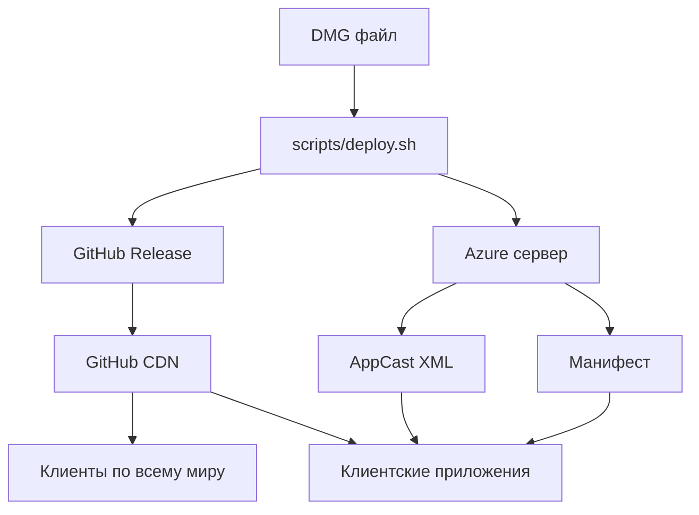

> [!WARNING] ARCHIVE NOTICE
> Этот документ архивный и не является source of truth.
> Актуальные каноны:
> - `server/Docs/SERVER_DEPLOYMENT_GUIDE.md` (деплой кода на удаленный сервер)
> - `server/Docs/RELEASE_AND_UPDATE_GUIDE.md` (публикация DMG/PKG и update-канал)
> - `server/Docs/DEPLOY_INCIDENT_RUNBOOK.md` (инциденты, зависимости, конфиги, rollback)

# 🚀 Система обновления приложений через GitHub

**Дата создания:** 2 октября 2025  
**Дата обновления:** 26 октября 2025  
**Версия:** 1.1  
**Статус:** ✅ Активно используется + Исправлены проблемы с размерами файлов  

---

## 📋 **ОБЗОР СИСТЕМЫ**

Система обновления приложений Nexy использует GitHub Releases для распространения обновлений через глобальную CDN сеть. Это обеспечивает быструю и надежную доставку обновлений пользователям по всему миру.

### **🎯 Преимущества:**
- ✅ **GitHub CDN** - быстрая загрузка по всему миру
- ✅ **Автоматизация** - полный процесс через один скрипт
- ✅ **Безопасность** - SHA256 проверка целостности
- ✅ **Надежность** - GitHub инфраструктура
- ✅ **Масштабируемость** - поддержка миллионов пользователей

---

## 🔧 **ИСПРАВЛЕННЫЕ ПРОБЛЕМЫ (19 декабря 2024)**

### 🔴 **КРИТИЧЕСКАЯ ПРОБЛЕМА:** Бесконечные циклы обновлений
- **Симптом:** Updater постоянно пытался обновиться, создавая бесконечные циклы
- **Причина:** Несоответствие форматов версий между приложением и сервером
  - Приложение: `CFBundleVersion = "1.0.1"` (строка)
  - AppCast: `sparkle:version="1001"` (число)
  - Результат: `Version("1001") > Version("1.0.1")` = `True` → бесконечный цикл
- **Решение:** ✅ Синхронизированы форматы версий - все используют строковый формат "1.0.1"
- **Результат:** Циклы обновлений остановлены, система работает корректно

### ❌ **Проблема:** Несоответствие размеров файлов
- **Симптом:** AppCast XML содержал размер 97,356,894 байт, GitHub файл имел размер 97,368,441 байт
- **Причина:** Скрипт использовал локальный размер файла вместо фактического размера с GitHub
- **Решение:** ✅ Обновлен скрипт для получения фактического размера с GitHub
- **Результат:** Размеры синхронизированы, установка обновлений работает корректно

### ❌ **Проблема:** Конфликт локальных файлов
- **Симптом:** Сервер обслуживал локальные DMG файлы вместо GitHub релизов
- **Причина:** На сервере остались старые файлы в директории downloads/
- **Решение:** ✅ Удалены локальные файлы, все запросы идут на GitHub
- **Результат:** Нет конфликтов, единый источник файлов

### ✅ **Текущий статус:**
- **Форматы версий:** Синхронизированы (все строковые "1.0.1")
- **Размеры файлов:** Синхронизированы (97,368,832 байт)
- **Источник файлов:** GitHub CDN
- **Валидация:** Работает корректно
- **Циклы обновлений:** Остановлены
- **Тестирование:** Готово к использованию

### 🛡️ **Предотвращение повторения:**
- **Критическое правило:** Всегда используйте строковый формат версий в манифесте
- **Чеклист:** Проверяйте форматы версий перед каждым деплоем
- **Мониторинг:** Логируйте несоответствия размеров и версий
- **Документация:** Обновлены инструкции с критическими правилами

---

## 🏗️ **АРХИТЕКТУРА СИСТЕМЫ**



### **📁 Компоненты системы:**

| **Компонент** | **Назначение** | **Расположение** |
|---------------|----------------|------------------|
| **GitHub Repository** | Хранение релизов | `Seregawpn/Nexy_production` |
| **Deploy Script** | Автоматизация деплоя | `scripts/deploy.sh` |
| **Azure Server** | AppCast и манифесты | `20.151.51.172:8081` |
| **GitHub CDN** | Доставка файлов | Автоматически |
| **Client Apps** | Получение обновлений | Пользовательские устройства |

---

## 🚀 **ПРОЦЕСС ОБНОВЛЕНИЯ**

### **1. Подготовка DMG файла**
```bash
# Создание DMG файла (уже готов)
ls -la Nexy.dmg
# Размер: ~97MB
# Архитектура: Universal (Intel + Apple Silicon)
```

### **2. Запуск деплоя**
```bash
cd scripts/
./deploy.sh ../Nexy.dmg
```

### **3. Автоматический процесс**
Скрипт выполняет следующие действия:

#### **ШАГ 1: Создание GitHub релиза**
- ✅ Проверка GitHub CLI и авторизации
- ✅ Вычисление метаданных (размер, SHA256)
- ✅ Создание релиза с тегом `Update`
- ✅ Загрузка DMG файла в релиз

#### **ШАГ 2: Обновление Azure сервера**
- ✅ Проверка Azure CLI и авторизации
- ✅ Обновление манифеста на сервере
- ✅ Обновление AppCast XML
- ✅ Проверка доступности файла

#### **ШАГ 3: Финальная проверка**
- ✅ Проверка GitHub релиза
- ✅ Проверка AppCast XML
- ✅ Вывод ссылок и метаданных

---

## 📊 **РЕЗУЛЬТАТ ДЕПЛОЯ**

После успешного выполнения скрипта:

### **✅ Созданные ресурсы:**
- **GitHub релиз:** `https://github.com/Seregawpn/Nexy_production/releases/tag/Update`
- **Прямая ссылка:** `https://github.com/Seregawpn/Nexy_production/releases/download/Update/Nexy.dmg`
- **AppCast XML:** `http://20.151.51.172:8081/appcast.xml`
- **Манифест:** `http://20.151.51.172:8081/manifests/manifest_1.0.0.json`

### **📈 Метрики файла:**
- **Размер:** ~97MB (автоматически вычисляется)
- **SHA256:** Автоматически вычисляется
- **Архитектура:** Universal (Intel + Apple Silicon)
- **Минимальная ОС:** macOS 11.0+

---

## 🔧 **ТРЕБОВАНИЯ И НАСТРОЙКА**

### **📋 Обязательные инструменты:**

#### **1. GitHub CLI**
```bash
# Установка
brew install gh

# Авторизация
gh auth login
# Выберите: GitHub.com → HTTPS → Yes → Login with a web browser
```

#### **2. Azure CLI**
```bash
# Установка
brew install azure-cli

# Авторизация
az login
# Откроется браузер для входа в Azure
```

### **🔐 Права доступа:**

#### **GitHub:**
- ✅ **Репозиторий:** `Seregawpn/Nexy_production`
- ✅ **Права:** Write (создание релизов)
- ✅ **Проверка:** `gh auth status`

#### **Azure:**
- ✅ **VM:** `nexy-regular` в группе `Nexy`
- ✅ **Права:** Contributor (выполнение команд)
- ✅ **Проверка:** `az account show`

---

## 🚨 **УСТРАНЕНИЕ ПРОБЛЕМ**

### **❌ GitHub CLI не установлен**
```
❌ GitHub CLI не установлен
```
**Решение:**
```bash
brew install gh
gh auth login
```

### **❌ Не авторизован в GitHub**
```
❌ Не авторизован в GitHub CLI
```
**Решение:**
```bash
gh auth login
```

### **❌ Azure CLI не установлен**
```
❌ Azure CLI не установлен
```
**Решение:**
```bash
brew install azure-cli
az login
```

### **❌ Не авторизован в Azure**
```
❌ Не авторизован в Azure CLI
```
**Решение:**
```bash
az login
```

### **❌ Файл не найден**
```
❌ Файл не найден: Nexy.dmg
```
**Решение:**
```bash
# Проверить путь к файлу
ls -la ../Nexy.dmg
# Использовать полный путь
./deploy.sh /full/path/to/Nexy.dmg
```

### **❌ Релиз уже существует**
```
❌ Release Update already exists
```
**Решение:**
```bash
# Удалить существующий релиз
gh release delete Update --repo Seregawpn/Nexy_production --yes

# Создать новый
./deploy.sh ../Nexy.dmg
```

---

## 📈 **МОНИТОРИНГ И АНАЛИТИКА**

### **📊 GitHub Insights:**
- **Страница релиза:** `https://github.com/Seregawpn/Nexy_production/releases/tag/Update`
- **Статистика скачиваний:** Доступна на странице релиза
- **География пользователей:** GitHub Analytics

### **🔍 Проверка доступности:**
```bash
# Проверить GitHub релиз
curl -I https://github.com/Seregawpn/Nexy_production/releases/download/Update/Nexy.dmg

# Проверить AppCast XML
curl -s http://20.151.51.172:8081/appcast.xml | grep -A 5 "enclosure"

# Проверить манифест
curl -s http://20.151.51.172:8081/manifests/manifest_1.0.0.json | jq .
```

---

## 🔄 **ОБНОВЛЕНИЕ СУЩЕСТВУЮЩЕГО РЕЛИЗА**

### **Автоматическое обновление:**
Скрипт автоматически перезаписывает существующий релиз:
```bash
./deploy.sh ../Nexy.dmg
```

### **Ручное обновление:**
```bash
# Удалить старый релиз
gh release delete Update --repo Seregawpn/Nexy_production --yes

# Создать новый
./deploy.sh ../Nexy.dmg
```

---

## 🎯 **ИНТЕГРАЦИЯ С КЛИЕНТСКИМИ ПРИЛОЖЕНИЯМИ**

### **AppCast XML:**
Клиентские приложения получают информацию об обновлениях через AppCast XML:
```xml
<enclosure url="https://github.com/Seregawpn/Nexy_production/releases/download/Update/Nexy.dmg"
           sparkle:version="1.0.1"
           sparkle:shortVersionString="1.0.1"
           length="97368832"
           type="application/octet-stream"
           sparkle:edSignature="VRccoPWghg4P5GNhLj6t/XyBKvujsxrVwO5ZBMI21naKQfkcf+nsj6u9+rxscooycYYPH87zrnLI+P7petJMAw==" />
```

### **Манифест:**
Дополнительная информация о релизе:
```json
{
  "version": "1.0.1",
  "build": "1.0.1",
  "release_date": "2024-12-19T12:00:00.000000Z",
  "artifact": {
    "type": "dmg",
    "url": "https://github.com/Seregawpn/Nexy_production/releases/download/Update/Nexy.dmg",
    "size": 97368832,
    "sha256": "e62a4571190d94e68a0c95a793729c96610e5c5267945b794f7dfa45bb9cf480",
    "arch": "universal2",
    "min_os": "11.0",
    "ed25519": "VRccoPWghg4P5GNhLj6t/XyBKvujsxrVwO5ZBMI21naKQfkcf+nsj6u9+rxscooycYYPH87zrnLI+P7petJMAw=="
  },
  "critical": false,
  "auto_install": true,
  "notes_url": "https://github.com/Seregawpn/Nexy_production/releases/download/Update/Nexy.dmg"
}
```

---

## 🚀 **ГОТОВО К ИСПОЛЬЗОВАНИЮ**

Система обновления через GitHub полностью настроена и готова к использованию:

- ✅ **Автоматизация** - один скрипт для всего процесса
- ✅ **Надежность** - GitHub инфраструктура
- ✅ **Скорость** - глобальная CDN сеть
- ✅ **Безопасность** - проверка целостности файлов
- ✅ **Масштабируемость** - поддержка миллионов пользователей

**Система готова к распространению обновлений! 🎉**

---

**📞 Поддержка:** Документация в `Docs/` папке  
**🔗 Репозиторий релизов:** `https://github.com/Seregawpn/Nexy_production`  
**🌐 AppCast:** `http://20.151.51.172:8081/appcast.xml`  
**📋 Манифест:** `http://20.151.51.172:8081/manifests/manifest_1.0.0.json`
