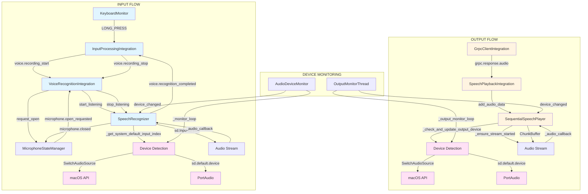

# Анализ текущего состояния системы аудио (Input/Output)

## Дата создания
2025-11-30

## Обзор архитектуры

### Компоненты системы

```
┌─────────────────────────────────────────────────────────────────┐
│                    АУДИО СИСТЕМА NEXY                           │
└─────────────────────────────────────────────────────────────────┘

INPUT (Микрофон)                          OUTPUT (Динамики)
├─ InputProcessingIntegration             ├─ SpeechPlaybackIntegration
│  └─ KeyboardMonitor                    │  └─ SequentialSpeechPlayer
│     └─ LONG_PRESS/RELEASE              │     └─ ChunkBuffer
│                                          │
├─ VoiceRecognitionIntegration            ├─ GrpcClientIntegration
│  └─ SpeechRecognizer                    │  └─ gRPC Stream
│     ├─ AudioDeviceMonitor               │     └─ audio_chunk events
│     ├─ DeviceParamsNormalizer           │
│     └─ sd.InputStream                   │
│                                          │
└─ MicrophoneStateManager                 └─ SignalIntegration
   └─ microphone.opened/closed                └─ AudioToneChannel
```

---

## 1. AUDIO INPUT (Микрофон) - Полный поток

### 1.1 Инициализация и определение устройства

```
[SpeechRecognizer.__init__]
  ├─ input_device_name: Optional[str] = None  # PRIMARY идентификатор
  ├─ input_device_id: Any = None              # RUNTIME идентификатор
  ├─ _device_name_to_id_cache: Dict[str, DeviceCacheEntry]  # TTL кэш
  └─ AudioDeviceMonitor (мониторинг изменений)

[SpeechRecognizer.start_listening]
  ├─ _get_system_default_input_index()
  │   ├─ ПРИОРИТЕТ 1: _get_system_default_input_name()
  │   │   └─ SwitchAudioSource -c -t input -f json
  │   │       └─ _find_device_id_by_name_input(name)  # Поиск ID по имени
  │   │           ├─ Проверка TTL кэша
  │   │           ├─ Exponential backoff (max_retries=3, base_delay=0.3s)
  │   │           └─ Обновление кэша
  │   │
  │   └─ ПРИОРИТЕТ 2: sd.default.device[0] (fallback)
  │
  ├─ DeviceParamsNormalizer.normalize_input_params()
  │   └─ Нормализация: sample_rate, channels, dtype
  │
  └─ sd.InputStream(device=input_device_id, ...)
      └─ _audio_callback() → обработка чанков
```

**Критические точки INPUT:**
- ⚠️ **TTL кэш может быть устаревшим** при быстром подключении BT устройств
- ⚠️ **Exponential backoff** может занять до 0.9s (3 попытки × 0.3s)
- ⚠️ **SwitchAudioSource может быть недоступен** → fallback на PortAudio
- ⚠️ **PortAudio кэш не обновляется автоматически** при подключении BT

### 1.2 Мониторинг изменений устройства (INPUT)

```
[AudioDeviceMonitor._monitor_loop]  # Каждые 0.5s
  ├─ _get_current_input_device()
  │   ├─ ПРИОРИТЕТ 1: _get_device_via_macos_api()
  │   │   ├─ SwitchAudioSource -c -t input -f json
  │   │   ├─ Exponential backoff (max_retries=3, base_delay=0.3s)
  │   │   └─ Поиск ID по имени в PortAudio
  │   │
  │   └─ ПРИОРИТЕТ 2: sd.default.device[0] (fallback)
  │
  ├─ Сравнение по ИМЕНИ (не по ID!)
  │   ├─ Если имя изменилось → РЕАЛЬНАЯ смена устройства
  │   │   └─ Если идет запись → _graceful_stop_listening()
  │   │
  │   └─ Если ID изменился, но имя то же → обновляем только ID
  │
  └─ Callback: _on_device_changed(old_device_id, new_device_id)
```

**Критические точки мониторинга INPUT:**
- ⚠️ **Интервал проверки 0.5s** может пропустить быстрые переключения
- ⚠️ **Сравнение по имени** может не сработать, если имя изменилось в PortAudio
- ⚠️ **Graceful stop** может не успеть остановить поток до создания нового

### 1.3 Поток записи и распознавания

```
[InputProcessingIntegration._handle_long_press]
  ├─ Проверки (5 защит):
  │   ├─ _long_press_in_progress? → игнорируем
  │   ├─ _input_state == PENDING? → проверяем
  │   ├─ keyboard_monitor.key_pressed? → проверяем
  │   ├─ state_manager.is_microphone_active()? → игнорируем если True
  │   └─ _recording_started? → игнорируем если True
  │
  ├─ _wait_for_mic_opened()  # Polling state_manager.is_microphone_active()
  │   └─ Таймаут: 5.0s
  │
  ├─ Публикует: voice.recording_start
  └─ Публикует: mode.request(LISTENING)

[VoiceRecognitionIntegration._on_recording_start]
  ├─ MicrophoneStateManager.request_open(session_id)
  │   ├─ Переход: IDLE → OPENING
  │   ├─ Публикует: microphone.open_requested
  │   └─ Ждет: microphone.opened (таймаут 5s)
  │
  └─ SpeechRecognizer.start_listening()
      ├─ Создает sd.InputStream
      ├─ Публикует: microphone.opened
      └─ Публикует: voice.mic_opened

[SpeechRecognizer._audio_callback]
  ├─ Получает аудио чанки
  ├─ Обрабатывает (нормализация, VAD)
  └─ Сохраняет в буфер для распознавания

[InputProcessingIntegration._handle_key_release]
  ├─ Публикует: voice.recording_stop
  └─ _wait_for_mic_closed()  # Таймаут: 1.0s

[VoiceRecognitionIntegration._on_recording_stop]
  ├─ Проверка физического потока: _current_stream.active
  ├─ Принудительная остановка потока (если активен)
  ├─ Публикует: microphone.closed (СРАЗУ после остановки)
  ├─ MicrophoneStateManager.request_close()
  └─ SpeechRecognizer.stop_listening()
      ├─ Останавливает поток
      └─ Выполняет распознавание
```

**Критические точки потока INPUT:**
- 🔴 **Deadlock в request_close**: исправлен публикацией microphone.closed ДО request_close
- ⚠️ **Polling вместо событий** в _wait_for_mic_opened (может быть медленным)
- ⚠️ **Таймауты могут быть недостаточными** для BT устройств (5s для открытия, 1s для закрытия)
- ⚠️ **Принудительная остановка потока** может вызвать ошибки PortAudio

---

## 2. AUDIO OUTPUT (Динамики) - Полный поток

### 2.1 Инициализация и определение устройства

```
[SequentialSpeechPlayer.__init__]
  ├─ output_device_name: Optional[str] = None  # PRIMARY идентификатор
  ├─ _current_output_device_id: Optional[int] = None  # RUNTIME идентификатор
  ├─ _device_tracking_lock: threading.RLock()
  └─ _output_monitor_thread: Optional[threading.Thread] = None

[SequentialSpeechPlayer.initialize]
  ├─ _sync_output_format()
  │   └─ _query_default_output_device()
  │       ├─ ПРИОРИТЕТ 1: _get_output_device_name_via_macos_api()
  │       │   └─ SwitchAudioSource -c -t output -f json
  │       │       └─ _find_device_id_by_name(name, device_type='output')
  │       │           ├─ Итерация по sd.query_devices()
  │       │           ├─ Фильтрация: max_output_channels > 0
  │       │           ├─ Точное совпадение имени
  │       │           ├─ Нечувствительное к регистру сравнение
  │       │           └─ Частичное совпадение (если не найдено)
  │       │
  │       └─ ПРИОРИТЕТ 2: sd.default.device[1] (fallback)
  │
  ├─ DeviceParamsNormalizer.normalize_output_params()
  │   └─ Нормализация: sample_rate, channels, dtype
  │
  └─ _start_output_monitoring()  # Если auto_output_device_switch=True
      └─ _output_monitor_loop()  # Каждые 1.0s
```

**Критические точки OUTPUT:**
- ⚠️ **SwitchAudioSource может вернуть имя, которого нет в PortAudio** → fallback
- ⚠️ **Поиск по имени может не найти устройство** (частичное совпадение - последняя попытка)
- ⚠️ **Мониторинг запускается только если auto_output_device_switch=True**

### 2.2 Мониторинг изменений устройства (OUTPUT)

```
[SequentialSpeechPlayer._output_monitor_loop]  # Каждые 5.0s для BT, 1.0s для обычных
  ├─ ✅ ЕДИНСТВЕННЫЙ ИСТОЧНИК ИСТИНЫ: _get_output_device_name_via_macos_api()
  │   └─ SwitchAudioSource -c -t output -f json
  │       └─ НЕТ fallback на PortAudio или sd.default.device (убран)
  │       └─ Если имя пустое → return None, ничего не создаём
  │
  ├─ ✅ ДЛЯ BT УСТРОЙСТВ: ВСЕГДА используется device=None (не ищется ID в PortAudio)
  │   └─ Для обычных устройств: _find_device_id_by_name(name, device_type='output')
  │
  ├─ Сравнение по имени устройства (из SwitchAudioSource - единственный источник истины)
  │   ├─ Если имя изменилось → _switch_output_device(new_name, new_id, is_bluetooth)
  │   └─ Если имя не изменилось → обновляем только ID (если найден)
  │
  └─ _switch_output_device(new_name, new_id, is_bluetooth)
      ├─ ✅ ГАРАНТИРОВАННОЕ ЗАКРЫТИЕ: _stop_audio_stream(is_bluetooth=old_is_bluetooth)
      │   ├─ stop(), close()
      │   ├─ цикл while stream_ref.active: sleep(0.02) (таймаут 3с для BT, 1с для обычных)
      │   ├─ лог "active=False"
      │   ├─ self._audio_stream=None
      │   └─ delay 2с (BT) / 0.3с (обычное) после закрытия
      ├─ ✅ ПРАВИЛЬНЫЕ ЗАДЕРЖКИ: 0.5с для обычных, 2.0с для BT (после закрытия старого потока)
      ├─ Очищает буфер: chunk_buffer.clear()
      ├─ Обновляет параметры: DeviceParamsNormalizer (только для обычных устройств, не для BT)
      ├─ Обновляет output_device_name, _current_output_device_id, _is_current_device_bluetooth
      └─ ✅ ВЫЗЫВАЕТ _start_audio_stream(sync_output=True, device_id=None) для BT устройств
```

**Критические точки мониторинга OUTPUT:**
- ✅ **SwitchAudioSource - единственный источник истины** (fallback на PortAudio убран)
- ✅ **Оптимизированный интервал проверки**: 5.0s для BT устройств, 1.0s для обычных
- ✅ **Для BT устройств**: используется device=None, не ищется ID в PortAudio
- ✅ **Безопасное переключение**: старый поток всегда закрывается перед созданием нового
- ✅ **Правильные задержки**: 0.3с для обычных, 2.0с для BT устройств
- ⚠️ **Переключение устройства прерывает воспроизведение** (очистка буфера) - можно улучшить
- ⚠️ **Lazy start** может задержать воспроизведение после переключения

### 2.3 Поток воспроизведения

```
[GrpcClientIntegration._on_voice_completed]
  └─ Публикует: grpc.response.audio
      └─ session_id, dtype, sample_rate, channels, bytes

[SpeechPlaybackIntegration._on_audio_chunk]
  ├─ Декодирует audio_data из bytes
  ├─ Проверяет/инициализирует плеер
  ├─ _check_and_update_output_device()  # Проверка смены устройства
  │   ├─ _get_output_device_name_via_macos_api()
  │   └─ Сравнение с output_device_name
  │
  ├─ start_playback()  # Если не играет
  │   └─ _ensure_stream_started()
  │       ├─ Создает sd.OutputStream (lazy start)
  │       └─ Запускает поток
  │
  └─ add_audio_data(audio_data, metadata)
      ├─ Добавляет в ChunkBuffer
      └─ Поток воспроизводит через _audio_callback()

[SequentialSpeechPlayer._audio_callback]
  ├─ Получает данные из ChunkBuffer
  ├─ Конвертирует каналы (моно → стерео)
  └─ Записывает в outdata
```

**Критические точки потока OUTPUT:**
- ✅ **SwitchAudioSource - единственный источник истины**: убраны все fallback на PortAudio и `sd.default.device`, если имя пустое → return None
- ✅ **BT устройства**: ВСЕГДА используется device=None, channels обязателен (из конфига), не задаются blocksize/latency (macOS управляет параметрами)
- ✅ **Гарантированное закрытие старого потока**: цикл ожидания active=False (таймаут 3с для BT, 1с для обычных), задержка после close() (2с для BT, 0.3с для обычных)
- ✅ **Проверка перед созданием нового потока**: перед sd.OutputStream убеждаемся, что self._audio_stream is None, иначе _stop_audio_stream() и ожидание
- ✅ **Обработка ошибок -9986/-10851**: повторно вызывается _stop_audio_stream() + sleep(1.0), создается stream с device=None, увеличенный backoff (×1.5)
- ✅ **Расширенное логирование**: фиксируется имя старого/нового устройства, тип (BT/обычное), параметры, задержки, ошибки, "старый поток закрыт → создаём новый stream", "SwitchAudioSource → device=None для BT"
- ✅ **Синхронизация с InputProcessingIntegration**: таймаут _ensure_playback_idle() = 5.0с, повторные попытки при TimeoutError (максимум 3 раза)
- ✅ **Мониторинг и переключение**: _switch_output_device() вызывает _start_audio_stream() для создания нового потока сразу после переключения
- ⚠️ **Lazy start** может задержать начало воспроизведения
- ⚠️ **Конвертация каналов** может вызвать проблемы с качеством

---

## 3. КРИТИЧЕСКИЕ ТОЧКИ И ПРОБЛЕМЫ

### 3.1 Общие проблемы

#### Проблема 1: Несоответствие между SwitchAudioSource и PortAudio
**Описание:**
- SwitchAudioSource возвращает имя устройства (например, "Sergiy's AirPods")
- PortAudio может не видеть это устройство сразу после подключения
- Или имя в PortAudio может отличаться от имени в SwitchAudioSource

**Последствия:**
- Устройство не найдено → fallback на sd.default.device
- Может выбрать неправильное устройство (например, "MacBook Air Speakers" вместо наушников)

**Текущее решение:**
- Частичное совпадение имени (последняя попытка в _find_device_id_by_name)
- Fallback на sd.default.device

**Рекомендации:**
- Добавить задержку перед поиском устройства после подключения BT (bt_prestart_delay)
- Добавить retry с exponential backoff при поиске устройства
- Логировать все доступные устройства при неудачном поиске

#### Проблема 2: Устаревший кэш PortAudio
**Описание:**
- PortAudio кэширует список устройств при инициализации
- При подключении BT устройства кэш не обновляется автоматически
- sd.query_devices() может не видеть новое устройство сразу

**Последствия:**
- Устройство не найдено в PortAudio, хотя оно подключено
- Fallback на старое устройство

**Текущее решение:**
- TTL кэш с автоматической инвалидацией
- Exponential backoff при поиске устройства

**Рекомендации:**
- Добавить принудительное обновление кэша PortAudio (sd._terminate() + sd._initialize())
- Использовать macOS API как единственный источник истины для имени устройства

#### Проблема 3: Race conditions при переключении устройств
**Описание:**
- Мониторинг устройств работает в отдельном потоке
- Переключение устройства может произойти во время активной записи/воспроизведения
- Старый поток может не успеть остановиться до создания нового

**Последствия:**
- Ошибки PortAudio (Error 89, Error 35)
- Потеря аудио данных
- Дублирование потоков

**Текущее решение:**
- Блокировки (_device_tracking_lock, _output_monitor_lock)
- Graceful stop для INPUT
- Остановка потока перед переключением для OUTPUT

**Рекомендации:**
- Добавить состояние "SWITCHING" для предотвращения новых операций
- Увеличить таймауты для graceful stop
- Добавить проверку состояния потока перед созданием нового

### 3.2 Специфичные проблемы INPUT

#### Проблема 4: Deadlock в request_close
**Статус:** ✅ ИСПРАВЛЕНО
**Описание:**
- request_close ждал microphone.closed
- microphone.closed публиковался после stop_listening
- stop_listening вызывался после request_close

**Решение:**
- Публикация microphone.closed СРАЗУ после остановки физического потока
- ДО вызова request_close

#### Проблема 5: Polling вместо событий в _wait_for_mic_opened
**Описание:**
- _wait_for_mic_opened использует polling state_manager.is_microphone_active()
- Интервал polling: 0.05s
- Таймаут: 5.0s

**Последствия:**
- Задержка до 0.05s при открытии микрофона
- Избыточная нагрузка на CPU

**Рекомендации:**
- Использовать событие microphone.opened вместо polling
- Добавить таймаут для безопасности

#### Проблема 6: Принудительная остановка потока
**Описание:**
- В _on_recording_stop проверяется _current_stream.active
- Если поток активен, он принудительно останавливается
- Это может вызвать ошибки PortAudio

**Последствия:**
- Ошибки PortAudio при следующем запуске
- Необходимость восстановления потока

**Рекомендации:**
- Использовать graceful stop везде, где возможно
- Принудительная остановка только как последний резерв
- Добавить восстановление потока после ошибок

### 3.3 Специфичные проблемы OUTPUT

#### Проблема 7: Переключение устройства прерывает воспроизведение
**Описание:**
- При смене устройства буфер очищается
- Текущее воспроизведение прерывается
- Новый поток создается при следующем add_audio_data (lazy start)

**Последствия:**
- Потеря аудио данных при переключении
- Задержка начала воспроизведения после переключения

**Рекомендации:**
- Сохранять буфер при переключении (если возможно)
- Создавать новый поток сразу после переключения
- Добавить очередь для отложенных чанков

#### Проблема 8: Lazy start может задержать воспроизведение
**Описание:**
- Поток создается только при первом add_audio_data
- Если устройство изменилось, поток нужно пересоздать
- Это может занять время

**Последствия:**
- Задержка начала воспроизведения
- Потеря первых чанков

**Рекомендации:**
- Создавать поток заранее при инициализации
- Пересоздавать поток сразу после переключения устройства
- Добавить предварительную проверку доступности устройства

#### Проблема 9: Проверка устройства при каждом чанке
**Описание:**
- _check_and_update_output_device() вызывается при каждом add_audio_data
- Это может быть избыточным

**Последствия:**
- Избыточная нагрузка на CPU
- Задержки при добавлении чанков

**Рекомендации:**
- Использовать фоновый мониторинг для проверки устройства
- Проверять устройство только при необходимости (например, при ошибках)

---

## 4. СХЕМА ВЗАИМОДЕЙСТВИЯ КОМПОНЕНТОВ



---

## 5. РЕКОМЕНДАЦИИ ПО УЛУЧШЕНИЮ

### Приоритет 1 (Критично)
1. ✅ **Исправлен deadlock в request_close** - публикация microphone.closed ДО request_close
2. ⚠️ **Добавить задержку перед поиском BT устройств** - bt_prestart_delay для стабилизации
3. ⚠️ **Улучшить обработку ошибок PortAudio** - восстановление потока после ошибок

### Приоритет 2 (Важно)
4. ⚠️ **Оптимизировать проверку устройств OUTPUT** - использовать только фоновый мониторинг
5. ⚠️ **Улучшить graceful stop** - увеличить таймауты для BT устройств
6. ⚠️ **Добавить состояние SWITCHING** - предотвращение новых операций во время переключения

### Приоритет 3 (Желательно)
7. ⚠️ **Использовать события вместо polling** - для _wait_for_mic_opened
8. ⚠️ **Сохранять буфер при переключении OUTPUT** - предотвращение потери данных
9. ⚠️ **Добавить предварительную проверку доступности устройства** - перед переключением

---

## 6. ТЕКУЩИЕ УЛУЧШЕНИЯ (РЕАЛИЗОВАНО)

### ✅ TTL кэш для устройств
- Кэш с автоматической инвалидацией по TTL
- Обновление кэша при истечении TTL

### ✅ Exponential backoff при поиске устройств
- Retry с увеличивающейся задержкой
- Максимум 3 попытки с базовой задержкой 0.3s

### ✅ Фоновый мониторинг OUTPUT устройств
- Отдельный поток для мониторинга
- Интервал проверки: 1.0s
- Автоматическое переключение при смене устройства

### ✅ Частичное совпадение имени устройства
- Точное совпадение → нечувствительное к регистру → частичное совпадение
- Улучшает поиск устройств с немного отличающимися именами

### ✅ Принудительная остановка потока INPUT
- Проверка физического состояния потока
- Принудительная остановка перед request_close
- Предотвращение deadlock

---

## 7. ИЗВЕСТНЫЕ ПРОБЛЕМЫ

### Проблема: Наушники не определяются как output устройство
**Описание:**
- SwitchAudioSource возвращает "MacBook Air Speakers"
- PortAudio показывает только "MacBook Air Speakers" (ID=2)
- Наушники "Sergiy's AirPods" не видны в PortAudio

**Возможные причины:**
1. Наушники не выбраны как default output в macOS
2. PortAudio не обновил список устройств после подключения
3. Наушники подключены только как input устройство

**Диагностика:**
- Проверить системные настройки macOS (Системные настройки → Звук)
- Проверить список всех устройств в PortAudio
- Проверить вывод SwitchAudioSource -a -t output

**Рекомендации:**
- Добавить логирование всех доступных устройств при старте мониторинга
- Добавить принудительное обновление кэша PortAudio
- Проверить, что наушники выбраны как default output в macOS

---

## 8. МЕТРИКИ И МОНИТОРИНГ

### Метрики INPUT
- `device_detection_time_ms` - время определения устройства
- `device_switch_count` - количество переключений устройств
- `stream_start_retries` - количество попыток запуска потока
- `mic_open_latency_ms` - задержка открытия микрофона

### Метрики OUTPUT
- `device_detection_time_ms` - время определения устройства
- `device_switch_count` - количество переключений устройств
- `stream_start_retries` - количество попыток запуска потока
- `playback_start_latency_ms` - задержка начала воспроизведения

### Логирование
- Все операции с устройствами логируются с уровнем DEBUG/INFO
- Критические ошибки логируются с уровнем ERROR
- Добавлены эмодзи для быстрой идентификации операций (🔍, ✅, ⚠️, ❌)

---

## ЗАКЛЮЧЕНИЕ

Текущая система аудио имеет хорошую архитектуру с разделением ответственности между компонентами. Основные проблемы связаны с:
1. Несоответствием между macOS API и PortAudio
2. Устаревшим кэшем PortAudio при подключении BT устройств
3. Race conditions при переключении устройств

Большинство критических проблем уже исправлены (deadlock, принудительная остановка потока). Остальные проблемы требуют улучшения обработки ошибок и оптимизации проверки устройств.


