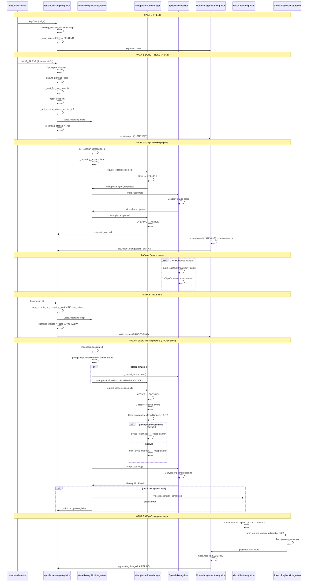
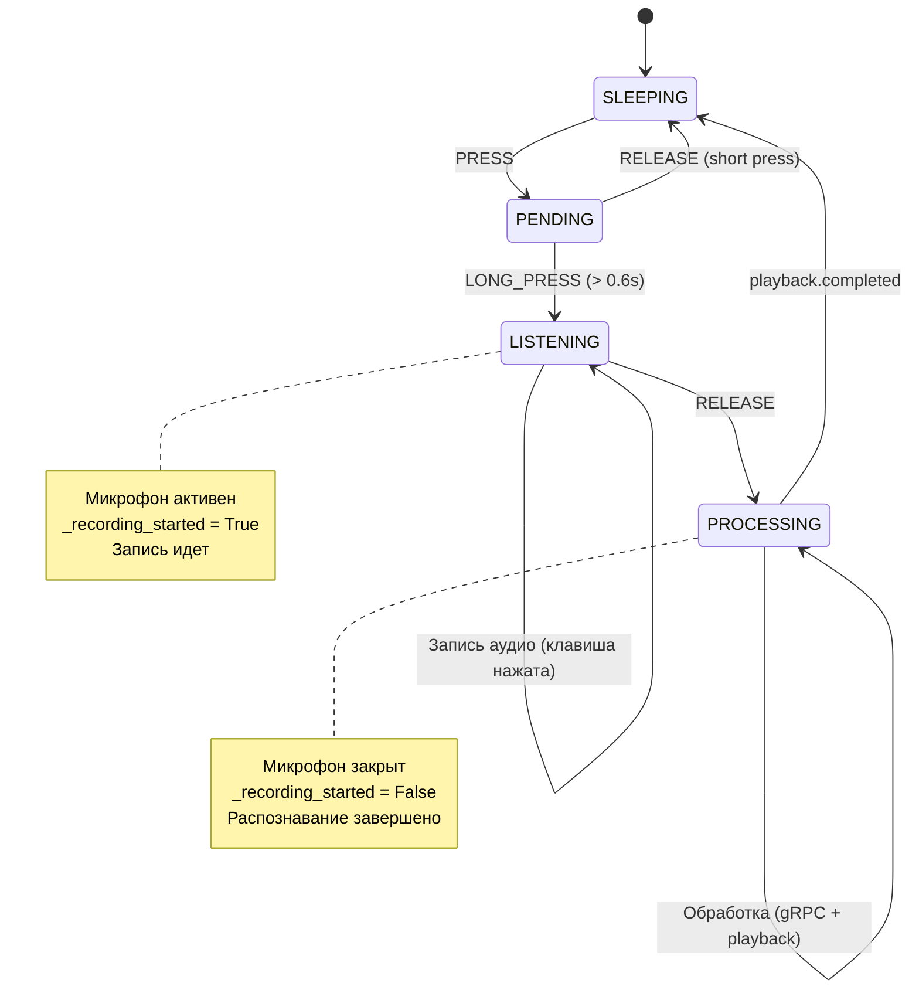

# Визуальная диаграмма взаимодействия клавиатуры и голосового управления

## Дата создания
2025-11-30

## Диаграмма последовательности (Mermaid)



---

## Диаграмма состояний



---

## Критические точки взаимодействия

### Точка 1: LONG_PRESS → voice.recording_start

**Компоненты:**
- `InputProcessingIntegration._handle_long_press`
- `VoiceRecognitionIntegration._on_recording_start`

**Проблемы:**
- ⚠️ Множественные проверки состояния (5 защит)
- ⚠️ `_recording_started` устанавливается ДО открытия микрофона
- ⚠️ `mode.request(LISTENING)` публикуется ДО открытия микрофона

**Рекомендация:**
- Упростить проверки до единой функции
- Устанавливать `_recording_started` только после `microphone.opened`

---

### Точка 2: RELEASE → voice.recording_stop

**Компоненты:**
- `InputProcessingIntegration._handle_key_release`
- `VoiceRecognitionIntegration._on_recording_stop`

**Проблемы:**
- 🔴 `_recording_started` сбрасывается СРАЗУ после публикации (строка 1419)
- 🔴 `was_recording` проверяется через несколько источников
- 🔴 `mode.request(PROCESSING)` публикуется ДО закрытия микрофона

**Рекомендация:**
- Сбрасывать `_recording_started` только после `microphone.closed`
- Использовать единую функцию проверки `was_recording`

---

### Точка 3: voice.recording_stop → stop_listening

**Компоненты:**
- `VoiceRecognitionIntegration._on_recording_stop`
- `MicrophoneStateManager.request_close`
- `SpeechRecognizer.stop_listening`

**Проблемы:**
- 🔴 Deadlock: `request_close` ждет `microphone.closed`, но оно публикуется после `stop_listening`
- ✅ **ИСПРАВЛЕНО**: Публикация `microphone.closed` до `request_close`
- ✅ **ИСПРАВЛЕНО**: Таймаут для `request_close`

**Остающаяся проблема:**
- ⚠️ Если `microphone.closed` публикуется ДО создания `_closed_event`, событие может быть потеряно
- ✅ **ИСПРАВЛЕНО**: Проверка в `request_close` на уже установленное событие

---

### Точка 4: stop_listening → voice.recognition_completed

**Компоненты:**
- `SpeechRecognizer.stop_listening`
- `VoiceRecognitionIntegration._on_recording_stop`

**Проблемы:**
- ⚠️ Если `stop_listening()` падает с исключением, распознавание не запускается
- ⚠️ Нет fallback для запуска распознавания

**Рекомендация:**
- Добавить обработку исключений с fallback
- Публиковать `voice.recognition_failed` при ошибке

---

## Матрица взаимодействий

| Событие | Отправитель | Получатели | Критичность |
|---------|-------------|------------|-------------|
| `keyboard.press` | InputProcessingIntegration | VoiceOverDuckingIntegration | Низкая |
| `voice.recording_start` | InputProcessingIntegration | VoiceRecognitionIntegration, ListeningWorkflow, ScreenshotCaptureIntegration | **КРИТИЧНО** |
| `microphone.open_requested` | MicrophoneStateManager | VoiceRecognitionIntegration | **КРИТИЧНО** |
| `microphone.opened` | SpeechRecognizer | MicrophoneStateManager | **КРИТИЧНО** |
| `voice.recording_stop` | InputProcessingIntegration | VoiceRecognitionIntegration, ScreenshotCaptureIntegration, ListeningWorkflow | **КРИТИЧНО** |
| `microphone.close_requested` | MicrophoneStateManager | (нет подписчиков) | Средняя |
| `microphone.closed` | VoiceRecognitionIntegration | MicrophoneStateManager | **КРИТИЧНО** |
| `voice.recognition_completed` | VoiceRecognitionIntegration | InputProcessingIntegration, GrpcClientIntegration, ProcessingWorkflow | **КРИТИЧНО** |
| `voice.recognition_failed` | VoiceRecognitionIntegration | InputProcessingIntegration | Высокая |
| `mode.request` | InputProcessingIntegration, ModeManagementIntegration | ModeManagementIntegration | **КРИТИЧНО** |

---

## Временная диаграмма (идеальный сценарий)

```
Время →
0.0s    PRESS
        ├─ pending_session_id создан
        └─ PENDING
        
0.6s    LONG_PRESS
        ├─ Проверки (5 защит)
        ├─ Ожидания (playback + mic)
        ├─ voice.recording_start
        └─ _recording_started = True
        
0.7s    voice.recording_start обработан
        ├─ MicrophoneStateManager.request_open
        └─ SpeechRecognizer.start_listening
        
0.8s    microphone.opened
        ├─ MicrophoneStateManager: OPENING → ACTIVE
        └─ mode.request(LISTENING) → применяется
        
0.8s-3.0s  Запись аудио (пользователь говорит)
        
3.0s    RELEASE
        ├─ voice.recording_stop
        ├─ _recording_started = False ⚠️ **СРАЗУ!**
        └─ mode.request(PROCESSING)
        
3.1s    voice.recording_stop обработан
        ├─ Проверка физического состояния потока
        ├─ _current_stream.stop()
        ├─ microphone.closed ✅ **РАЗРЫВ DEADLOCK**
        └─ request_close (таймаут 0.5s)
        
3.2s    request_close завершен
        └─ stop_listening()
        
3.5s    stop_listening завершен
        ├─ RecognitionResult получен
        └─ voice.recognition_completed
        
3.6s    voice.recognition_completed обработан
        └─ GrpcClientIntegration отправляет на сервер
        
4.0s    grpc.request_completed
        └─ SpeechPlaybackIntegration воспроизводит
        
6.0s    playback.completed
        └─ mode.request(SLEEPING)
        
6.1s    SLEEPING
```

---

## Проблемные сценарии

### Сценарий 1: Быстрое повторное нажатие

```
PRESS → LONG_PRESS → RELEASE → PRESS (быстро)
```

**Проблема:**
- `_recording_started` сброшен в False, но микрофон еще не закрыт
- Второй `LONG_PRESS` может не сработать из-за проверки `state_manager.is_microphone_active()`

**Решение:**
- Сбрасывать `_recording_started` только после `microphone.closed`

---

### Сценарий 2: RELEASE до LONG_PRESS

```
PRESS → RELEASE (быстро, < 0.6s)
```

**Проблема:**
- `pending_session_id` отменяется
- Но если `LONG_PRESS` уже начал обработку, может быть race condition

**Решение:**
- ✅ Используется `_pending_recording_cancelled_event` для синхронизации

---

### Сценарий 3: Ошибка при открытии микрофона

```
LONG_PRESS → voice.recording_start → start_listening() → ОШИБКА
```

**Проблема:**
- `_recording_started = True`, но микрофон не открыт
- `state_manager.is_microphone_active()` = False
- При следующем `LONG_PRESS` проверки могут работать неправильно

**Решение:**
- ✅ Обработка ошибок в `_on_recording_start`
- ⚠️ Нужно сбрасывать `_recording_started` при ошибке

---

## План исправлений

**📋 Детальный план исправлений:** См. `Docs/VOICE_INTERACTION_FIX_PLAN.md`

---

## Рекомендации по исправлению

### Приоритет 1: Критические исправления

1. **Сброс `_recording_started` только после закрытия микрофона**
   - Файл: `integration/integrations/input_processing_integration.py:1419`
   - Удалить: `self._recording_started = False` из `RELEASE`
   - Добавить: сброс в `_on_mic_closed`

2. **Единая функция проверки состояния микрофона**
   - Файл: `integration/integrations/voice_recognition_integration.py`
   - Создать: `is_microphone_actually_active()`
   - Использовать везде вместо множественных проверок

### Приоритет 2: Улучшения

3. **Упрощение логики LONG_PRESS**
   - Объединить проверки в единую функцию
   - Улучшить логирование

4. **Улучшение обработки ошибок**
   - Добавить fallback для всех критических операций
   - Логировать все изменения состояния

### Приоритет 3: Рефакторинг

5. **Единый источник истины для session_id**
   - Удалить локальные переменные
   - Использовать только `state_manager`

6. **Упрощение состояния микрофона**
   - Удалить `_recording_started` и `_recording_active`
   - Использовать только `state_manager.is_microphone_active()`

